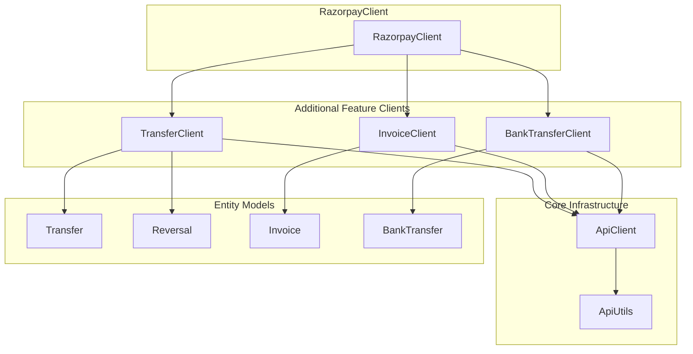
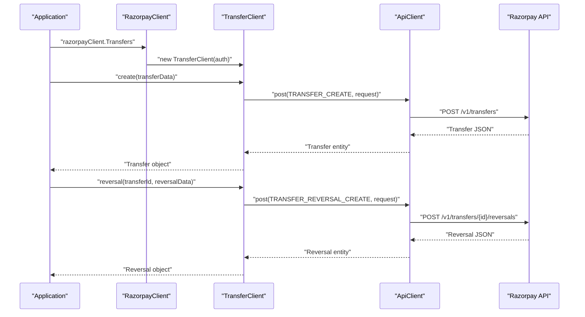
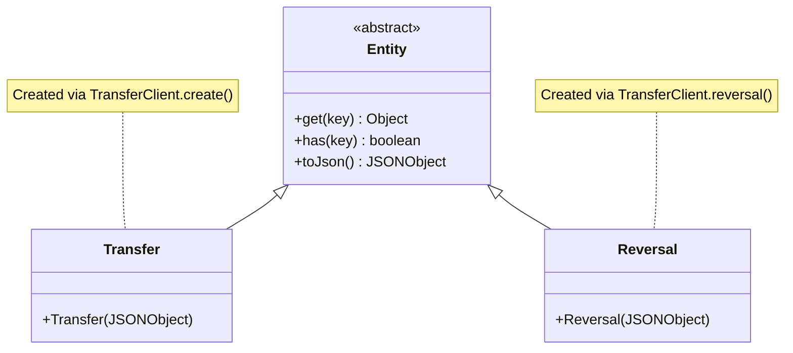
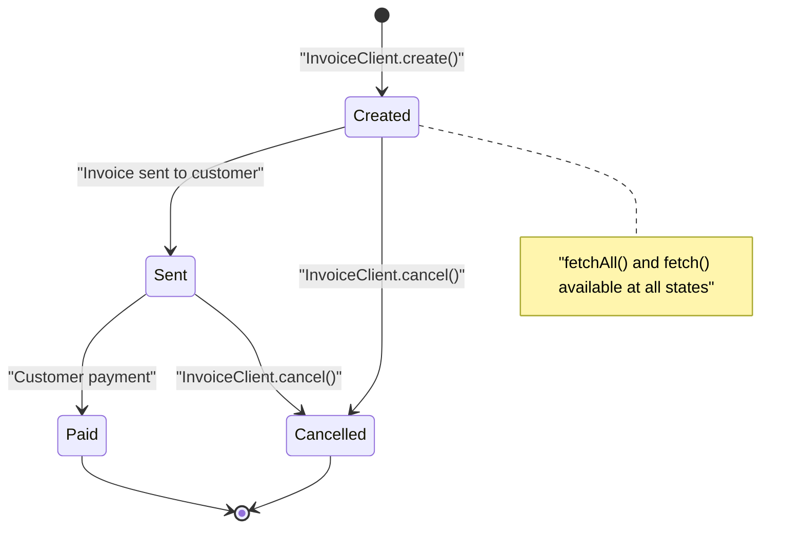
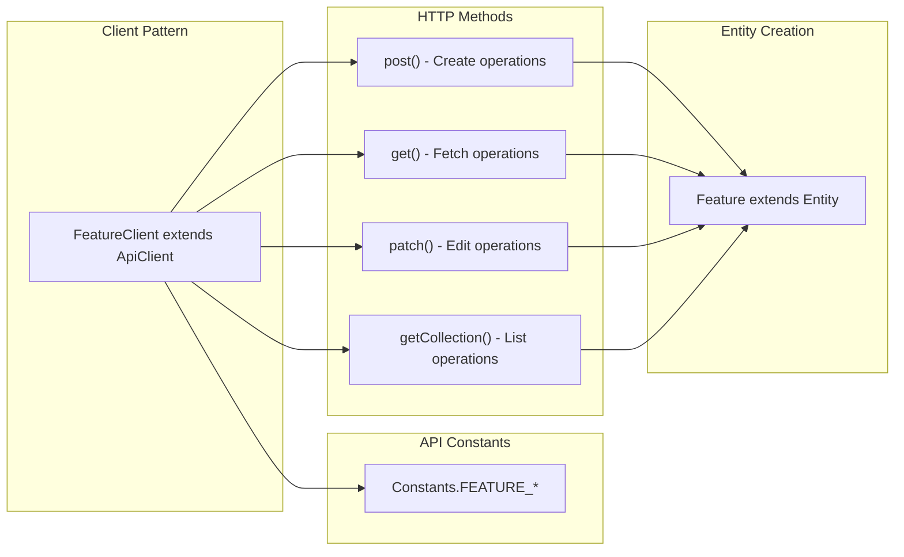

# Additional Features

Relevant source files

The following files were used as context for generating this wiki page:

- [src/main/java/com/razorpay/InvoiceClient.java](src/main/java/com/razorpay/InvoiceClient.java)
- [src/main/java/com/razorpay/Reversal.java](src/main/java/com/razorpay/Reversal.java)
- [src/main/java/com/razorpay/Transfer.java](src/main/java/com/razorpay/Transfer.java)
- [src/main/java/com/razorpay/TransferClient.java](src/main/java/com/razorpay/TransferClient.java)

## Purpose and Scope

This document covers the less commonly used but important features of the Razorpay Java SDK, specifically focusing on transfers, invoices, and bank transfers. These features enable advanced payment scenarios including marketplace operations, billing management, and alternative payment processing workflows.

For core payment operations, see [Payment Operations](#4). For subscription-based billing, see [Subscription & Billing](#7). For customer and account management features, see [Customer & Account Management](#6).

## Overview

The Razorpay Java SDK provides specialized clients for handling advanced payment scenarios beyond basic payment processing. These additional features are accessed through dedicated client classes that follow the same architectural patterns as the core payment operations.

**Additional Features in SDK Architecture**

Sources: [src/main/java/com/razorpay/TransferClient.java:1-36](), [src/main/java/com/razorpay/InvoiceClient.java:1-32]()

## Transfers

The `TransferClient` enables marketplace scenarios where payments need to be distributed to multiple parties. Transfers allow splitting payment amounts between the main merchant account and linked accounts, with support for editing and reversal operations.

### Transfer Operations

The `TransferClient` provides comprehensive transfer management capabilities:

| Operation | Method | Purpose |
|-----------|--------|---------|
| Create | `create(JSONObject)` | Create a new transfer |
| Edit | `edit(String id, JSONObject)` | Modify an existing transfer |
| Fetch | `fetch(String id)` | Retrieve a specific transfer |
| List | `fetchAll()` / `fetchAll(JSONObject)` | Retrieve multiple transfers |
| Reverse | `reversal(String id, JSONObject)` | Create a reversal for a transfer |

**Transfer Operation Flow**

### Transfer and Reversal Entities

Both `Transfer` and `Reversal` entities extend the base `Entity` class, providing JSON-based data access through the inherited methods:

- `Transfer` represents a payment distribution to a linked account
- `Reversal` represents the reversal of a previously created transfer

**Transfer Entity Relationships**

Sources: [src/main/java/com/razorpay/TransferClient.java:13-35](), [src/main/java/com/razorpay/Transfer.java:1-10](), [src/main/java/com/razorpay/Reversal.java:1-10]()

## Invoices

The `InvoiceClient` provides invoice management capabilities for billing scenarios where formal invoice generation and tracking is required. This is distinct from the subscription billing system and focuses on one-time or ad-hoc billing needs.

### Invoice Operations

The `InvoiceClient` supports the complete invoice lifecycle:

| Operation | Method | API Endpoint Constant | Purpose |
|-----------|--------|----------------------|---------|
| Create | `create(JSONObject)` | `INVOICE_CREATE` | Generate a new invoice |
| Fetch | `fetch(String id)` | `INVOICE_GET` | Retrieve a specific invoice |
| List | `fetchAll()` / `fetchAll(JSONObject)` | `INVOICE_LIST` | Retrieve multiple invoices |
| Cancel | `cancel(String id)` | `INVOICE_CANCEL` | Cancel an existing invoice |

**Invoice State Management**

### Invoice Entity

The `Invoice` entity follows the same pattern as other SDK entities, extending `Entity` to provide JSON-based data access. Invoice data includes details such as amount, customer information, due dates, and payment status.

Sources: [src/main/java/com/razorpay/InvoiceClient.java:13-31]()

## Bank Transfers

Bank transfer functionality provides access to bank transfer data and processing capabilities. This feature will be covered in detail in [Bank Transfers](#8.3), including data retrieval and processing workflows for bank-based payment methods.

## Integration Patterns

All additional features follow consistent integration patterns within the SDK:

**Common Integration Pattern for Additional Features**

These additional features integrate seamlessly with the core SDK architecture, providing specialized functionality while maintaining consistency with the overall design patterns and error handling mechanisms.

Sources: [src/main/java/com/razorpay/TransferClient.java:7-11](), [src/main/java/com/razorpay/InvoiceClient.java:7-11]()
