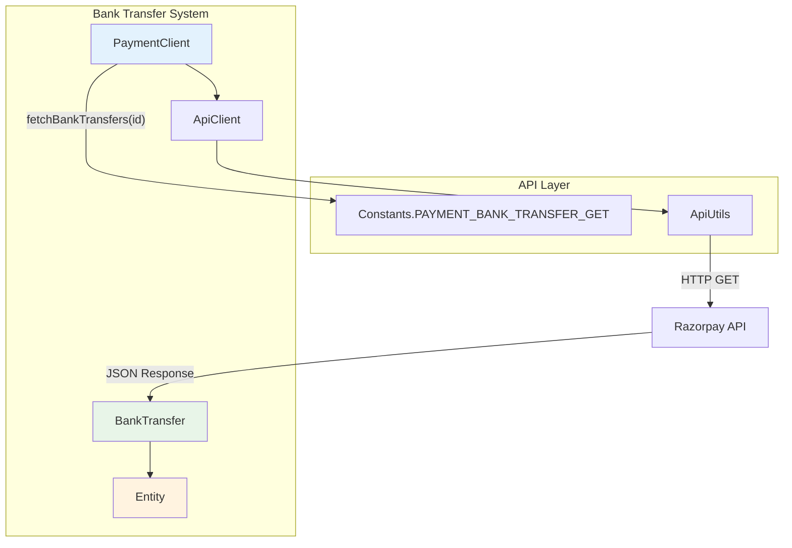
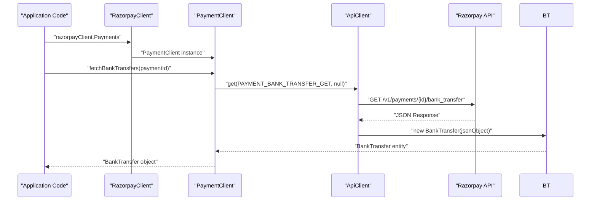
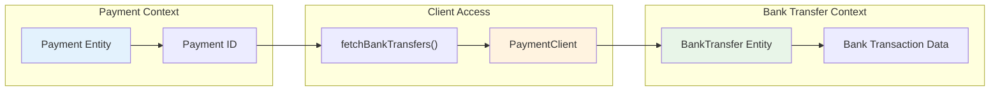

# Bank Transfers

<details>
<summary>Relevant source files</summary>

The following files were used as context for generating this wiki page:

- [src/main/java/com/razorpay/BankTransfer.java](src/main/java/com/razorpay/BankTransfer.java)
- [src/main/java/com/razorpay/PaymentClient.java](src/main/java/com/razorpay/PaymentClient.java)

</details>


## Purpose and Scope

This document covers the bank transfer functionality in the Razorpay Java SDK, specifically the retrieval and processing of bank transfer data associated with payments. Bank transfers in this context refer to the underlying bank transaction details for payments that were made via bank transfer methods.

For information about payment operations in general, see [Payment Operations](#4). For transfer operations between accounts (marketplace scenarios), see [Transfers](#8.1).

## Overview

Bank transfers in the Razorpay SDK represent the bank transaction details associated with payments that were processed through bank transfer payment methods. The SDK provides read-only access to bank transfer information, allowing developers to retrieve detailed transaction data for payments that were completed via bank transfers.

The bank transfer functionality is accessed through the `PaymentClient` and returns `BankTransfer` entities that contain the relevant transaction metadata.



**Bank Transfer Data Flow**

Sources: [src/main/java/com/razorpay/PaymentClient.java:80-82](), [src/main/java/com/razorpay/BankTransfer.java:1-10]()

## BankTransfer Entity

The `BankTransfer` class is a simple entity that extends the base `Entity` class, providing access to bank transfer data through the standard JSON-based data model used throughout the SDK.

| Component | Description | File Location |
|-----------|-------------|---------------|
| `BankTransfer` | Bank transfer data entity | [src/main/java/com/razorpay/BankTransfer.java:5-10]() |
| Constructor | Takes JSONObject from API response | [src/main/java/com/razorpay/BankTransfer.java:7-9]() |
| Inheritance | Extends `Entity` for JSON handling | [src/main/java/com/razorpay/BankTransfer.java:5]() |

The `BankTransfer` entity inherits all the standard `Entity` functionality, including:
- `get(key)` method for accessing field values
- `toJson()` method for JSON serialization
- `has(key)` method for checking field existence
- Automatic timestamp handling for date fields

Sources: [src/main/java/com/razorpay/BankTransfer.java:1-10]()

## Retrieving Bank Transfer Information

Bank transfer data is retrieved through the `PaymentClient` using the payment ID. The SDK provides a single method for fetching bank transfer details associated with a specific payment.



**Bank Transfer Retrieval Sequence**

### Method Signature

The `fetchBankTransfers` method in `PaymentClient` accepts a payment ID and returns bank transfer information:

```java
public BankTransfer fetchBankTransfers(String id) throws RazorpayException
```

### Usage Pattern

```java
// Assuming you have a RazorpayClient instance
PaymentClient paymentClient = razorpayClient.Payments;

// Fetch bank transfer details for a specific payment
String paymentId = "pay_1234567890";
BankTransfer bankTransfer = paymentClient.fetchBankTransfers(paymentId);

// Access bank transfer data
String bankReference = bankTransfer.get("bank_reference");
String payeeAccount = bankTransfer.get("payee_account");
```

Sources: [src/main/java/com/razorpay/PaymentClient.java:80-82]()

## API Integration

The bank transfer functionality integrates with the Razorpay API through the standard HTTP infrastructure used throughout the SDK.

| Component | Role | Implementation |
|-----------|------|----------------|
| Endpoint | API path for bank transfer data | `Constants.PAYMENT_BANK_TRANSFER_GET` |
| HTTP Method | GET request to retrieve data | [src/main/java/com/razorpay/PaymentClient.java:81]() |
| Response Handling | JSON to BankTransfer entity conversion | Inherited from `ApiClient.get()` |
| Error Handling | Standard `RazorpayException` throwing | Method signature includes exception |

The method implementation uses the inherited `get()` method from `ApiClient`, which:
1. Formats the API endpoint URL with the payment ID
2. Makes an authenticated HTTP GET request
3. Processes the JSON response into a `BankTransfer` entity
4. Handles any API errors as `RazorpayException`

Sources: [src/main/java/com/razorpay/PaymentClient.java:80-82]()

## Relationship to Payment Operations

Bank transfers are directly associated with payments and can only be accessed through the `PaymentClient`. This reflects the business logic where bank transfer details are metadata associated with a specific payment transaction.



**Payment to Bank Transfer Relationship**

### Integration Points

| Integration | Description | Code Location |
|-------------|-------------|---------------|
| Client Access | Bank transfers accessed via PaymentClient | [src/main/java/com/razorpay/PaymentClient.java:80-82]() |
| ID Requirement | Requires payment ID as parameter | Method signature in PaymentClient |
| Entity Model | Uses same Entity pattern as Payment | [src/main/java/com/razorpay/BankTransfer.java:5]() |
| Error Handling | Same exception model as other payment operations | Method throws `RazorpayException` |

### Typical Workflow

1. Create or retrieve a payment using `PaymentClient`
2. Use the payment ID to fetch associated bank transfer details
3. Process bank transfer metadata for reconciliation or reporting
4. Handle any errors using standard exception handling patterns

Sources: [src/main/java/com/razorpay/PaymentClient.java:80-82](), [src/main/java/com/razorpay/BankTransfer.java:1-10]()
