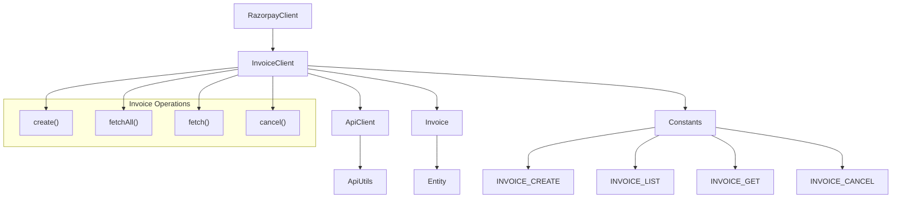
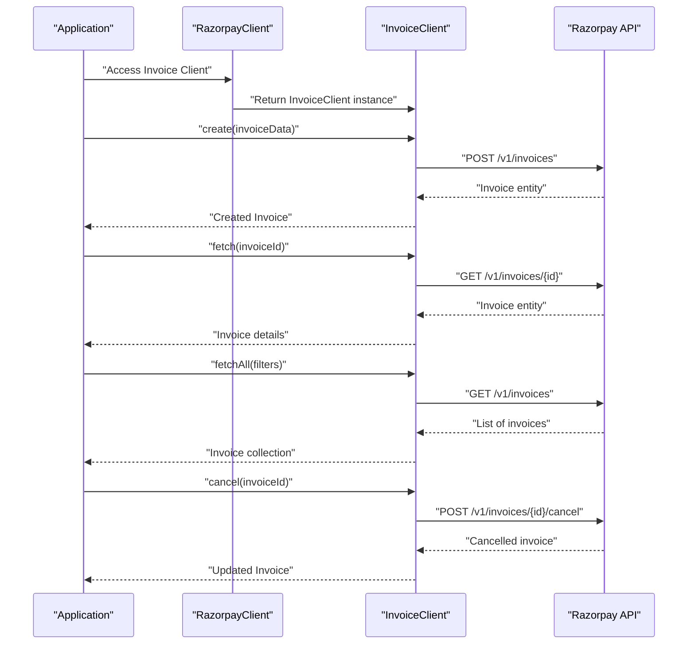
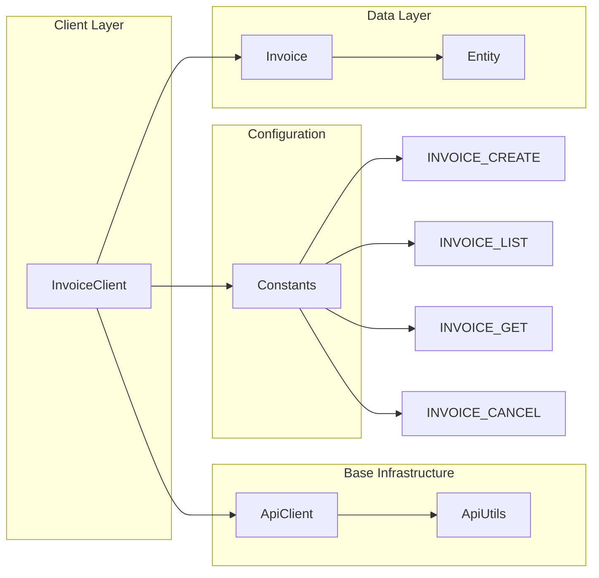

# Invoices

<details>
<summary>Relevant source files</summary>

The following files were used as context for generating this wiki page:

- [src/main/java/com/razorpay/InvoiceClient.java](src/main/java/com/razorpay/InvoiceClient.java)

</details>


The invoice functionality in the Razorpay Java SDK enables developers to create, manage, and cancel invoices for billing customers. This document covers the `InvoiceClient` class and its operations for handling invoice lifecycle management.

For information about core payment operations, see [Payments](#4.1). For details about the underlying HTTP infrastructure, see [HTTP Infrastructure](#3.2). For information about data model patterns, see [Data Models](#3.3).

## Architecture Overview

The `InvoiceClient` follows the standard SDK pattern of extending `ApiClient` to provide specialized invoice operations. It integrates with the broader Razorpay SDK architecture through the main client interface.



**Sources:** [src/main/java/com/razorpay/InvoiceClient.java:1-32]()

## InvoiceClient Class Structure

The `InvoiceClient` provides a clean interface for invoice operations through five core methods. Each method maps to specific Razorpay API endpoints defined in the `Constants` class.

| Method | Purpose | Return Type | API Endpoint Constant |
|--------|---------|-------------|----------------------|
| `create(JSONObject)` | Create new invoice | `Invoice` | `INVOICE_CREATE` |
| `fetchAll()` | List all invoices | `List<Invoice>` | `INVOICE_LIST` |
| `fetchAll(JSONObject)` | List invoices with filters | `List<Invoice>` | `INVOICE_LIST` |
| `fetch(String)` | Get specific invoice | `Invoice` | `INVOICE_GET` |
| `cancel(String)` | Cancel invoice | `Invoice` | `INVOICE_CANCEL` |

**Sources:** [src/main/java/com/razorpay/InvoiceClient.java:13-31]()

## Constructor and Initialization

The `InvoiceClient` uses a package-private constructor that accepts an authentication string, following the standard pattern used by all resource clients in the SDK.

```java
InvoiceClient(String auth) {
  super(auth);
}
```

This constructor is called internally by `RazorpayClient` during initialization. Developers access invoice operations through the main client instance rather than creating `InvoiceClient` directly.

**Sources:** [src/main/java/com/razorpay/InvoiceClient.java:9-11]()

## API Operations

### Invoice Creation

The `create` method handles new invoice creation by accepting a `JSONObject` with invoice parameters and returning an `Invoice` entity.

```java
public Invoice create(JSONObject request) throws RazorpayException {
  return post(Constants.INVOICE_CREATE, request);
}
```

This method uses the inherited `post` method from `ApiClient` to send the request to the `INVOICE_CREATE` endpoint.

**Sources:** [src/main/java/com/razorpay/InvoiceClient.java:13-15]()

### Invoice Retrieval

The SDK provides two approaches for fetching invoices:

**Fetch All Invoices:**
```java
public List<Invoice> fetchAll() throws RazorpayException {
  return fetchAll(null);
}

public List<Invoice> fetchAll(JSONObject request) throws RazorpayException {
  return getCollection(Constants.INVOICE_LIST, request);
}
```

The parameterless `fetchAll()` method is a convenience wrapper that calls the parameterized version with `null`, while the second method allows filtering through request parameters.

**Fetch Specific Invoice:**
```java
public Invoice fetch(String id) throws RazorpayException {
  return get(String.format(Constants.INVOICE_GET, id), null);
}
```

This method uses `String.format` to inject the invoice ID into the endpoint URL pattern.

**Sources:** [src/main/java/com/razorpay/InvoiceClient.java:17-27]()

### Invoice Cancellation

The `cancel` method allows cancelling an existing invoice by ID:

```java
public Invoice cancel(String id) throws RazorpayException {
  return post(String.format(Constants.INVOICE_CANCEL, id), null);
}
```

This operation uses a POST request with no body (`null`) to the formatted cancel endpoint.

**Sources:** [src/main/java/com/razorpay/InvoiceClient.java:29-31]()

## Invoice Lifecycle Flow

The following diagram illustrates the typical lifecycle of an invoice and the corresponding API operations:



**Sources:** [src/main/java/com/razorpay/InvoiceClient.java:13-31]()

## Integration with SDK Components

The `InvoiceClient` integrates with several core SDK components:



- **ApiClient**: Provides base HTTP operations (`get`, `post`, `getCollection`)
- **Invoice Entity**: Represents invoice data with JSON backing
- **Constants**: Defines API endpoint patterns for invoice operations
- **ApiUtils**: Handles actual HTTP communication and authentication

**Sources:** [src/main/java/com/razorpay/InvoiceClient.java:7-32]()

## Error Handling

All `InvoiceClient` methods declare `RazorpayException` in their signatures, following the SDK's standard error handling pattern. This exception is thrown when:

- HTTP requests fail
- API returns error responses  
- Network connectivity issues occur
- Authentication problems arise

For detailed error handling patterns, see [Error Handling](#9).

**Sources:** [src/main/java/com/razorpay/InvoiceClient.java:13-31]()
