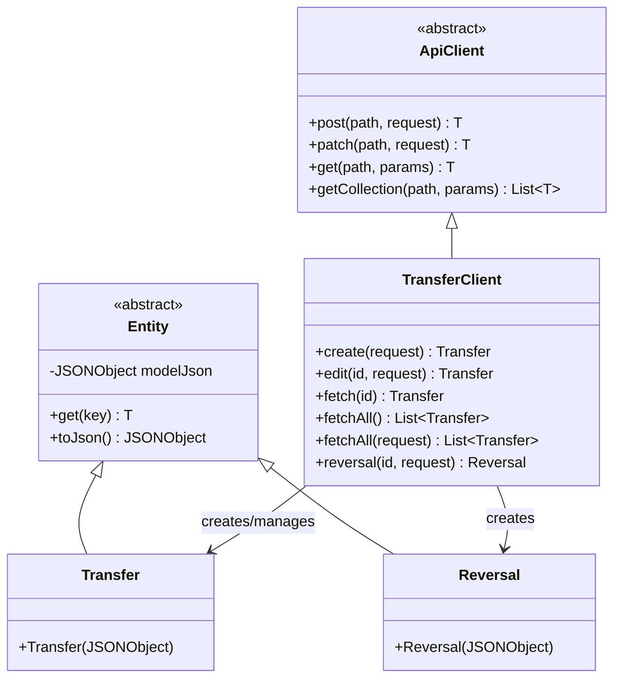
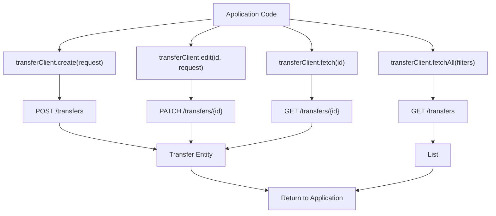
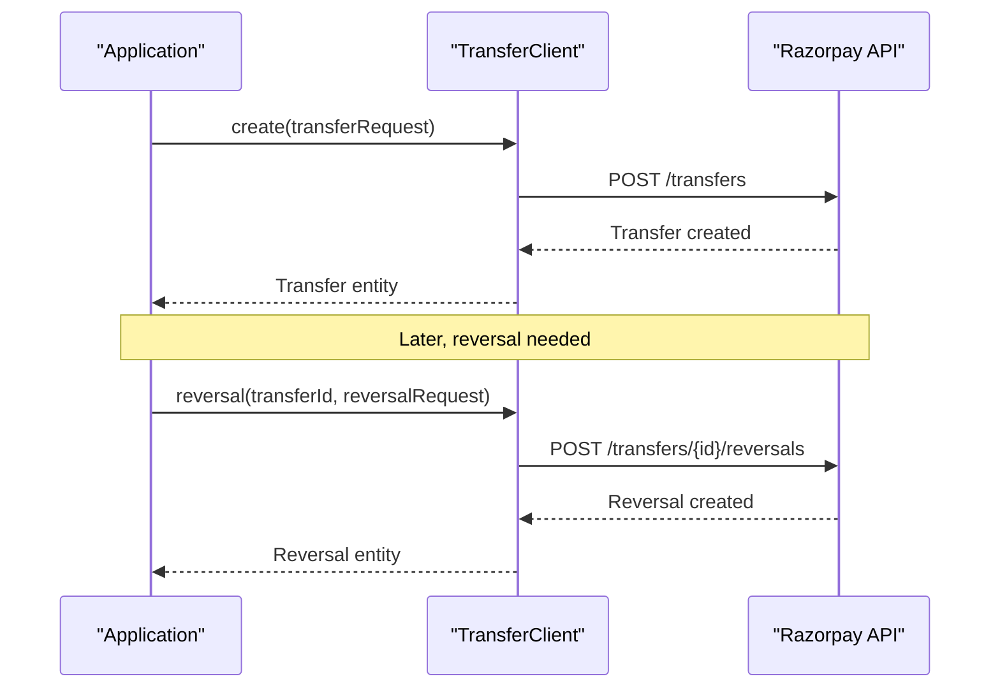

# Transfers

Relevant source files

The following files were used as context for generating this wiki page:

- [src/main/java/com/razorpay/Reversal.java](src/main/java/com/razorpay/Reversal.java)
- [src/main/java/com/razorpay/Transfer.java](src/main/java/com/razorpay/Transfer.java)
- [src/main/java/com/razorpay/TransferClient.java](src/main/java/com/razorpay/TransferClient.java)

## Purpose and Scope

This document covers the transfer functionality in the Razorpay Java SDK, which enables marketplace scenarios where funds need to be transferred from one account to another. Transfers allow you to route payments to linked accounts and create reversals when needed.

For general payment operations, see [Payments](#4.1). For refund operations that affect the original payment, see [Refunds](#4.2).

## Architecture Overview

The transfer functionality is built around three main components: the `TransferClient` for API operations, the `Transfer` entity for transfer data, and the `Reversal` entity for reversal operations.

### Transfer System Architecture

Sources: [src/main/java/com/razorpay/TransferClient.java:7-36](), [src/main/java/com/razorpay/Transfer.java:5-10](), [src/main/java/com/razorpay/Reversal.java:5-10]()

The `TransferClient` extends `ApiClient` to inherit common HTTP operations and provides transfer-specific methods. Both `Transfer` and `Reversal` entities extend the base `Entity` class for consistent JSON handling.

## Transfer Operations

### Creating Transfers

The `create` method creates a new transfer by posting to the transfer creation endpoint:

| Method | Description | Parameters | Returns |
|--------|-------------|------------|---------|
| `create(JSONObject request)` | Creates a new transfer | JSON object with transfer details | `Transfer` entity |

Sources: [src/main/java/com/razorpay/TransferClient.java:13-15]()

### Editing Transfers

Existing transfers can be modified using the `edit` method:

| Method | Description | Parameters | Returns |
|--------|-------------|------------|---------|
| `edit(String id, JSONObject request)` | Updates an existing transfer | Transfer ID and JSON with updates | `Transfer` entity |

Sources: [src/main/java/com/razorpay/TransferClient.java:17-19]()

### Fetching Transfers

The SDK provides methods to retrieve individual transfers or collections of transfers:

| Method | Description | Parameters | Returns |
|--------|-------------|------------|---------|
| `fetch(String id)` | Retrieves a single transfer | Transfer ID | `Transfer` entity |
| `fetchAll()` | Retrieves all transfers | None | `List<Transfer>` |
| `fetchAll(JSONObject request)` | Retrieves transfers with filters | JSON with filter criteria | `List<Transfer>` |

Sources: [src/main/java/com/razorpay/TransferClient.java:25-35]()

### Transfer Operation Flow

Sources: [src/main/java/com/razorpay/TransferClient.java:13-35]()

## Reversals

### What are Reversals

Reversals allow you to reverse a transfer that has been made to a linked account. This is useful in marketplace scenarios where a transfer needs to be undone due to disputes, cancellations, or other business reasons.

### Creating Reversals

The `reversal` method creates a reversal for an existing transfer:

| Method | Description | Parameters | Returns |
|--------|-------------|------------|---------|
| `reversal(String id, JSONObject request)` | Creates a reversal for a transfer | Transfer ID and reversal details | `Reversal` entity |

Sources: [src/main/java/com/razorpay/TransferClient.java:21-23]()

### Transfer and Reversal Relationship

Sources: [src/main/java/com/razorpay/TransferClient.java:13-23]()

## Entity Data Models

Both `Transfer` and `Reversal` are simple entity classes that wrap JSON data:

- **Transfer**: Represents a transfer object with all transfer-related data accessible through the inherited `get()` method from `Entity`
- **Reversal**: Represents a reversal object with reversal-specific data and metadata

Sources: [src/main/java/com/razorpay/Transfer.java:7-9](), [src/main/java/com/razorpay/Reversal.java:7-9]()

## API Endpoint Constants

The `TransferClient` uses several predefined constants for API endpoints:

- `Constants.TRANSFER_CREATE` - Transfer creation endpoint
- `Constants.TRANSFER_EDIT` - Transfer editing endpoint (with ID parameter)
- `Constants.TRANSFER_REVERSAL_CREATE` - Reversal creation endpoint (with transfer ID parameter)
- `Constants.TRANSFER_GET` - Single transfer retrieval endpoint (with ID parameter)
- `Constants.TRANSFER_LIST` - Transfer listing endpoint

Sources: [src/main/java/com/razorpay/TransferClient.java:14,18,22,26,34]()
