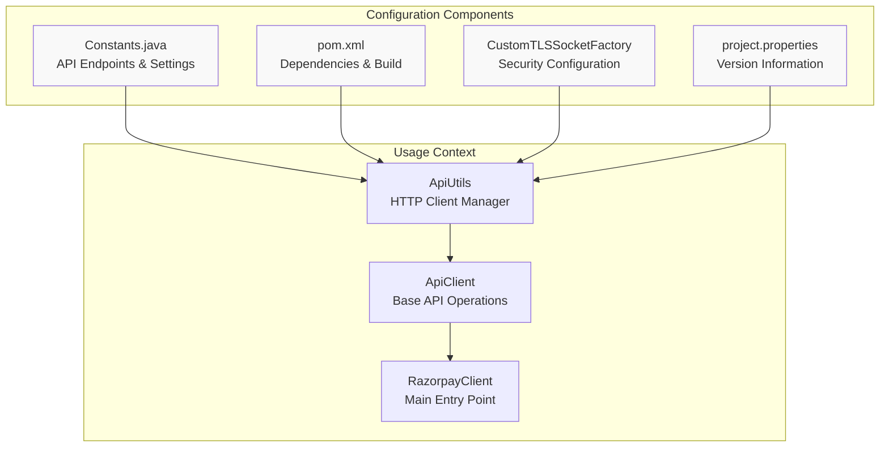
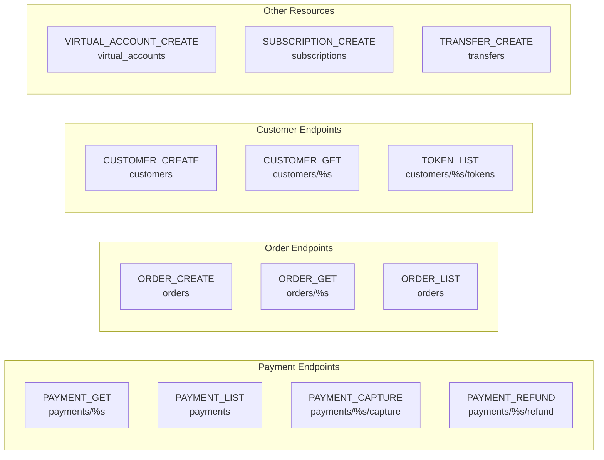
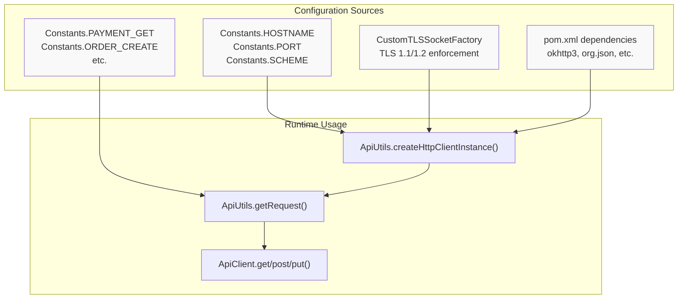

# Configuration

<details>
<summary>Relevant source files</summary>

The following files were used as context for generating this wiki page:

- [pom.xml](pom.xml)
- [src/main/java/com/razorpay/Constants.java](src/main/java/com/razorpay/Constants.java)
- [src/main/java/com/razorpay/CustomTLSSocketFactory.java](src/main/java/com/razorpay/CustomTLSSocketFactory.java)

</details>


This page documents the configuration system of the Razorpay Java SDK, including API endpoints, build settings, security configuration, and constants management. The configuration system provides a centralized approach to managing API connectivity, security parameters, and build dependencies.

For information about authentication mechanisms and signature verification, see [Security & Authentication](#3.4). For details about the HTTP communication layer that uses these configurations, see [HTTP Infrastructure](#3.2).

## Configuration Overview

The SDK's configuration is managed through several key components that work together to provide a consistent and secure foundation for API communication:



**Configuration Component Relationships**
*Sources: [src/main/java/com/razorpay/Constants.java:1-78](), [pom.xml:1-153](), [src/main/java/com/razorpay/CustomTLSSocketFactory.java:1-75]()*

## API Configuration

The `Constants` class centralizes all API-related configuration including server settings, HTTP parameters, and endpoint definitions.

### Server Configuration

The SDK targets the Razorpay production API with these core settings:

| Setting | Value | Purpose |
|---------|-------|---------|
| `SCHEME` | "https" | Enforces secure HTTPS communication |
| `HOSTNAME` | "api.razorpay.com" | Razorpay API server |
| `PORT` | 443 | Standard HTTPS port |
| `VERSION` | "v1" | API version specification |

*Sources: [src/main/java/com/razorpay/Constants.java:8-11]()*

### HTTP Configuration

Standard HTTP headers and content types are defined as constants:

- `AUTH_HEADER_KEY`: "Authorization" - Used for API key authentication
- `USER_AGENT`: "User-Agent" - HTTP user agent header
- `MEDIA_TYPE_JSON`: MediaType for "application/json; charset=utf-8"

*Sources: [src/main/java/com/razorpay/Constants.java:13-15]()*

### API Endpoint Mapping

The SDK maintains a comprehensive mapping of business operations to API endpoints. This mapping follows a consistent pattern where placeholders (`%s`) are used for dynamic path parameters:



**API Endpoint Organization by Resource Type**
*Sources: [src/main/java/com/razorpay/Constants.java:18-77]()*

### Endpoint Categories

The endpoints are organized into logical groups:

- **Payment Operations**: Create, fetch, capture, refund, and transfer operations
- **Order Management**: Order creation, retrieval, and payment tracking
- **Customer Management**: Customer CRUD operations and token management
- **Subscription & Billing**: Plans, subscriptions, and addon management
- **Virtual Accounts**: Virtual account lifecycle and payment collection
- **Transfer Operations**: Marketplace transfer and reversal functionality

*Sources: [src/main/java/com/razorpay/Constants.java:18-77]()*

## Build Configuration

The Maven `pom.xml` file defines the project structure, dependencies, and build process.

### Project Metadata

| Property | Value | Purpose |
|----------|-------|---------|
| `groupId` | com.razorpay | Maven group identifier |
| `artifactId` | razorpay-java | Project artifact name |
| `version` | 1.3.9 | Current SDK version |
| `packaging` | jar | Output format |

*Sources: [pom.xml:5-8]()*

### Java Version Compatibility

The SDK maintains compatibility with Java 1.7 and higher:

```xml
<maven.compiler.source>1.7</maven.compiler.source>
<maven.compiler.target>1.7</maven.compiler.target>
```

*Sources: [pom.xml:39-40]()*

### Dependencies

The SDK relies on five core dependencies:

| Dependency | Version | Purpose |
|------------|---------|---------|
| okhttp3:okhttp | 3.10.0 | HTTP client for API communication |
| okhttp3:logging-interceptor | 3.10.0 | HTTP request/response logging |
| org.json:json | 20180130 | JSON parsing and manipulation |
| commons-codec:commons-codec | 1.11 | Encoding/decoding utilities |
| commons-text:commons-text | 1.3 | Text processing utilities |

*Sources: [pom.xml:45-73]()*

### Build Process

The build configuration includes:

- **Resource Filtering**: Enables Maven property substitution in resources
- **Source Attachment**: Generates source JAR for debugging
- **Javadoc Generation**: Creates API documentation
- **GPG Signing**: Signs artifacts for Maven Central deployment

*Sources: [pom.xml:90-149]()*

## Security Configuration

The `CustomTLSSocketFactory` class enforces secure TLS communication by configuring SSL socket behavior.

### TLS Protocol Enforcement

The SDK explicitly enables only TLS 1.1 and TLS 1.2 protocols for all SSL connections:

```java
((SSLSocket) socket).setEnabledProtocols(new String[] {"TLSv1.1", "TLSv1.2"});
```

This configuration ensures that all API communication uses modern, secure TLS versions and prevents fallback to older, vulnerable protocols.

*Sources: [src/main/java/com/razorpay/CustomTLSSocketFactory.java:70-71]()*

### Socket Factory Implementation

The `CustomTLSSocketFactory` extends `SSLSocketFactory` and overrides all socket creation methods to apply TLS configuration consistently. The factory:

1. Creates an internal `SSLContext` with default settings
2. Wraps the system's default `SSLSocketFactory` 
3. Applies TLS protocol restrictions to every created socket

*Sources: [src/main/java/com/razorpay/CustomTLSSocketFactory.java:14-75]()*

## Version Management

The SDK uses Maven resource filtering to inject version information from the POM into runtime resources. The `project.properties` file is processed during the build to include dynamic version data that can be accessed by the `ApiUtils` class for HTTP User-Agent headers.

*Sources: [pom.xml:90-95]()*

## Configuration Integration

The configuration components work together through the HTTP infrastructure layer:



**Configuration Flow from Definition to Runtime Usage**
*Sources: [src/main/java/com/razorpay/Constants.java:8-11](), [src/main/java/com/razorpay/CustomTLSSocketFactory.java:18-22](), [pom.xml:45-73]()*

The configuration system ensures that all SDK components have consistent access to API endpoints, security settings, and build dependencies while maintaining a clean separation between configuration definition and runtime usage.
