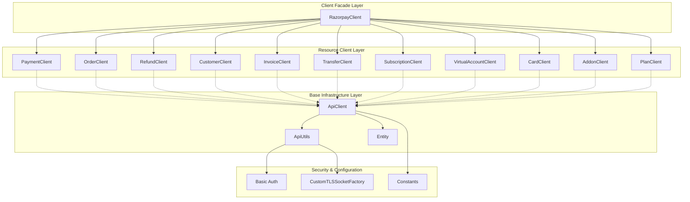
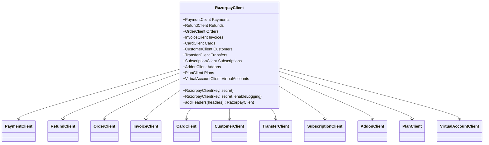
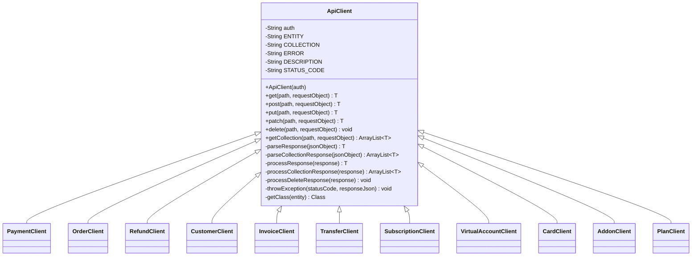
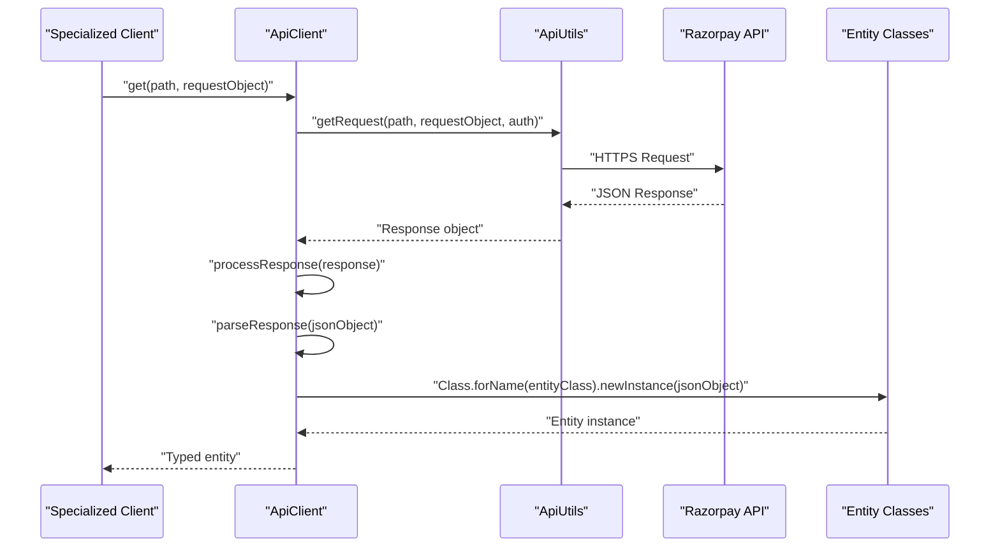
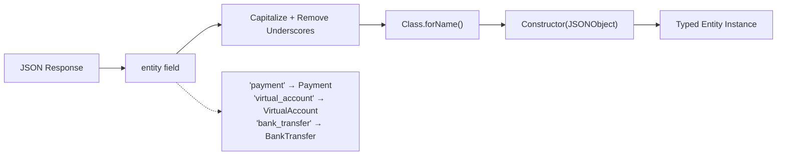

# Core Architecture

Relevant source files

The following files were used as context for generating this wiki page:

- [src/main/java/com/razorpay/ApiClient.java](src/main/java/com/razorpay/ApiClient.java)
- [src/main/java/com/razorpay/RazorpayClient.java](src/main/java/com/razorpay/RazorpayClient.java)

This document explains the fundamental architectural components and design patterns of the Razorpay Java SDK. It covers the main structural elements, inheritance hierarchies, and how the different components work together to provide a cohesive API client experience.

For specific implementation details of individual components, see [RazorpayClient](#3.1), [HTTP Infrastructure](#3.2), [Data Models](#3.3), and [Security & Authentication](#3.4). For usage examples and getting started, see [Quick Start Guide](#2).

## Overview

The Razorpay Java SDK follows a layered architecture with clear separation of concerns. The design emphasizes security, type safety, and ease of use through well-defined abstractions and consistent patterns.

**Sources:** [src/main/java/com/razorpay/RazorpayClient.java:1-45](), [src/main/java/com/razorpay/ApiClient.java:1-194]()

## Facade Pattern Implementation

The SDK implements the Facade pattern through `RazorpayClient`, which serves as the single entry point for all API operations. This class encapsulates the complexity of managing multiple specialized clients and provides a unified interface.

The `RazorpayClient` constructor handles initialization of all specialized clients and configuration of the HTTP infrastructure. Authentication credentials are processed once and distributed to all clients during initialization [src/main/java/com/razorpay/RazorpayClient.java:21-39]().

**Sources:** [src/main/java/com/razorpay/RazorpayClient.java:7-45]()

## Base Class Hierarchy

All API interaction follows a consistent inheritance pattern where specialized clients extend `ApiClient`, which provides common HTTP operations and response processing logic.

The `ApiClient` class centralizes HTTP method handling, response parsing, and error processing. It uses generics to provide type-safe operations while maintaining a consistent interface across all resource types [src/main/java/com/razorpay/ApiClient.java:12-194]().

**Sources:** [src/main/java/com/razorpay/ApiClient.java:12-194]()

## HTTP Request Processing Flow

The SDK processes HTTP requests through a well-defined flow that ensures consistent handling of authentication, request formatting, and response parsing.

The flow demonstrates how requests move through the architecture layers, with each layer handling specific responsibilities:

- **Specialized Clients**: Business logic and API endpoint mapping
- **ApiClient**: HTTP method abstraction and response processing [src/main/java/com/razorpay/ApiClient.java:34-52]()
- **ApiUtils**: Low-level HTTP communication and authentication
- **Entity Classes**: Data model instantiation and JSON mapping

**Sources:** [src/main/java/com/razorpay/ApiClient.java:34-121]()

## Dynamic Entity Resolution

The SDK uses reflection-based entity resolution to dynamically create appropriate model objects based on API response metadata. This approach provides flexibility while maintaining type safety.

The dynamic resolution mechanism [src/main/java/com/razorpay/ApiClient.java:186-193]() transforms API entity names into corresponding Java class names using Apache Commons Text utilities. This allows the SDK to handle new entity types without code changes, as long as the naming convention is followed.

**Sources:** [src/main/java/com/razorpay/ApiClient.java:65-76](), [src/main/java/com/razorpay/ApiClient.java:186-193]()

## Error Handling Strategy

The architecture implements comprehensive error handling that distinguishes between different types of failures and provides meaningful error information to developers.

| Error Type | HTTP Status | Processing Method | Exception Details |
|------------|-------------|-------------------|-------------------|
| API Errors | 400-599 | `throwException()` | Includes error code and description from API response |
| Server Errors | 500+ | `throwServerException()` | Includes status code and raw response body |
| Network Errors | N/A | HTTP layer | IOException wrapped in RazorpayException |
| Parsing Errors | N/A | Entity creation | Reflection exceptions wrapped in RazorpayException |

The error handling logic [src/main/java/com/razorpay/ApiClient.java:169-184]() extracts structured error information from API responses when available, falling back to generic server error handling for unexpected response formats.

**Sources:** [src/main/java/com/razorpay/ApiClient.java:99-121](), [src/main/java/com/razorpay/ApiClient.java:169-184]()

## Design Patterns Summary

The SDK architecture employs several well-established design patterns:

- **Facade Pattern**: `RazorpayClient` provides unified access to multiple specialized APIs
- **Template Method Pattern**: `ApiClient` defines common HTTP operation workflows that specialized clients inherit
- **Factory Pattern**: Dynamic entity creation based on response metadata
- **Decorator Pattern**: Headers can be added to modify HTTP client behavior
- **Strategy Pattern**: Different HTTP methods (GET, POST, PUT, PATCH, DELETE) handled through common interface

These patterns work together to create a maintainable, extensible architecture that can accommodate new API features with minimal changes to existing code.

**Sources:** [src/main/java/com/razorpay/RazorpayClient.java:1-45](), [src/main/java/com/razorpay/ApiClient.java:1-194]()
