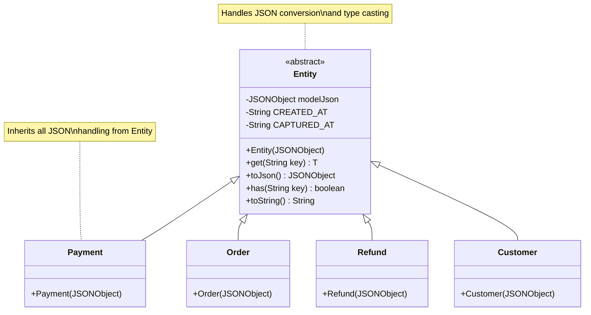
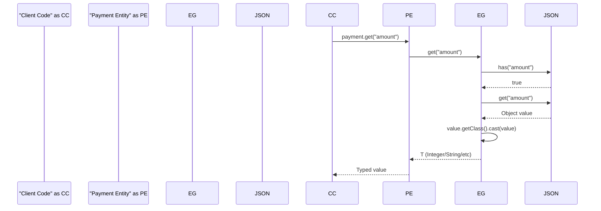
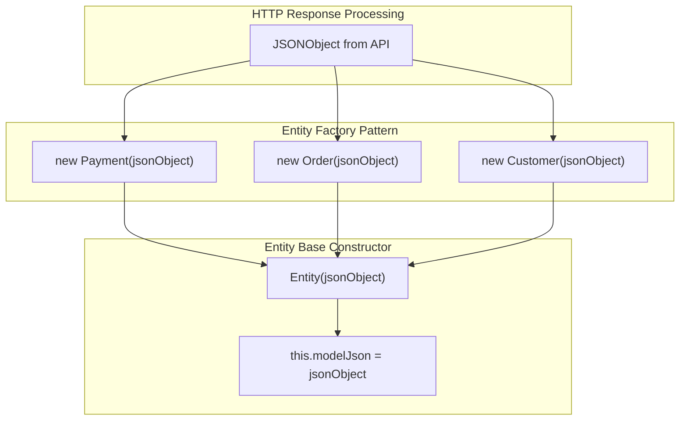
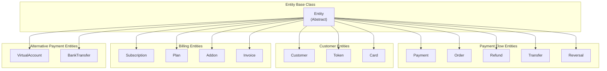

# Data Models

<details>
<summary>Relevant source files</summary>

The following files were used as context for generating this wiki page:

- [src/main/java/com/razorpay/Entity.java](src/main/java/com/razorpay/Entity.java)
- [src/main/java/com/razorpay/Order.java](src/main/java/com/razorpay/Order.java)
- [src/main/java/com/razorpay/Payment.java](src/main/java/com/razorpay/Payment.java)

</details>


This document explains the data model layer of the Razorpay Java SDK, focusing on the `Entity` base class and how data models provide type-safe access to JSON responses from the Razorpay API. All domain objects in the SDK inherit from the `Entity` class, which handles JSON serialization, deserialization, and type conversion.

For information about specific business operations using these data models, see the individual resource sections ([4](#4) Payment Operations, [5](#5) Order Management, [6](#6) Customer & Account Management, etc.). For details about how these models are instantiated during HTTP communication, see [3.2](#3.2) HTTP Infrastructure.

## Entity Base Class Architecture

The SDK follows a consistent pattern where all domain objects extend a single `Entity` abstract base class. This design provides unified JSON handling and type-safe data access across all API resources.

### Entity Class Structure



**Sources:** [src/main/java/com/razorpay/Entity.java:1-46](), [src/main/java/com/razorpay/Payment.java:1-11](), [src/main/java/com/razorpay/Order.java:1-11]()

The `Entity` class serves as the foundation for all data models by storing the raw JSON response from the API in the `modelJson` field [src/main/java/com/razorpay/Entity.java:9]() and providing type-safe accessor methods.

## JSON Data Flow and Type Conversion

### Data Access Pattern

The SDK uses a generic `get()` method to provide type-safe access to JSON properties with automatic type conversion:



**Sources:** [src/main/java/com/razorpay/Entity.java:18-32]()

The `get()` method implements several key behaviors:

| Behavior | Code Location | Description |
|----------|---------------|-------------|
| Null Safety | [src/main/java/com/razorpay/Entity.java:19-22]() | Returns `null` if key doesn't exist |
| Timestamp Conversion | [src/main/java/com/razorpay/Entity.java:24-26]() | Converts Unix timestamps to `Date` objects |
| Type Casting | [src/main/java/com/razorpay/Entity.java:31]() | Uses reflection for safe type conversion |

### Special Timestamp Handling

The SDK provides automatic conversion for timestamp fields from Unix epoch to Java `Date` objects:

```mermaid
graph LR
    subgraph "API Response"
        UT["Unix Timestamp<br/>(seconds)"]
    end
    
    subgraph "Entity.get() Processing"
        CHK["Check if CREATED_AT<br/>or CAPTURED_AT"]
        CONV["new Date(timestamp * 1000)"]
    end
    
    subgraph "Client Code"
        DATE["Date Object"]
    end
    
    UT --> CHK
    CHK --> CONV
    CONV --> DATE
    
    note for CONV "Converts seconds to<br/>milliseconds for Date"
```

**Sources:** [src/main/java/com/razorpay/Entity.java:11-12](), [src/main/java/com/razorpay/Entity.java:24-26]()

The constants `CREATED_AT` and `CAPTURED_AT` [src/main/java/com/razorpay/Entity.java:11-12]() are specifically handled to convert Unix timestamps (in seconds) to Java `Date` objects by multiplying by 1000 to convert to milliseconds.

## Entity Instantiation and Lifecycle

### Entity Creation Pattern

All entities follow the same instantiation pattern where the concrete class constructor accepts a `JSONObject` and passes it to the parent `Entity` constructor:



**Sources:** [src/main/java/com/razorpay/Entity.java:14-16](), [src/main/java/com/razorpay/Payment.java:7-9](), [src/main/java/com/razorpay/Order.java:7-9]()

Each concrete entity class is minimal, containing only a constructor that delegates to the parent `Entity` class. This design allows the SDK to add new entity types with minimal code while maintaining consistent behavior.

## Core Entity Methods

The `Entity` base class provides four essential methods for data access and manipulation:

| Method | Purpose | Return Type | Usage Example |
|--------|---------|-------------|---------------|
| `get(String key)` | Type-safe property access | `<T> T` | `payment.get("amount")` |
| `has(String key)` | Check property existence | `boolean` | `payment.has("currency")` |
| `toJson()` | Access raw JSON | `JSONObject` | `payment.toJson()` |
| `toString()` | String representation | `String` | `payment.toString()` |

**Sources:** [src/main/java/com/razorpay/Entity.java:18-44]()

### Method Implementation Details

- **get()**: Uses generic type casting with `value.getClass().cast(value)` [src/main/java/com/razorpay/Entity.java:31]() for runtime type safety
- **has()**: Delegates to `JSONObject.has()` [src/main/java/com/razorpay/Entity.java:39]() for property existence checking
- **toJson()**: Returns the underlying `modelJson` [src/main/java/com/razorpay/Entity.java:35]() for direct JSON access
- **toString()**: Delegates to `JSONObject.toString()` [src/main/java/com/razorpay/Entity.java:43]() for debugging and logging

## Complete Entity Hierarchy

The SDK defines multiple entity classes that all inherit from the `Entity` base class:



**Sources:** [src/main/java/com/razorpay/Entity.java:7](), [src/main/java/com/razorpay/Payment.java:5](), [src/main/java/com/razorpay/Order.java:5]()

Each entity class follows the same minimal implementation pattern shown in `Payment` and `Order`, providing type safety while leveraging the common functionality implemented in the `Entity` base class. This architecture ensures consistent behavior across all API resources while maintaining clean separation between different domain objects.
