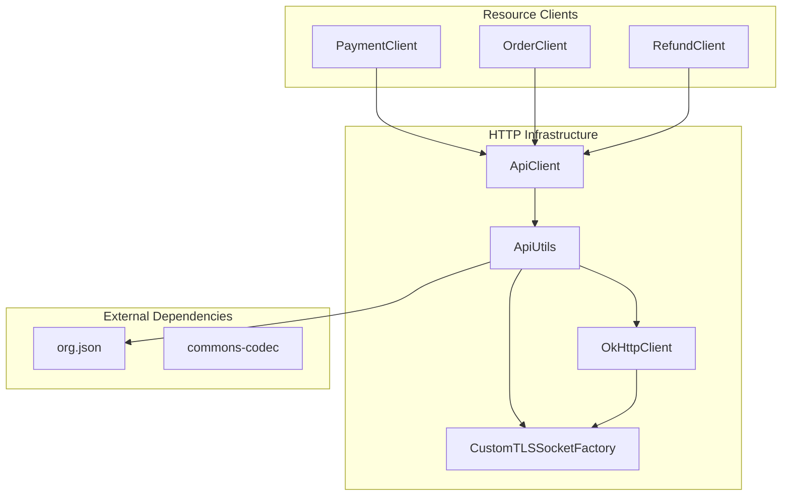
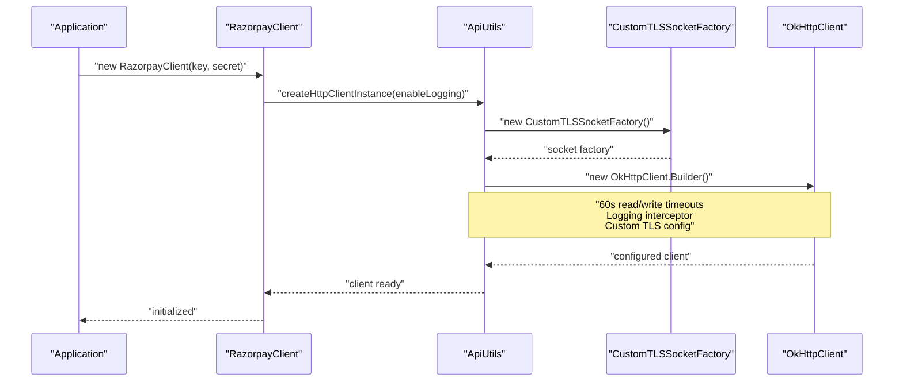
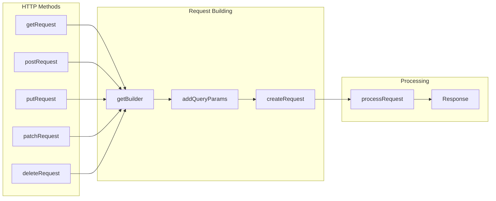
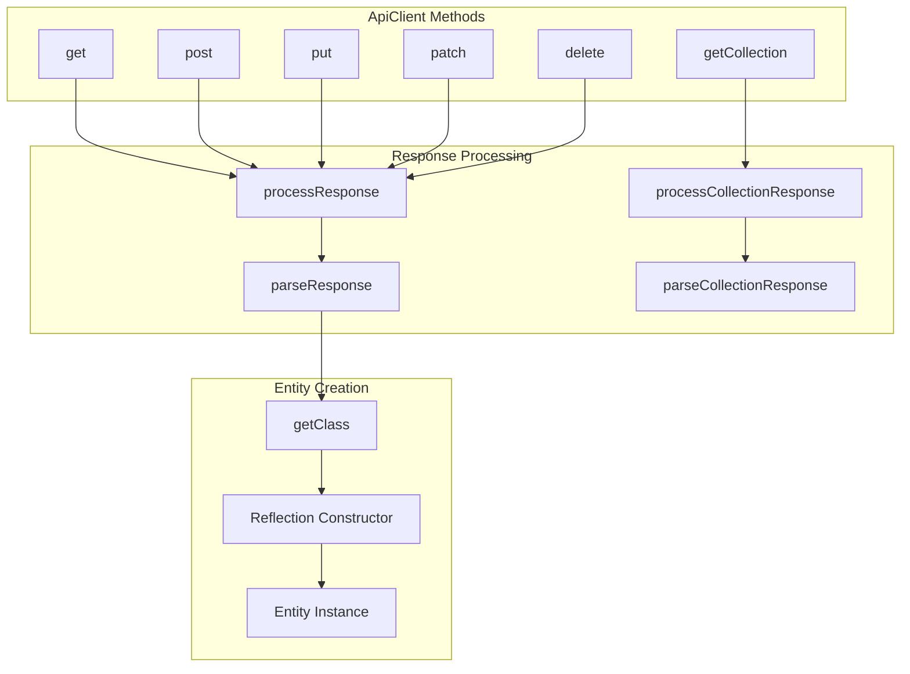
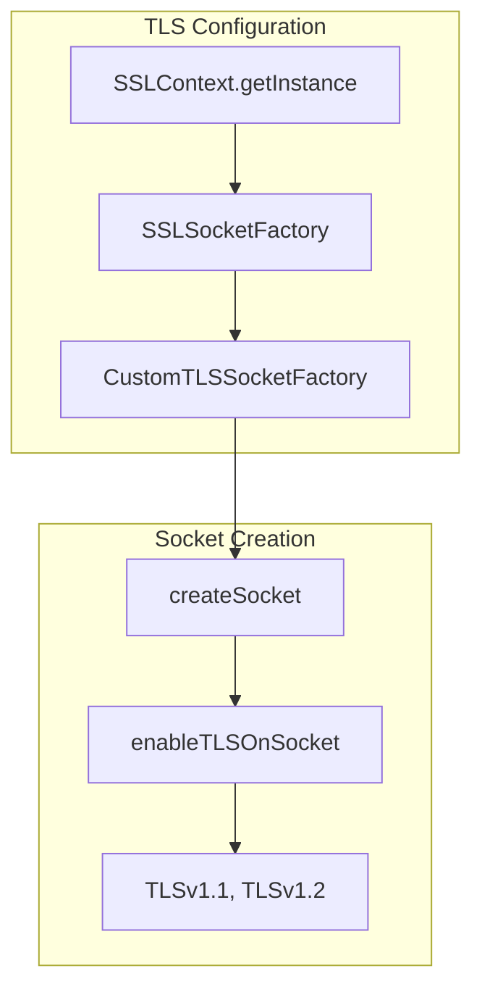
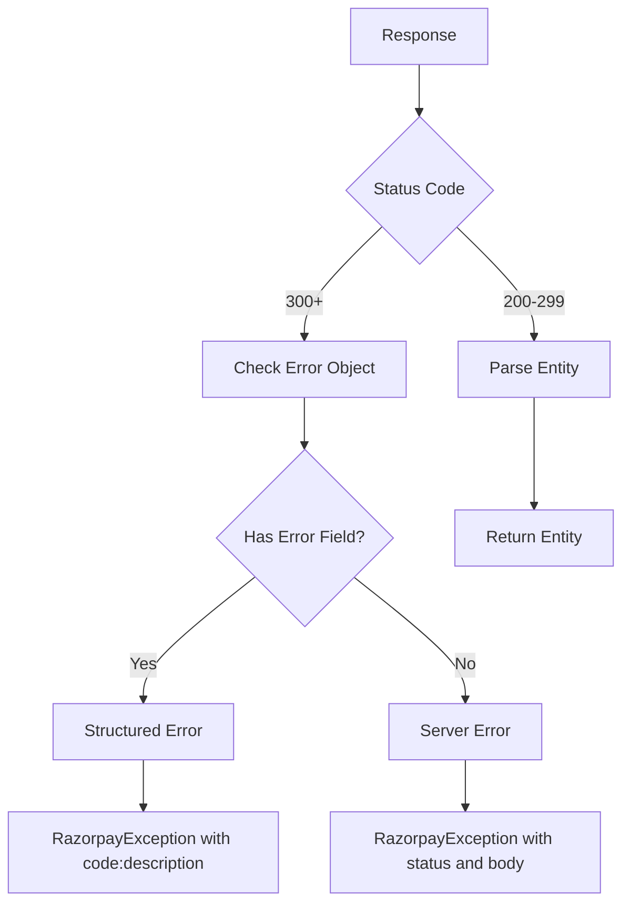

# HTTP Infrastructure

Relevant source files

The following files were used as context for generating this wiki page:

- [pom.xml](pom.xml)
- [src/main/java/com/razorpay/ApiClient.java](src/main/java/com/razorpay/ApiClient.java)
- [src/main/java/com/razorpay/ApiUtils.java](src/main/java/com/razorpay/ApiUtils.java)
- [src/main/java/com/razorpay/CustomTLSSocketFactory.java](src/main/java/com/razorpay/CustomTLSSocketFactory.java)

This document covers the HTTP communication layer of the Razorpay Java SDK, including HTTP client management, request/response processing, and security configuration. This infrastructure provides the foundation for all API communication between the SDK and Razorpay's REST API endpoints.

For authentication mechanisms and signature verification, see [Security & Authentication](#3.4). For API endpoint configuration and constants, see [Configuration](#3.5).

## Overview

The HTTP infrastructure consists of two primary components: `ApiUtils` for low-level HTTP operations and `ApiClient` for higher-level request processing. This layer handles HTTP client initialization, request construction, response parsing, and secure TLS communication.

Sources: [src/main/java/com/razorpay/ApiUtils.java:1-179](), [src/main/java/com/razorpay/ApiClient.java:1-194](), [pom.xml:43-75]()

## HTTP Client Configuration

The `ApiUtils` class manages a singleton `OkHttpClient` instance configured with specific timeouts, logging, and security settings.

The HTTP client is configured with the following settings:

| Configuration | Value | Purpose |
|---------------|-------|---------|
| Read Timeout | 60 seconds | Prevents hanging on slow responses |
| Write Timeout | 60 seconds | Prevents hanging on slow uploads |
| SSL Socket Factory | `CustomTLSSocketFactory` | Enforces TLS 1.1/1.2 protocols |
| Logging Level | BASIC or NONE | Configurable request/response logging |

Sources: [src/main/java/com/razorpay/ApiUtils.java:34-62](), [src/main/java/com/razorpay/ApiUtils.java:44-49]()

## Request Processing Flow

The HTTP infrastructure supports five HTTP methods through a consistent interface pattern:

Each HTTP method follows this pattern:
1. **URL Construction**: Build URL using `Constants` for scheme, hostname, port, and version
2. **Parameter Handling**: Add query parameters for GET/DELETE, JSON body for POST/PUT/PATCH
3. **Authentication**: Add Basic Auth header with API credentials
4. **User Agent**: Include SDK version and Java version information
5. **Execution**: Process request through OkHttp and handle responses

Sources: [src/main/java/com/razorpay/ApiUtils.java:68-125](), [src/main/java/com/razorpay/ApiUtils.java:127-144]()

## Response Processing Architecture

The `ApiClient` class provides typed response processing with automatic entity instantiation:

The response processing includes:
- **Status Code Validation**: Success range 200-299
- **Entity Recognition**: Uses `entity` field in JSON to determine class type
- **Dynamic Instantiation**: Creates appropriate entity objects using reflection
- **Collection Handling**: Processes arrays of entities in collection responses
- **Error Handling**: Structured error response parsing and exception throwing

Sources: [src/main/java/com/razorpay/ApiClient.java:99-146](), [src/main/java/com/razorpay/ApiClient.java:65-96](), [src/main/java/com/razorpay/ApiClient.java:186-193]()

## TLS Security Configuration

The `CustomTLSSocketFactory` enforces modern TLS protocols for secure communication:

The custom TLS implementation:
- **Protocol Enforcement**: Restricts to TLS 1.1 and TLS 1.2 only
- **Socket Wrapping**: Overrides all socket creation methods
- **Security Compliance**: Ensures encrypted communication with Razorpay API
- **Default Trust Manager**: Uses system's default certificate validation

Sources: [src/main/java/com/razorpay/CustomTLSSocketFactory.java:14-75](), [src/main/java/com/razorpay/CustomTLSSocketFactory.java:69-74]()

## Error Handling Mechanism

The HTTP infrastructure provides structured error handling with multiple fallback mechanisms:

| Error Type | Status Code | Handling Strategy |
|------------|-------------|-------------------|
| API Errors | 400-499 | Parse `error` object with `code` and `description` |
| Server Errors | 500+ | Include full response body and status code |
| Network Errors | N/A | Wrap IOException in RazorpayException |
| Parse Errors | N/A | Include original exception message |

Sources: [src/main/java/com/razorpay/ApiClient.java:169-184](), [src/main/java/com/razorpay/ApiUtils.java:157-163]()

## Dependencies and External Libraries

The HTTP infrastructure relies on these key dependencies:

| Dependency | Version | Purpose |
|------------|---------|---------|
| OkHttp | 3.10.0 | HTTP client and request/response handling |
| OkHttp Logging Interceptor | 3.10.0 | Request/response logging for debugging |
| org.json | 20180130 | JSON parsing and serialization |
| commons-codec | 1.11 | Base64 encoding for authentication |

Sources: [pom.xml:45-67]()
