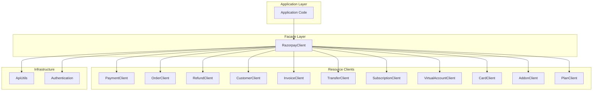
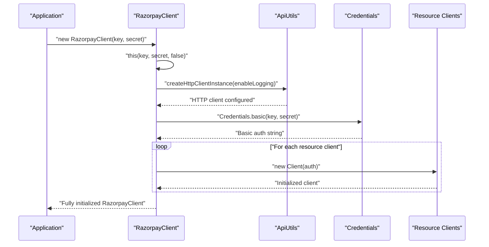
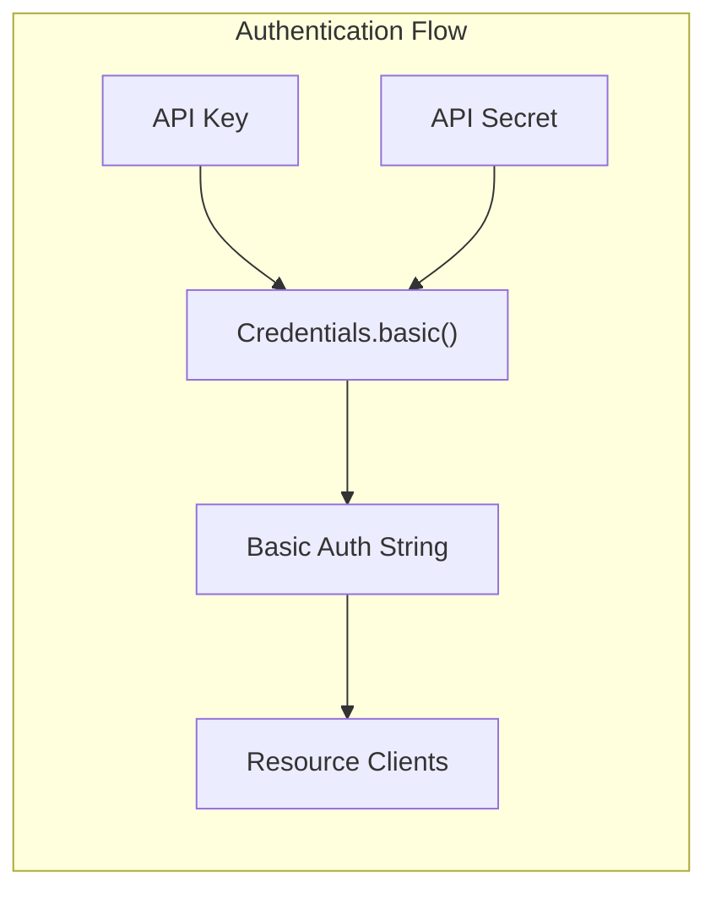
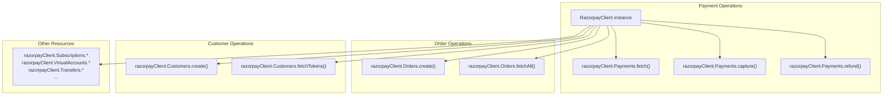

# RazorpayClient

<details>
<summary>Relevant source files</summary>

The following files were used as context for generating this wiki page:

- [README.md](README.md)
- [src/main/java/com/razorpay/RazorpayClient.java](src/main/java/com/razorpay/RazorpayClient.java)

</details>


This document covers the `RazorpayClient` class, which serves as the main entry point and facade for the Razorpay Java SDK. It provides unified access to all API resource clients and handles initialization, authentication, and configuration.

For details about the underlying HTTP communication layer, see [HTTP Infrastructure](#3.2). For authentication mechanisms and security features, see [Security & Authentication](#3.4).

## Overview

The `RazorpayClient` class implements the Facade pattern, providing a single entry point to access all Razorpay API functionality. It manages 11 specialized resource clients and handles common concerns like authentication, HTTP client initialization, and custom header management.



**Sources:** [src/main/java/com/razorpay/RazorpayClient.java:1-45]()

## Class Structure

The `RazorpayClient` class exposes all resource clients as public fields, allowing direct access to specialized functionality:

| Client Field | Type | Purpose |
|-------------|------|---------|
| `Payments` | `PaymentClient` | Payment operations (create, capture, refund) |
| `Refunds` | `RefundClient` | Standalone refund operations |
| `Orders` | `OrderClient` | Order creation and management |
| `Invoices` | `InvoiceClient` | Invoice lifecycle management |
| `Cards` | `CardClient` | Card information retrieval |
| `Customers` | `CustomerClient` | Customer and token management |
| `Transfers` | `TransferClient` | Transfer and reversal operations |
| `Subscriptions` | `SubscriptionClient` | Subscription lifecycle management |
| `Addons` | `AddonClient` | Subscription addon management |
| `Plans` | `PlanClient` | Billing plan operations |
| `VirtualAccounts` | `VirtualAccountClient` | Virtual account management |

**Sources:** [src/main/java/com/razorpay/RazorpayClient.java:9-19]()

## Initialization Process

The `RazorpayClient` provides two constructor overloads for different initialization scenarios:



### Basic Constructor

The primary constructor accepts API credentials and uses default settings:

```java
public RazorpayClient(String key, String secret) throws RazorpayException
```

This constructor internally calls the overloaded version with logging disabled.

**Sources:** [src/main/java/com/razorpay/RazorpayClient.java:21-23]()

### Constructor with Logging

The overloaded constructor provides control over HTTP request logging:

```java
public RazorpayClient(String key, String secret, Boolean enableLogging) throws RazorpayException
```

**Initialization Steps:**
1. **HTTP Client Setup**: Calls `ApiUtils.createHttpClientInstance(enableLogging)` to configure the shared HTTP client
2. **Authentication**: Creates Basic Auth credentials using `Credentials.basic(key, secret)`
3. **Client Instantiation**: Initializes all 11 resource clients with the authentication string

**Sources:** [src/main/java/com/razorpay/RazorpayClient.java:25-39]()

## Authentication Mechanism

The `RazorpayClient` uses HTTP Basic Authentication for API access:



The authentication string is generated using OkHttp's `Credentials.basic()` utility and passed to each resource client during initialization. This ensures all API requests include proper authentication headers.

**Sources:** [src/main/java/com/razorpay/RazorpayClient.java:27]()

## Custom Headers

The `RazorpayClient` supports adding custom headers that will be included in all API requests:

```java
public RazorpayClient addHeaders(Map<String, String> headers)
```

This method:
- Accepts a `Map<String, String>` containing header key-value pairs
- Delegates to `ApiUtils.addHeaders(headers)` for actual header management
- Returns the `RazorpayClient` instance to support method chaining

### Usage Example

```java
Map<String, String> headers = new HashMap<String, String>();
headers.put("X-Custom-Header", "custom-value");
razorpayClient.addHeaders(headers);
```

**Sources:** [src/main/java/com/razorpay/RazorpayClient.java:41-44](), [README.md:46-47]()

## Resource Client Access Pattern

All resource clients are accessible as public fields, enabling direct method invocation:



This design pattern allows developers to access functionality in an intuitive, namespace-like manner without requiring additional method calls or factory patterns.

**Sources:** [README.md:53-58](), [README.md:147-152](), [README.md:223-228]()

## Exception Handling

The `RazorpayClient` constructor throws `RazorpayException` if initialization fails. Common failure scenarios include:
- Invalid API credentials
- Network connectivity issues during HTTP client setup
- Missing required dependencies

Applications should handle this exception appropriately during client initialization.

**Sources:** [src/main/java/com/razorpay/RazorpayClient.java:21,25]()

## Thread Safety

The `RazorpayClient` instance and its resource clients share the same underlying HTTP client managed by `ApiUtils`. Once initialized, the client is thread-safe for concurrent API operations across multiple threads.

**Sources:** [src/main/java/com/razorpay/RazorpayClient.java:26]()
