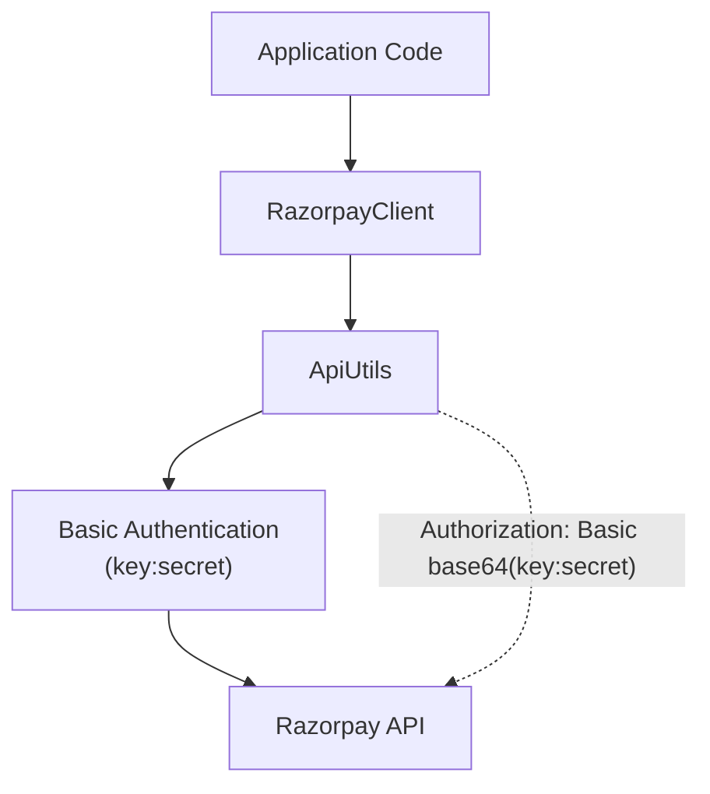
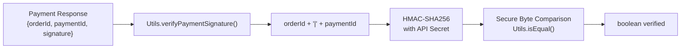
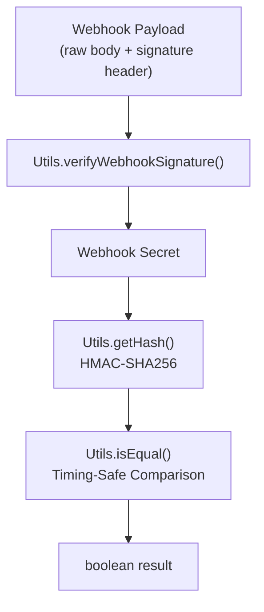
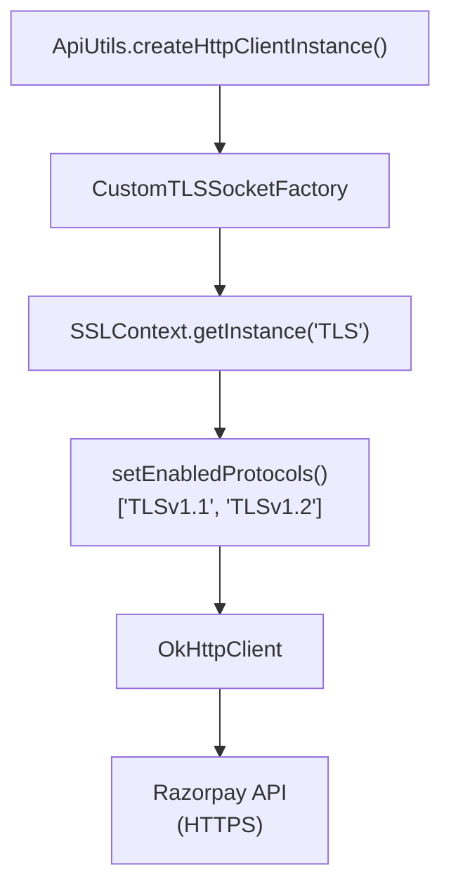
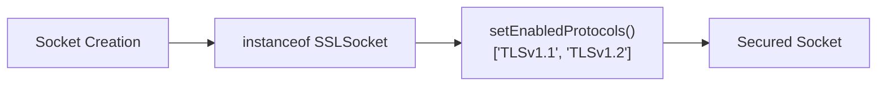

# Security & Authentication

Relevant source files

The following files were used as context for generating this wiki page:

- [pom.xml](pom.xml)
- [src/main/java/com/razorpay/CustomTLSSocketFactory.java](src/main/java/com/razorpay/CustomTLSSocketFactory.java)
- [src/main/java/com/razorpay/Utils.java](src/main/java/com/razorpay/Utils.java)

This document covers the security mechanisms and authentication patterns implemented in the Razorpay Java SDK. It details signature verification, TLS configuration, and authentication flows that ensure secure communication between your application and Razorpay's API.

For information about the HTTP infrastructure that implements these security measures, see [HTTP Infrastructure](#3.2). For details about error handling related to authentication failures, see [Error Handling](#9).

## Authentication Overview

The Razorpay Java SDK uses HTTP Basic Authentication with API credentials consisting of a key and secret pair. These credentials are embedded in every API request to authenticate your application with Razorpay's servers.

**Authentication Flow in Code Entities**

Sources: [src/main/java/com/razorpay/ApiUtils.java](), [src/main/java/com/razorpay/RazorpayClient.java]()

The authentication credentials are configured during `RazorpayClient` initialization and automatically applied to all subsequent API requests through the `ApiUtils` class.

## Signature Verification

The SDK provides cryptographic signature verification for both payment confirmations and webhook payloads. This ensures the authenticity and integrity of data received from Razorpay.

### Payment Signature Verification

Payment signatures verify that payment completion data has not been tampered with during transmission.

**Payment Signature Verification Process**

The verification process combines the order ID and payment ID with a pipe separator, then computes an HMAC-SHA256 hash using your API secret. The result is compared against the provided signature using a timing-attack-resistant comparison.

Sources: [src/main/java/com/razorpay/Utils.java:11-18]()

### Webhook Signature Verification

Webhook signatures ensure that incoming webhook payloads are genuinely from Razorpay and have not been modified.

**Webhook Verification Implementation**

Sources: [src/main/java/com/razorpay/Utils.java:20-23]()

### Cryptographic Implementation Details

The signature verification uses industry-standard HMAC-SHA256 hashing with several security considerations:

| Security Feature | Implementation | Purpose |
|------------------|----------------|---------|
| HMAC-SHA256 | `Mac.getInstance("HmacSHA256")` | Cryptographically secure hashing |
| Timing-Safe Comparison | `Utils.isEqual()` with XOR loop | Prevents timing attacks |
| UTF-8 Encoding | `secret.getBytes("UTF-8")` | Consistent character encoding |
| Hex Encoding | `Hex.encodeHex(hash)` | Standard signature format |

The timing-safe comparison prevents attackers from using response time differences to determine partial signature matches.

Sources: [src/main/java/com/razorpay/Utils.java:25-61]()

## TLS Configuration and Secure Connections

The SDK enforces secure TLS connections through a custom socket factory that ensures only modern TLS versions are used for API communication.

**TLS Security Implementation**

The `CustomTLSSocketFactory` class ensures that all SSL sockets created for API communication use only TLS 1.1 and TLS 1.2 protocols, rejecting older and potentially vulnerable SSL/TLS versions.

Sources: [src/main/java/com/razorpay/CustomTLSSocketFactory.java:14-75]()

### TLS Protocol Enforcement

The custom socket factory wraps the default SSL socket factory and enforces secure protocols on all created sockets:

**TLS Protocol Configuration**

Every socket creation method in `CustomTLSSocketFactory` calls `enableTLSOnSocket()` to ensure the socket uses only approved TLS versions, preventing downgrade attacks to older protocols.

Sources: [src/main/java/com/razorpay/CustomTLSSocketFactory.java:69-74]()

## Security Dependencies

The SDK relies on several security-focused dependencies to implement its authentication and verification features:

| Dependency | Version | Security Purpose |
|------------|---------|------------------|
| `commons-codec` | 1.11 | Hex encoding for signature verification |
| `okhttp3` | 3.10.0 | Secure HTTP client with TLS support |
| `org.json` | 20180130 | Safe JSON parsing and manipulation |

Sources: [pom.xml:63-73]()

### Security Considerations

The dependency versions are specifically chosen to avoid known security vulnerabilities:

- **commons-codec 1.11**: Provides secure hex encoding for HMAC signatures
- **OkHttp 3.10.0**: Includes robust TLS configuration and connection security
- **Java 7 Compatibility**: Maintains compatibility while supporting modern TLS protocols

The SDK's security model assumes that:
1. API credentials are stored securely by the integrating application
2. Network communication occurs over HTTPS
3. Webhook endpoints properly validate signatures before processing payloads
4. Applications handle authentication failures appropriately

Sources: [pom.xml:37-48](), [src/main/java/com/razorpay/CustomTLSSocketFactory.java:18-22]()
