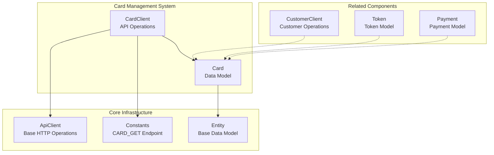
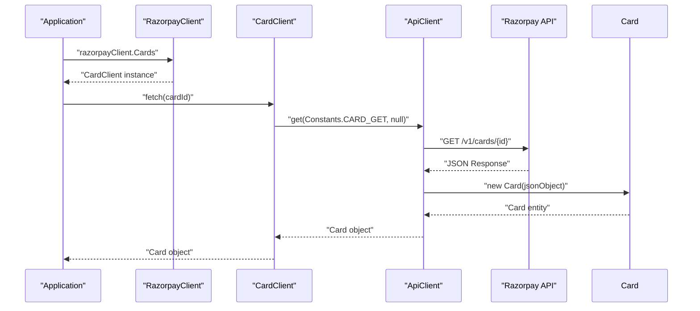
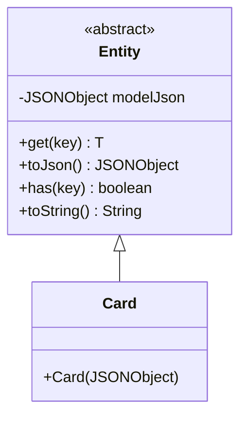
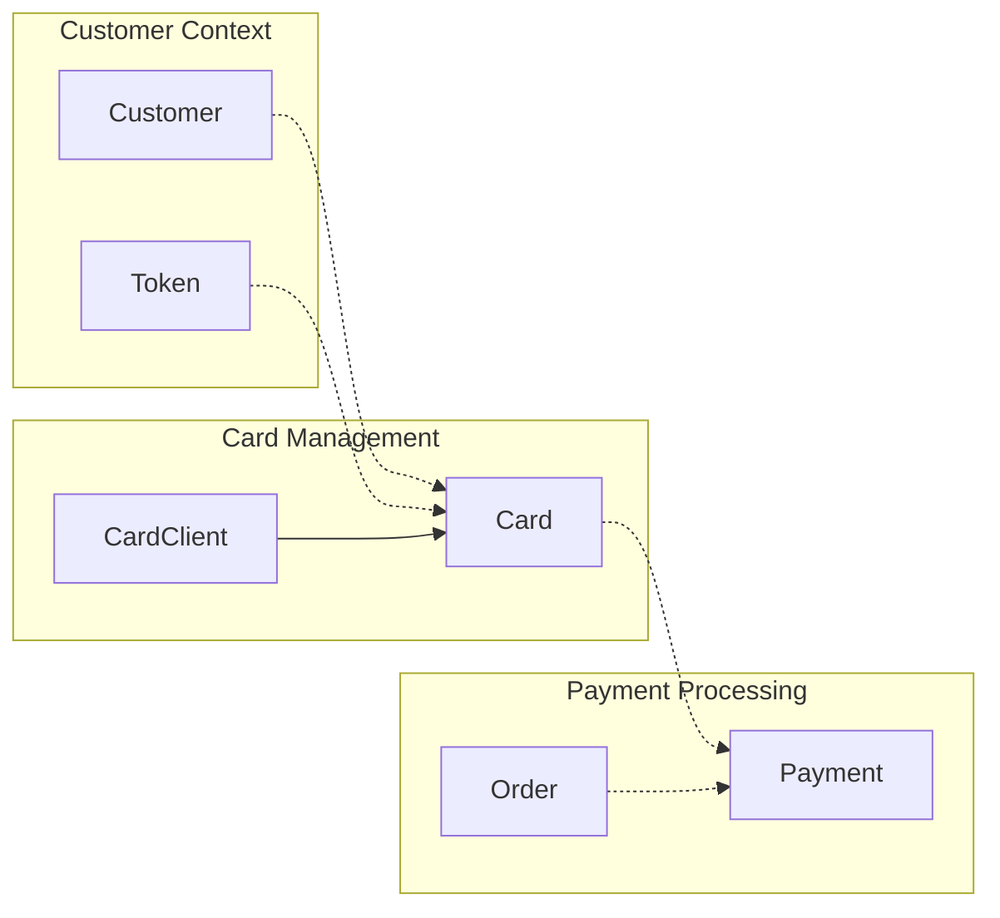

# Cards

<details>
<summary>Relevant source files</summary>

The following files were used as context for generating this wiki page:

- [src/main/java/com/razorpay/Card.java](src/main/java/com/razorpay/Card.java)
- [src/main/java/com/razorpay/CardClient.java](src/main/java/com/razorpay/CardClient.java)

</details>


This document covers the card management functionality in the Razorpay Java SDK, specifically focusing on the `CardClient` class and `Card` entity model. This includes card retrieval operations and the data structures used to represent card information.

For customer management operations that may involve cards, see [Customer Management](#6.1). For virtual account functionality, see [Virtual Accounts](#6.2).

## Overview

The card management system in the Razorpay Java SDK provides functionality to retrieve card information associated with customer accounts. The system follows the SDK's standard architecture pattern with a dedicated client class (`CardClient`) for API operations and an entity class (`Card`) for data representation.

The card functionality is primarily focused on retrieval operations, allowing applications to fetch card details using card identifiers. This is typically used in scenarios where applications need to display saved card information or validate card details during payment processing.

**Sources:** [src/main/java/com/razorpay/CardClient.java:1-12](), [src/main/java/com/razorpay/Card.java:1-10]()

## Architecture

### Card Component Structure



The card management system integrates with the SDK's core architecture by extending the base `ApiClient` and `Entity` classes. The `CardClient` inherits HTTP communication capabilities from `ApiClient`, while the `Card` model inherits JSON handling from `Entity`.

**Sources:** [src/main/java/com/razorpay/CardClient.java:3](), [src/main/java/com/razorpay/Card.java:5]()

### Card Operations Flow



The card retrieval flow follows the standard SDK pattern where the application accesses the `CardClient` through the main `RazorpayClient`, calls the `fetch` method with a card ID, and receives a structured `Card` object containing the card information.

**Sources:** [src/main/java/com/razorpay/CardClient.java:9-11](), [src/main/java/com/razorpay/Card.java:7-9]()

## Card Data Model

The `Card` class represents card information returned from the Razorpay API. It extends the base `Entity` class, providing access to card data through the inherited JSON handling methods.

### Card Entity Structure



The `Card` entity inherits all JSON manipulation capabilities from the `Entity` base class, allowing access to card properties using the `get()` method and JSON serialization through `toJson()`.

**Sources:** [src/main/java/com/razorpay/Card.java:5-10]()

## API Operations

The `CardClient` provides the following operations for card management:

### Card Retrieval

| Method | Purpose | Parameters | Return Type | Exceptions |
|--------|---------|------------|-------------|------------|
| `fetch` | Retrieve card by ID | `String id` | `Card` | `RazorpayException` |

The `fetch` method uses the `Constants.CARD_GET` endpoint to retrieve card information from the Razorpay API. The method formats the card ID into the API path and returns a `Card` object containing the response data.

```java
// Example usage (for reference only - actual implementation)
Card card = cardClient.fetch("card_abc123");
```

**Sources:** [src/main/java/com/razorpay/CardClient.java:9-11]()

### Error Handling

Card operations can throw `RazorpayException` when API requests fail. This includes cases such as:
- Invalid card ID
- Card not found
- Authentication failures
- Network connectivity issues

For comprehensive error handling information, see [Error Handling](#9).

**Sources:** [src/main/java/com/razorpay/CardClient.java:9]()

## Integration with Payment Ecosystem

### Card Relationships



Cards in the Razorpay ecosystem are typically associated with customers and can be tokenized for secure storage. The card information retrieved through `CardClient` can be used in payment processing workflows.

**Sources:** [src/main/java/com/razorpay/CardClient.java:1-12](), [src/main/java/com/razorpay/Card.java:1-10]()

## Client Access

The `CardClient` is accessible through the main `RazorpayClient` instance, following the SDK's consistent access pattern:

```java
// Access pattern (for reference only)
RazorpayClient razorpayClient = new RazorpayClient(keyId, keySecret);
CardClient cardClient = razorpayClient.Cards;
```

The client is initialized with authentication credentials and provides access to all card-related operations through a unified interface.

**Sources:** [src/main/java/com/razorpay/CardClient.java:5-7]()
