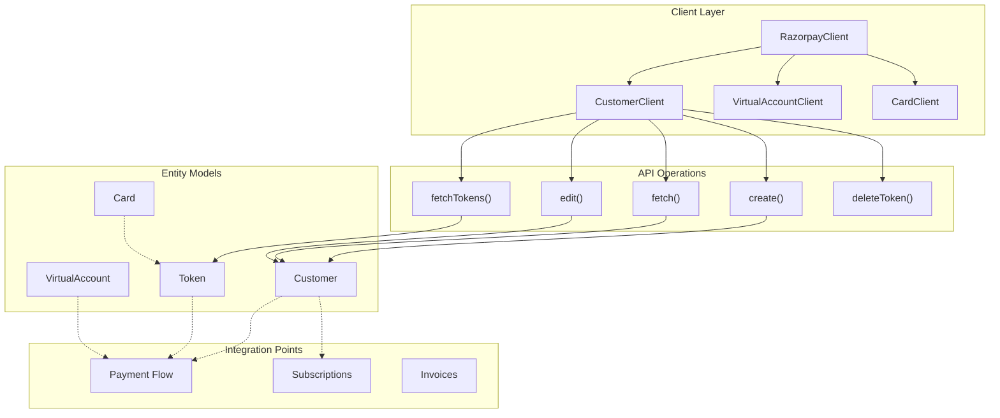
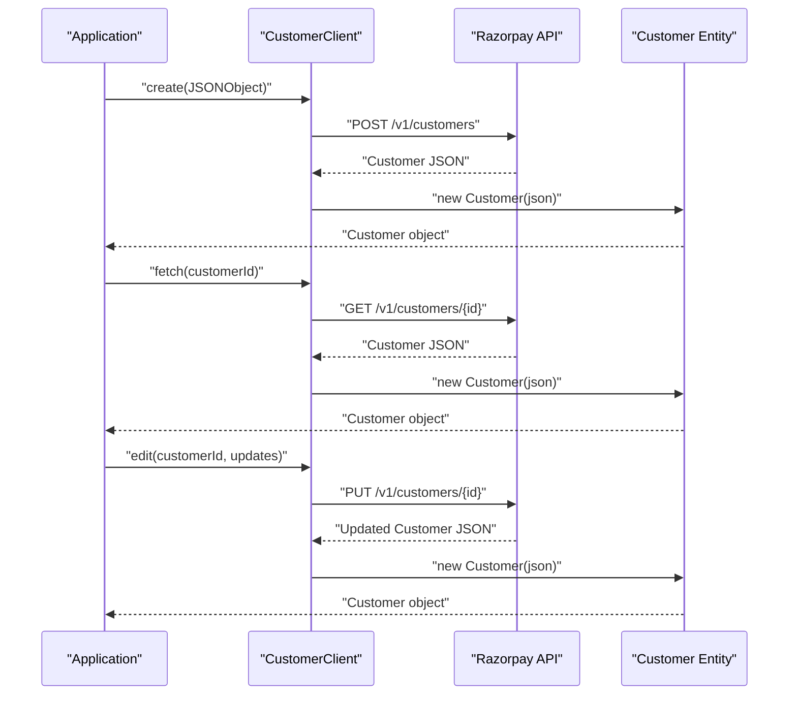
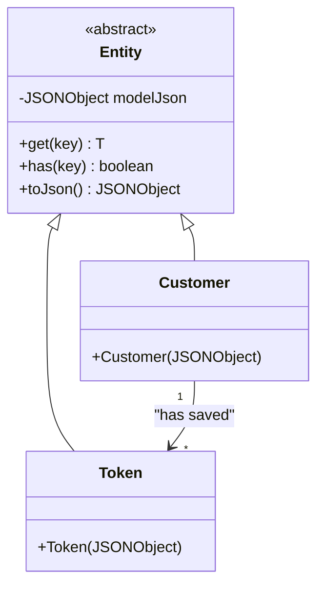
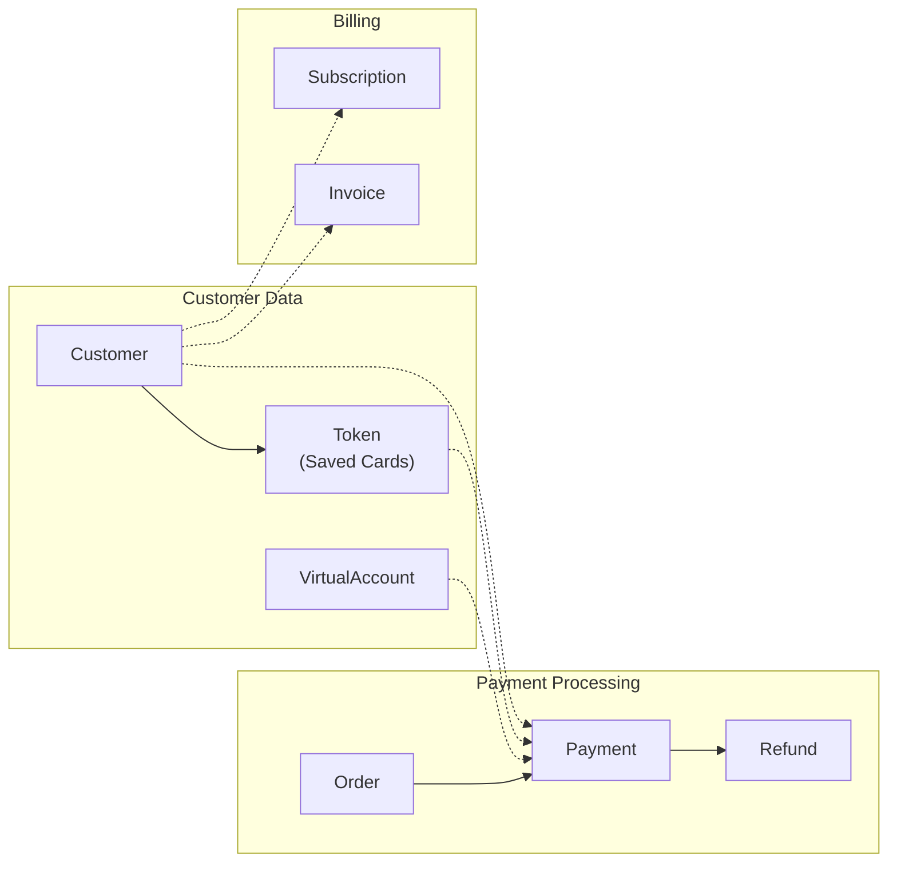

# Customer & Account Management

<details>
<summary>Relevant source files</summary>

The following files were used as context for generating this wiki page:

- [src/main/java/com/razorpay/Customer.java](src/main/java/com/razorpay/Customer.java)
- [src/main/java/com/razorpay/CustomerClient.java](src/main/java/com/razorpay/CustomerClient.java)
- [src/main/java/com/razorpay/Token.java](src/main/java/com/razorpay/Token.java)
- [src/main/resources/project.properties](src/main/resources/project.properties)

</details>


This document covers the customer and account management functionality within the Razorpay Java SDK. This includes customer lifecycle operations, token management for saved payment methods, virtual account handling, and card management operations.

For detailed payment processing operations, see [Payment Operations](#4). For subscription and billing management, see [Subscription & Billing](#7).

## Architecture Overview

The customer and account management system is built around several key components that work together to provide comprehensive customer data and payment method management.

### Customer Management System Architecture



**Sources:** [src/main/java/com/razorpay/CustomerClient.java:1-36]()

### Core Components

| Component | Purpose | Key Operations |
|-----------|---------|----------------|
| `CustomerClient` | Primary interface for customer operations | create, fetch, edit, token management |
| `Customer` | Entity representing customer data | Inherits from `Entity` base class |
| `Token` | Entity for saved payment methods | Represents tokenized cards/accounts |
| `VirtualAccountClient` | Manages virtual accounts | Account creation and payment collection |
| `CardClient` | Card-specific operations | Card data retrieval and management |

## CustomerClient Operations

The `CustomerClient` class provides the core functionality for customer lifecycle management through the following operations:

### Customer Lifecycle Methods



### Token Management Methods

The `CustomerClient` also handles token operations for managing saved payment methods:

| Method | Purpose | API Endpoint Pattern |
|--------|---------|---------------------|
| `fetchTokens(customerId)` | Retrieve all tokens for a customer | `Constants.TOKEN_LIST` |
| `fetchToken(customerId, tokenId)` | Get specific token details | `Constants.TOKEN_GET` |
| `deleteToken(customerId, tokenId)` | Remove a saved payment method | `Constants.TOKEN_DELETE` |

**Sources:** [src/main/java/com/razorpay/CustomerClient.java:25-35]()

## Data Models

### Customer Entity

The `Customer` class extends the base `Entity` class, providing access to customer data through the standard JSON-based interface.



### Data Access Patterns

Both `Customer` and `Token` entities follow the standard entity pattern:

- JSON-based data storage via `Entity.modelJson`
- Type-safe data access through `get(key)` methods
- Standard serialization via `toJson()`
- Existence checking with `has(key)`

**Sources:** [src/main/java/com/razorpay/Customer.java:1-11](), [src/main/java/com/razorpay/Token.java:1-10]()

## Integration with Payment Flow

Customer and account management integrates with the broader payment ecosystem:

### Payment Method Relationships



### Usage Patterns

- **Customer Creation**: Typically done before payment processing to maintain customer records
- **Token Management**: Enables saved payment methods for repeat purchases
- **Virtual Accounts**: Provides dedicated payment collection endpoints per customer
- **Card Management**: Handles card data retrieval and tokenization

## Client Access Pattern

Customer and account management functionality is accessed through the main `RazorpayClient`:

```
RazorpayClient razorpayClient = new RazorpayClient(key, secret);
CustomerClient customerClient = razorpayClient.Customers;
```

The client provides thread-safe access to all customer operations and maintains consistent authentication and error handling across all methods.

**Sources:** [src/main/java/com/razorpay/CustomerClient.java:7-11]()

## Related Documentation

For detailed information on specific areas:

- Customer creation, editing, and token operations: [Customer Management](#6.1)
- Virtual account setup and payment collection: [Virtual Accounts](#6.2)  
- Card data management and retrieval: [Cards](#6.3)
- Payment processing integration: [Payment Operations](#4)
- Recurring billing scenarios: [Subscription & Billing](#7)
