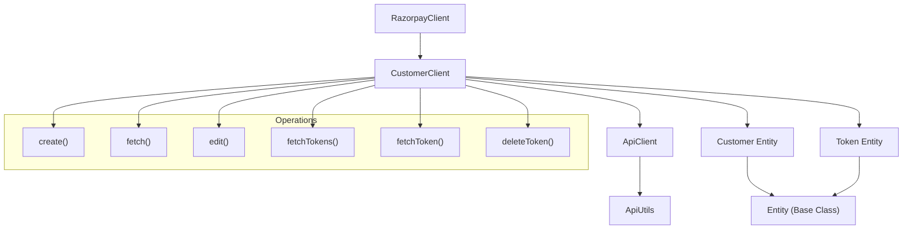
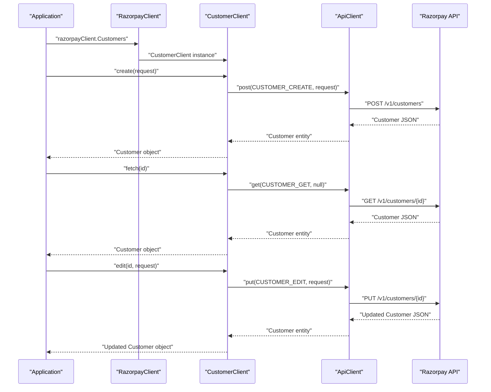
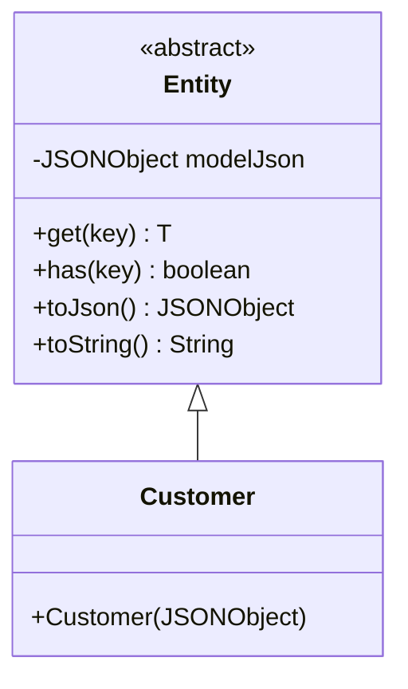
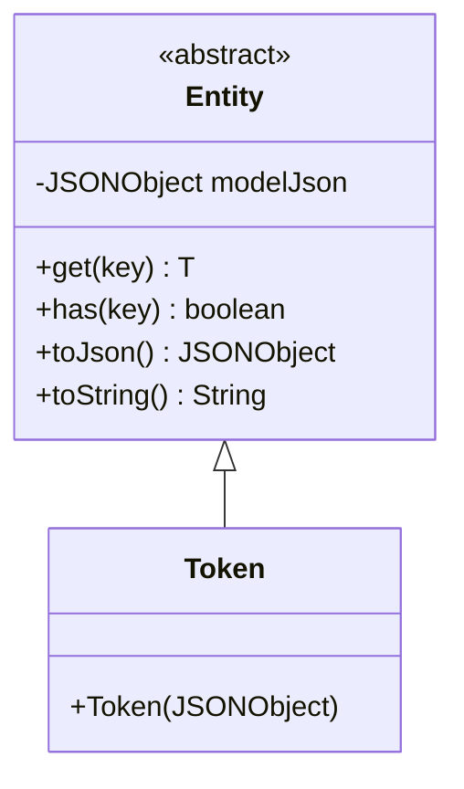

# Customer Management

Relevant source files

The following files were used as context for generating this wiki page:

- [src/main/java/com/razorpay/Customer.java](src/main/java/com/razorpay/Customer.java)
- [src/main/java/com/razorpay/CustomerClient.java](src/main/java/com/razorpay/CustomerClient.java)
- [src/main/java/com/razorpay/Token.java](src/main/java/com/razorpay/Token.java)
- [src/main/resources/project.properties](src/main/resources/project.properties)

This document covers customer creation, editing, and token management functionality in the Razorpay Java SDK. The customer management system allows applications to create and manage customer profiles, and associate payment tokens with those customers for recurring transactions.

For virtual account management, see [Virtual Accounts](#6.2). For card-specific operations, see [Cards](#6.3).

## Architecture Overview

The customer management system is built around the `CustomerClient` class, which provides methods for customer CRUD operations and token management. All customer and token data is represented using the `Customer` and `Token` entity classes respectively.

### Customer Management Components

Sources: [src/main/java/com/razorpay/CustomerClient.java:1-36](), [src/main/java/com/razorpay/Customer.java:1-10](), [src/main/java/com/razorpay/Token.java:1-10]()

## CustomerClient Class

The `CustomerClient` extends `ApiClient` and provides the primary interface for customer operations. It is initialized with authentication credentials and accessed through the main `RazorpayClient`.

### Customer Operations

The `CustomerClient` supports three core customer operations:

| Operation | Method | HTTP Verb | Purpose |
|-----------|--------|-----------|---------|
| Create | `create(JSONObject request)` | POST | Create a new customer |
| Fetch | `fetch(String id)` | GET | Retrieve customer by ID |
| Edit | `edit(String id, JSONObject request)` | PUT | Update existing customer |

### Customer Operation Flow

Sources: [src/main/java/com/razorpay/CustomerClient.java:13-23]()

## Token Management

Tokens represent saved payment methods associated with customers. The `CustomerClient` provides comprehensive token management capabilities including listing, fetching individual tokens, and deletion.

### Token Operations

| Operation | Method | Parameters | Purpose |
|-----------|--------|------------|---------|
| List Tokens | `fetchTokens(String id)` | Customer ID | Get all tokens for a customer |
| Fetch Token | `fetchToken(String id, String tokenId)` | Customer ID, Token ID | Get specific token |
| Delete Token | `deleteToken(String id, String tokenId)` | Customer ID, Token ID | Remove token |

### Token Management Implementation

The token operations use formatted URL constants to construct the appropriate API endpoints:

- `fetchTokens()` uses `Constants.TOKEN_LIST` with customer ID [src/main/java/com/razorpay/CustomerClient.java:25-27]()
- `fetchToken()` uses `Constants.TOKEN_GET` with both customer and token IDs [src/main/java/com/razorpay/CustomerClient.java:29-31]()
- `deleteToken()` uses `Constants.TOKEN_DELETE` with both IDs and returns void [src/main/java/com/razorpay/CustomerClient.java:33-35]()

Sources: [src/main/java/com/razorpay/CustomerClient.java:25-35]()

## Data Models

### Customer Entity

The `Customer` class extends the base `Entity` class and represents customer data returned from the Razorpay API. It uses the standard entity pattern for JSON data access.

Sources: [src/main/java/com/razorpay/Customer.java:5-10]()

### Token Entity

The `Token` class follows the same pattern as `Customer`, extending `Entity` to provide access to token data through the inherited JSON handling methods.

Sources: [src/main/java/com/razorpay/Token.java:5-9]()

## API Integration

All customer management operations integrate with the Razorpay REST API through the inherited `ApiClient` methods. The `CustomerClient` constructor takes an authentication string and passes it to the parent `ApiClient` class.

The client uses the following API patterns:
- `post()` for customer creation
- `get()` for single resource retrieval 
- `put()` for customer updates
- `getCollection()` for token lists
- `delete()` for token removal

Each method leverages predefined constants from the `Constants` class to construct proper API endpoints and automatically handles the conversion of JSON responses to appropriate entity objects.

Sources: [src/main/java/com/razorpay/CustomerClient.java:7-11]()
