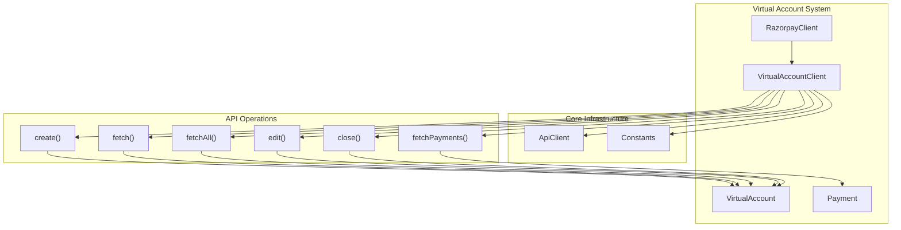
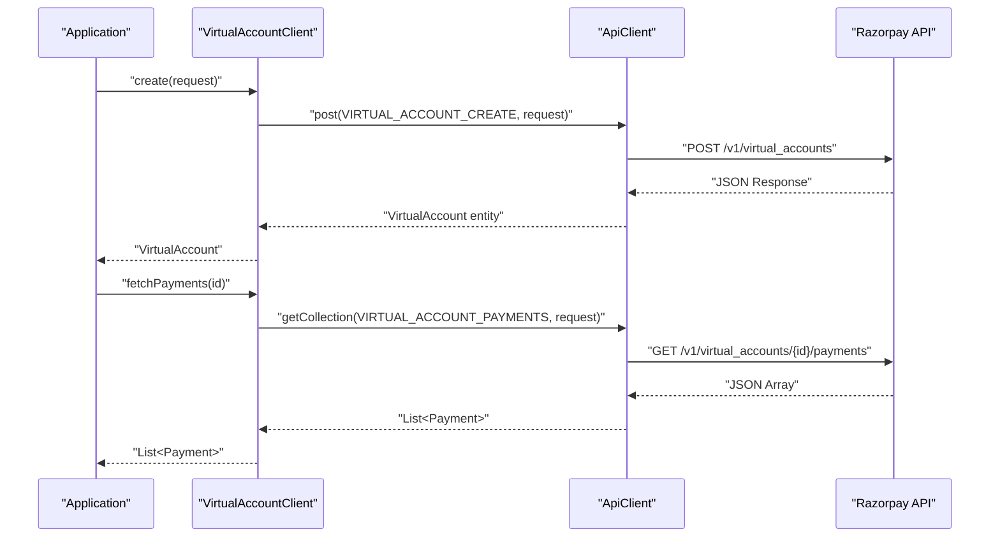
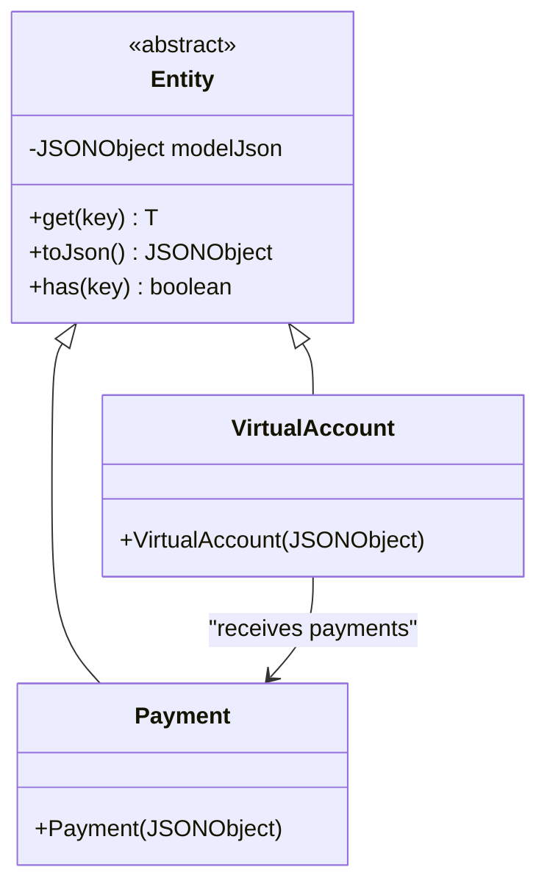

# Virtual Accounts

Relevant source files

The following files were used as context for generating this wiki page:

- [src/main/java/com/razorpay/VirtualAccount.java](src/main/java/com/razorpay/VirtualAccount.java)
- [src/main/java/com/razorpay/VirtualAccountClient.java](src/main/java/com/razorpay/VirtualAccountClient.java)

This document covers the virtual accounts functionality in the Razorpay Java SDK, including account creation, management, payment collection, and lifecycle operations. Virtual accounts enable businesses to accept payments through dedicated bank account numbers without maintaining actual bank accounts.

For general customer management operations, see [Customer Management](#6.1). For card-specific operations, see [Cards](#6.3).

## Overview

Virtual accounts in Razorpay allow merchants to create dedicated bank account numbers for collecting payments from customers. Each virtual account can receive payments through NEFT, RTGS, UPI, or other bank transfer methods. The SDK provides comprehensive management capabilities through the `VirtualAccountClient` class.

The virtual account system integrates with the broader payment processing infrastructure, automatically linking received payments to the appropriate virtual account and notifying the merchant through webhooks.

## VirtualAccountClient Operations

The `VirtualAccountClient` class provides all virtual account management operations and follows the standard SDK pattern of extending `ApiClient` for HTTP operations.

### Architecture Overview

**Sources:** [src/main/java/com/razorpay/VirtualAccountClient.java:7-44]()

### Core Operations

| Operation | Method | Purpose | Returns |
|-----------|--------|---------|---------|
| Create | `create(JSONObject request)` | Creates a new virtual account | `VirtualAccount` |
| Fetch | `fetch(String id)` | Retrieves a specific virtual account | `VirtualAccount` |
| List | `fetchAll()` / `fetchAll(JSONObject request)` | Retrieves all virtual accounts | `List<VirtualAccount>` |
| Edit | `edit(String id, JSONObject request)` | Updates virtual account details | `VirtualAccount` |
| Close | `close(String id)` | Closes an active virtual account | `VirtualAccount` |
| Payments | `fetchPayments(String id)` / `fetchPayments(String id, JSONObject request)` | Retrieves payments for a virtual account | `List<Payment>` |

### Client Implementation

The `VirtualAccountClient` implements standard CRUD operations using inherited HTTP methods from `ApiClient`:

**Sources:** [src/main/java/com/razorpay/VirtualAccountClient.java:13-43]()

## Data Model

### VirtualAccount Entity

The `VirtualAccount` class extends the base `Entity` class, providing JSON-based data access through the inherited methods:

- **Inheritance**: Extends `Entity` for consistent data handling
- **JSON Storage**: Internal `JSONObject` stores all account attributes
- **Type Safety**: Inherits type-safe getter methods from `Entity`

**Sources:** [src/main/java/com/razorpay/VirtualAccount.java:5-10]()

## Client Access Pattern

Virtual accounts are accessed through the main `RazorpayClient` using the standard sub-client pattern:

| Access Method | Description |
|---------------|-------------|
| `razorpayClient.VirtualAccounts` | Property-style access to `VirtualAccountClient` |
| Direct instantiation | `new VirtualAccountClient(auth)` for advanced use cases |

The client maintains authentication state and provides access to all virtual account operations through a unified interface.

## API Constants Integration

The `VirtualAccountClient` uses predefined constants for API endpoints, ensuring consistency and maintainability:

| Operation | Constant | HTTP Method |
|-----------|----------|-------------|
| Create | `VIRTUAL_ACCOUNT_CREATE` | POST |
| Fetch | `VIRTUAL_ACCOUNT_GET` | GET |
| List | `VIRTUAL_ACCOUNT_LIST` | GET |
| Edit | `VIRTUAL_ACCOUNT_EDIT` | PATCH |
| Close | `VIRTUAL_ACCOUNT_CLOSE` | POST |
| Payments | `VIRTUAL_ACCOUNT_PAYMENTS` | GET |

**Sources:** [src/main/java/com/razorpay/VirtualAccountClient.java:14-42]()

## Error Handling

All `VirtualAccountClient` operations can throw `RazorpayException` for various error conditions:

- **Authentication errors**: Invalid API credentials
- **Validation errors**: Malformed request data
- **Business logic errors**: Invalid account state transitions
- **Network errors**: API communication failures

For comprehensive error handling patterns, see [Error Handling](#9).

## Integration Points

Virtual accounts integrate with several other SDK components:

- **Payment Processing**: Virtual account payments are standard `Payment` entities
- **Customer Management**: Virtual accounts can be linked to customer records
- **Webhook Processing**: Payment notifications require signature verification
- **Transfer Operations**: Virtual account payments can trigger transfers

The virtual account system maintains consistency with the broader Razorpay payment ecosystem while providing specialized functionality for bank transfer collection.

**Sources:** [src/main/java/com/razorpay/VirtualAccountClient.java:1-44](), [src/main/java/com/razorpay/VirtualAccount.java:1-10]()
