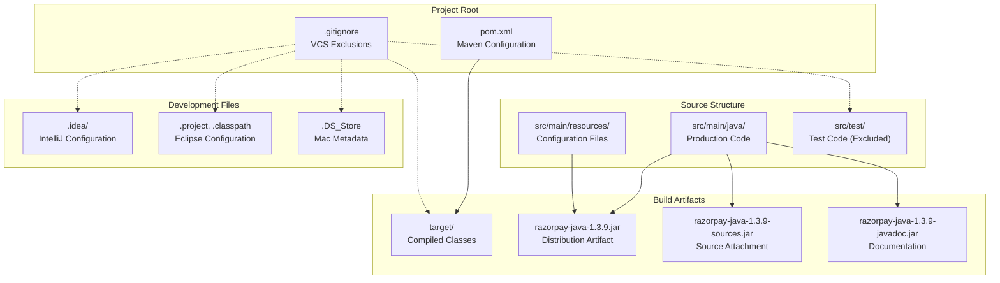
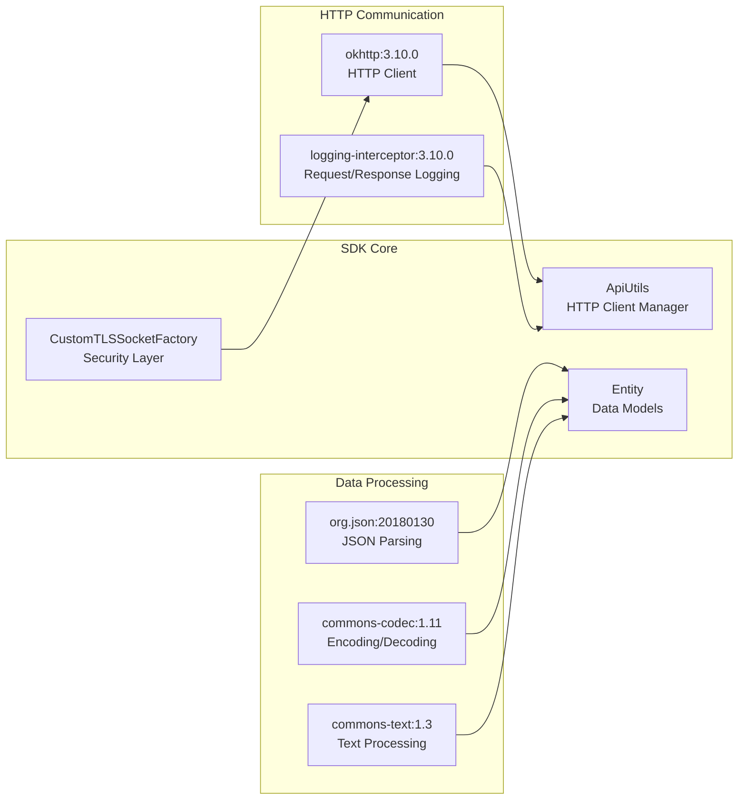
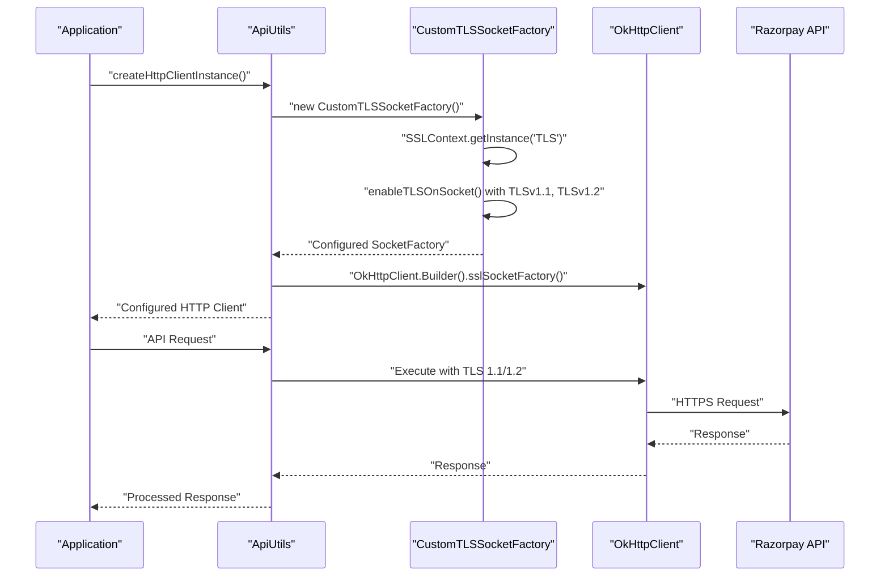
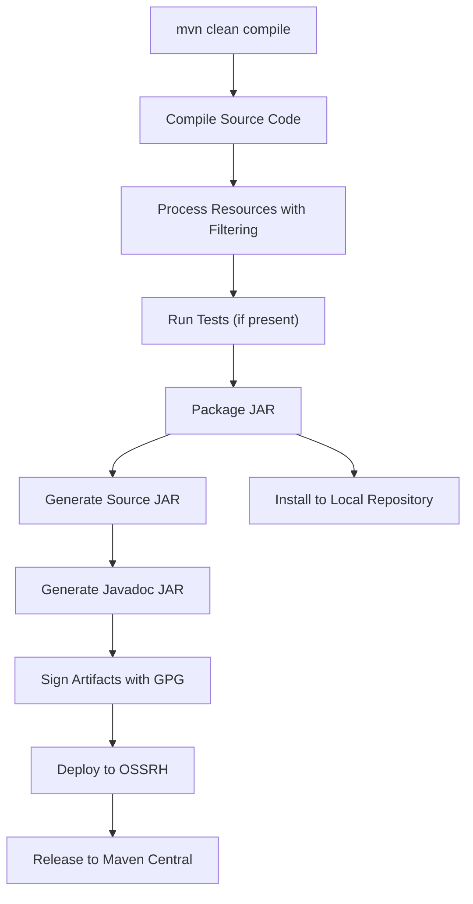

# Development & Build Setup

<details>
<summary>Relevant source files</summary>

The following files were used as context for generating this wiki page:

- [.gitignore](.gitignore)
- [pom.xml](pom.xml)
- [src/main/java/com/razorpay/CustomTLSSocketFactory.java](src/main/java/com/razorpay/CustomTLSSocketFactory.java)

</details>


This document covers the technical setup, build configuration, and development environment for the Razorpay Java SDK. It includes Maven project configuration, dependency management, build process, and development tools setup required to contribute to or extend the SDK.

For information about using the SDK in your applications, see [Quick Start Guide](#2). For details about the core architecture and design patterns, see [Core Architecture](#3).

## Prerequisites

The Razorpay Java SDK has specific requirements for development and runtime environments:

| Requirement | Version | Purpose |
|-------------|---------|---------|
| Java | 1.7+ | Source and target compatibility |
| Maven | 3.0+ | Build and dependency management |
| Git | Any recent version | Version control |

**Sources:** [pom.xml:39-40]()

## Project Structure

The SDK follows standard Maven project structure with specific configurations for secure payment processing:



**Sources:** [pom.xml:1-153](), [.gitignore:1-21]()

## Maven Project Configuration

The project is configured as a standard Maven JAR artifact with specific settings for open source distribution:

### Basic Project Information

| Property | Value | Description |
|----------|-------|-------------|
| `groupId` | `com.razorpay` | Organization identifier |
| `artifactId` | `razorpay-java` | Project identifier |
| `version` | `1.3.9` | Current release version |
| `packaging` | `jar` | Output format |

### Compiler Configuration

The SDK maintains Java 1.7 compatibility for broad platform support:

```xml
<properties>
    <project.build.sourceEncoding>UTF-8</project.build.sourceEncoding>
    <maven.compiler.source>1.7</maven.compiler.source>
    <maven.compiler.target>1.7</maven.compiler.target>
</properties>
```

**Sources:** [pom.xml:5-8](), [pom.xml:37-41]()

## Dependencies

The SDK uses carefully selected dependencies for HTTP communication, JSON processing, and security:



### Core Dependencies

| Dependency | Version | Purpose |
|------------|---------|---------|
| `com.squareup.okhttp3:okhttp` | 3.10.0 | HTTP client for API communication |
| `com.squareup.okhttp3:logging-interceptor` | 3.10.0 | HTTP request/response logging |
| `org.json:json` | 20180130 | JSON parsing and manipulation |
| `commons-codec:commons-codec` | 1.11 | Base64 and other encoding utilities |
| `org.apache.commons:commons-text` | 1.3 | Text processing utilities |

### Security Considerations

The SDK implements custom TLS socket factory for secure communications:



**Sources:** [pom.xml:43-75](), [src/main/java/com/razorpay/CustomTLSSocketFactory.java:18-22](), [src/main/java/com/razorpay/CustomTLSSocketFactory.java:69-74]()

## Build Process

The Maven build process includes several phases for quality assurance and distribution:

### Build Plugins

| Plugin | Version | Purpose |
|--------|---------|---------|
| `nexus-staging-maven-plugin` | 1.6.8 | Sonatype OSSRH deployment |
| `maven-source-plugin` | 3.0.1 | Source JAR generation |
| `maven-javadoc-plugin` | 3.0.1 | Javadoc JAR generation |
| `maven-gpg-plugin` | 1.6 | Artifact signing for security |

### Build Lifecycle



### Resource Filtering

The build process includes resource filtering for dynamic content:

```xml
<resources>
    <resource>
        <directory>src/main/resources</directory>
        <filtering>true</filtering>
    </resource>
</resources>
```

**Sources:** [pom.xml:88-151](), [pom.xml:90-95]()

## Development Environment Setup

### IDE Configuration

The project supports multiple IDEs with appropriate exclusions in version control:

#### IntelliJ IDEA
- Configuration files in `.idea/` directory
- Module files with `.iml` extension
- Workspace files with `.iws` extension

#### Eclipse
- Project configuration in `.project` file
- Classpath configuration in `.classpath` file
- Settings directory `.settings/`

### Git Configuration

The `.gitignore` file excludes development artifacts:

```
# Intellij
.idea/
*.iml
*.iws

#Eclipse  
.project
.settings/
.classpath

# Maven
target/

#Test
src/test/
```

**Sources:** [.gitignore:1-21]()

### Local Development Commands

| Command | Purpose |
|---------|---------|
| `mvn clean compile` | Compile source code |
| `mvn clean package` | Build JAR artifact |
| `mvn install` | Install to local Maven repository |
| `mvn clean package -DskipTests` | Build without running tests |

## Distribution Configuration

The SDK is distributed through Sonatype OSSRH to Maven Central:

### Repository Configuration

```xml
<distributionManagement>
    <snapshotRepository>
        <id>ossrh</id>
        <url>https://oss.sonatype.org/content/repositories/snapshots</url>
    </snapshotRepository>
    <repository>
        <id>ossrh</id>
        <url>https://oss.sonatype.org/service/local/staging/deploy/maven2/</url>
    </repository>
</distributionManagement>
```

### License and Metadata

The project includes complete metadata for open source distribution:

- **License:** MIT License
- **SCM:** GitHub repository `razorpay/razorpay-java`
- **Developer:** Razorpay team (`developers@razorpay.com`)
- **URL:** https://github.com/razorpay/razorpay-java

**Sources:** [pom.xml:77-86](), [pom.xml:14-35]()

## Security Build Considerations

The SDK implements several security measures at the build level:

### TLS Configuration

The `CustomTLSSocketFactory` ensures secure communications by enforcing TLS 1.1 and 1.2 protocols:

```java
private Socket enableTLSOnSocket(Socket socket) {
    if (socket != null && (socket instanceof SSLSocket)) {
        ((SSLSocket) socket).setEnabledProtocols(new String[] {"TLSv1.1", "TLSv1.2"});
    }
    return socket;
}
```

### Artifact Signing

All distributed artifacts are signed with GPG for integrity verification during the Maven build process.

**Sources:** [src/main/java/com/razorpay/CustomTLSSocketFactory.java:69-74](), [pom.xml:135-148]()
