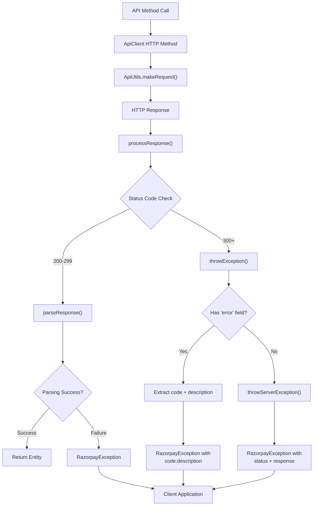
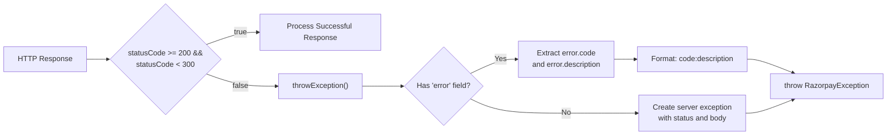

# Error Handling

<details>
<summary>Relevant source files</summary>

The following files were used as context for generating this wiki page:

- [src/main/java/com/razorpay/ApiClient.java](src/main/java/com/razorpay/ApiClient.java)
- [src/main/java/com/razorpay/RazorpayException.java](src/main/java/com/razorpay/RazorpayException.java)

</details>


This document covers the error handling mechanisms in the Razorpay Java SDK, including the `RazorpayException` class, error response processing, and best practices for handling API errors. For information about specific API operations and their usage patterns, see the individual feature pages under sections [4](#4) through [8](#8).

## Overview

The Razorpay Java SDK uses a centralized error handling approach through the `RazorpayException` class. All API operations can throw this checked exception, requiring developers to explicitly handle potential errors. The SDK processes both HTTP-level errors and API response errors, providing structured error information from the Razorpay API.

## RazorpayException Class

The `RazorpayException` class is the primary exception type used throughout the SDK. It extends Java's standard `Exception` class, making it a checked exception that must be handled or declared.

### Exception Constructors

| Constructor | Purpose |
|-------------|---------|
| `RazorpayException(String message)` | Basic exception with error message |
| `RazorpayException(String message, Throwable cause)` | Exception with message and underlying cause |
| `RazorpayException(Throwable cause)` | Exception wrapping another exception |
| `RazorpayException(String, Throwable, boolean, boolean)` | Full constructor with suppression and stack trace control |

**Sources:** [src/main/java/com/razorpay/RazorpayException.java:5-20]()

## Error Processing Flow

The following diagram illustrates how errors flow through the SDK's processing layers:

### Error Handling Flow



**Sources:** [src/main/java/com/razorpay/ApiClient.java:99-121](), [src/main/java/com/razorpay/ApiClient.java:169-184]()

## Error Response Processing

The SDK processes errors at multiple levels within the `ApiClient` class:

### HTTP Status Code Validation

The SDK validates HTTP status codes and treats responses outside the 200-299 range as errors:



**Sources:** [src/main/java/com/razorpay/ApiClient.java:115-120](), [src/main/java/com/razorpay/ApiClient.java:169-184]()

### API Error Response Format

When the Razorpay API returns an error, it follows a structured format that the SDK parses:

| Field | Location | Purpose |
|-------|----------|---------|
| `error` | Root level | Contains error details object |
| `error.code` | Error object | API-specific error code |
| `error.description` | Error object | Human-readable error description |

The SDK extracts these fields and formats them as `code:description` in the exception message.

**Sources:** [src/main/java/com/razorpay/ApiClient.java:16-25](), [src/main/java/com/razorpay/ApiClient.java:170-175]()

## Types of Errors

### SDK-Level Errors

These errors occur within the SDK itself during request processing or response parsing:

| Error Type | Cause | Example |
|------------|-------|---------|
| Null Response | Server returns null response | "Invalid Response from server" |
| IO Exception | Network or connection issues | IOException message wrapped |
| Parsing Error | Invalid JSON or entity creation failure | "Unable to parse response because of [reason]" |
| Missing Entity | Response lacks required entity field | "Unable to parse response" |

**Sources:** [src/main/java/com/razorpay/ApiClient.java:100-102](), [src/main/java/com/razorpay/ApiClient.java:111-113](), [src/main/java/com/razorpay/ApiClient.java:70-76]()

### API-Level Errors

These errors are returned by the Razorpay API and indicate business logic or validation failures:

- Authentication errors (invalid API key/secret)
- Validation errors (missing required fields)
- Business rule violations (insufficient balance, invalid state transitions)
- Rate limiting errors
- Resource not found errors

### Error Processing Methods

The `ApiClient` class contains several methods for handling different types of responses:

```mermaid
classDiagram
    class ApiClient {
        +processResponse(Response) Entity
        +processCollectionResponse(Response) ArrayList~Entity~
        +processDeleteResponse(Response) void
        -throwException(int, JSONObject) void
        -throwServerException(int, String) void
    }
    
    note for ApiClient : "All methods throw RazorpayException<br/>on error conditions"
```

**Sources:** [src/main/java/com/razorpay/ApiClient.java:99-184]()

## Best Practices

### Exception Handling Pattern

When using the SDK, always wrap API calls in try-catch blocks:

```java
try {
    Payment payment = razorpayClient.Payments.fetch(paymentId);
    // Process successful response
} catch (RazorpayException e) {
    // Handle error - check e.getMessage() for details
    logger.error("Payment fetch failed: " + e.getMessage());
}
```

### Error Message Format

SDK error messages follow these patterns:

| Error Source | Format | Example |
|--------------|--------|---------|
| API Error | `code:description` | `BAD_REQUEST_ERROR:Payment id is required` |
| Server Error | `Status Code: [code]\nServer response: [body]` | `Status Code: 500\nServer response: {...}` |
| SDK Error | Direct message | `Unable to parse response` |

### Common Error Scenarios

| Scenario | Typical Cause | Recommended Action |
|----------|---------------|-------------------|
| Authentication failure | Invalid API credentials | Verify key/secret configuration |
| Validation error | Missing/invalid request parameters | Check request data against API documentation |
| Network timeout | Connectivity issues | Implement retry logic with exponential backoff |
| Rate limiting | Too many requests | Implement request throttling |
| Server errors (5xx) | Razorpay service issues | Log error and retry later |

**Sources:** [src/main/java/com/razorpay/ApiClient.java:169-184]()
