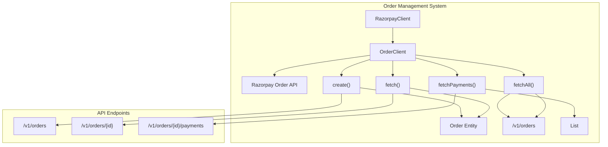
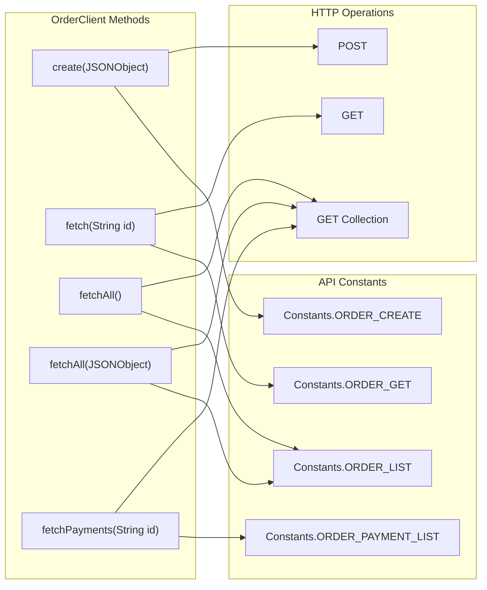
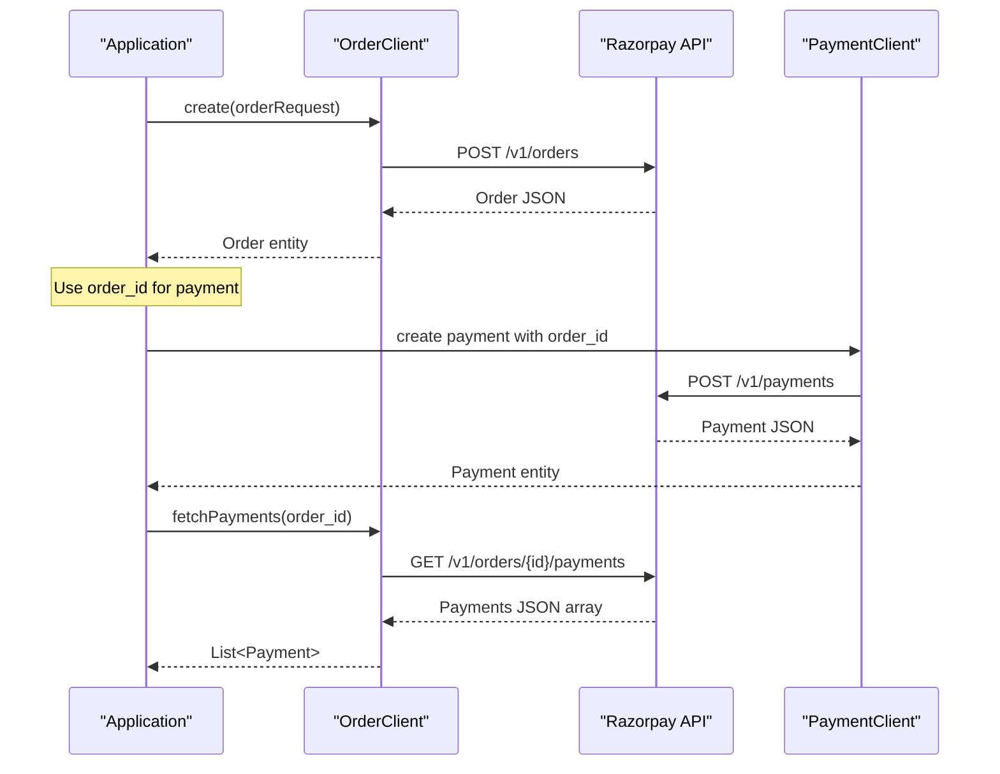

# Order Management

<details>
<summary>Relevant source files</summary>

The following files were used as context for generating this wiki page:

- [README.md](README.md)
- [src/main/java/com/razorpay/Order.java](src/main/java/com/razorpay/Order.java)
- [src/main/java/com/razorpay/OrderClient.java](src/main/java/com/razorpay/OrderClient.java)

</details>


## Purpose and Scope

This document covers the order management functionality within the Razorpay Java SDK. Orders serve as the foundation for payment processing, allowing merchants to pre-create payment intents with specific amounts, currencies, and receipt information before collecting payments from customers.

For payment processing operations after order creation, see [Payment Operations](#4). For customer management and virtual account integration with orders, see [Customer & Account Management](#6).

## Overview

The order management system in the Razorpay Java SDK provides a complete lifecycle for handling payment orders. Orders act as containers that define payment parameters and enable tracking of associated payments. The system consists of two main components: the `Order` entity for data representation and the `OrderClient` for API operations.



**Order Management Component Architecture**

Sources: [src/main/java/com/razorpay/OrderClient.java:1-32](), [src/main/java/com/razorpay/Order.java:1-10]()

## Order Entity

The `Order` class serves as the data model for order objects, extending the base `Entity` class to inherit common JSON handling capabilities.

```mermaid
classDiagram
    class Entity {
        <<abstract>>
        -JSONObject modelJson
        +get(key) T
        +toJson() JSONObject
        +has(key) boolean
        +toString() String
    }
    
    class Order {
        +Order(JSONObject)
    }
    
    Entity <|-- Order
    
    note for Order : "Simple data container\nfor order information"
    note for Entity : "Provides JSON handling\nand type conversion"
```

**Order Entity Class Hierarchy**

The `Order` entity is implemented as a minimal wrapper around JSON data, leveraging the parent `Entity` class for all data access operations. This design allows flexible access to order attributes while maintaining type safety through the entity's generic `get()` method.

| Property | Type | Description |
|----------|------|-------------|
| Constructor | `JSONObject` | Initializes order with API response data |
| Data Access | `Entity.get(key)` | Inherited generic accessor for order fields |
| Serialization | `Entity.toJson()` | Inherited JSON export functionality |

Sources: [src/main/java/com/razorpay/Order.java:5-10]()

## OrderClient Operations

The `OrderClient` class provides the primary interface for order management operations, extending `ApiClient` to inherit HTTP communication capabilities.



**OrderClient Method Mapping**

### Core Methods

| Method | Parameters | Return Type | Purpose |
|--------|------------|-------------|---------|
| `create` | `JSONObject request` | `Order` | Creates new order with specified parameters |
| `fetch` | `String id` | `Order` | Retrieves specific order by ID |
| `fetchAll` | None | `List<Order>` | Retrieves all orders without filtering |
| `fetchAll` | `JSONObject request` | `List<Order>` | Retrieves orders with filtering parameters |
| `fetchPayments` | `String id` | `List<Payment>` | Retrieves all payments associated with an order |

### Implementation Details

The `OrderClient` delegates to inherited `ApiClient` methods for HTTP operations:

- **POST operations**: [src/main/java/com/razorpay/OrderClient.java:13-15]() uses `post()` for order creation
- **GET operations**: [src/main/java/com/razorpay/OrderClient.java:25-27]() uses `get()` for single order retrieval
- **Collection operations**: [src/main/java/com/razorpay/OrderClient.java:17-23]() and [src/main/java/com/razorpay/OrderClient.java:29-31]() use `getCollection()` for list retrieval

Sources: [src/main/java/com/razorpay/OrderClient.java:7-32]()

## Order-Payment Relationship

Orders serve as the foundation for payment collection in the Razorpay ecosystem. The relationship between orders and payments follows a one-to-many pattern where a single order can have multiple payment attempts.



**Order to Payment Workflow**

### Order Creation Flow

1. **Order Initialization**: Applications create orders with amount, currency, and receipt information
2. **Payment Collection**: Orders are used as references during payment creation
3. **Payment Tracking**: The `fetchPayments()` method allows tracking all payment attempts for an order

### Key Relationships

| Aspect | Description |
|--------|-------------|
| **Order → Payments** | One order can have multiple payment attempts |
| **Payment Reference** | Payments reference orders via `order_id` field |
| **Status Tracking** | Orders maintain overall status while payments have individual statuses |

Sources: [src/main/java/com/razorpay/OrderClient.java:29-31](), [README.md:158-161]()

## API Endpoint Mapping

The `OrderClient` maps its methods to specific Razorpay API endpoints through the `Constants` class. This mapping provides a clear understanding of the underlying REST operations.

| Method | Constant | HTTP Method | Endpoint Pattern |
|--------|----------|-------------|------------------|
| `create()` | `Constants.ORDER_CREATE` | POST | `/v1/orders` |
| `fetchAll()` | `Constants.ORDER_LIST` | GET | `/v1/orders` |
| `fetch()` | `Constants.ORDER_GET` | GET | `/v1/orders/{id}` |
| `fetchPayments()` | `Constants.ORDER_PAYMENT_LIST` | GET | `/v1/orders/{id}/payments` |

### Endpoint Implementation

The client uses string formatting for parameterized endpoints:

```java
// Single order retrieval
String.format(Constants.ORDER_GET, id)

// Order payments retrieval  
String.format(Constants.ORDER_PAYMENT_LIST, id)
```

Sources: [src/main/java/com/razorpay/OrderClient.java:14](), [src/main/java/com/razorpay/OrderClient.java:22](), [src/main/java/com/razorpay/OrderClient.java:26](), [src/main/java/com/razorpay/OrderClient.java:30]()

## Usage Patterns

### Basic Order Creation

The most common pattern involves creating an order with required parameters:

```java
JSONObject options = new JSONObject();
options.put("amount", 5000); // Amount in paise
options.put("currency", "INR");
options.put("receipt", "txn_123456");
Order order = razorpayClient.Orders.create(options);
```

### Order Retrieval and Payment Tracking

```java
// Fetch specific order
Order order = razorpayClient.Orders.fetch("order_id");

// Get all payments for the order
List<Payment> payments = razorpayClient.Orders.fetchPayments("order_id");

// Fetch all orders with filtering
JSONObject filters = new JSONObject();
List<Order> orders = razorpayClient.Orders.fetchAll(filters);
```

### Error Handling Considerations

All `OrderClient` methods can throw `RazorpayException`, requiring proper exception handling in client applications. The inherited `ApiClient` functionality manages HTTP errors and API response validation.

Sources: [README.md:141-161](), [src/main/java/com/razorpay/OrderClient.java:13-31]()
