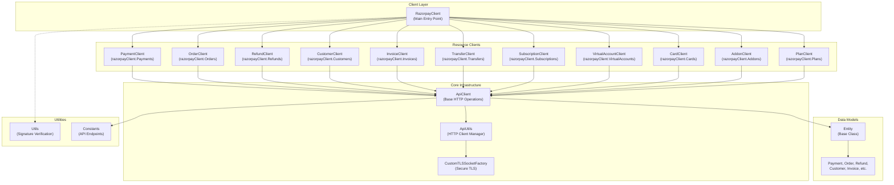
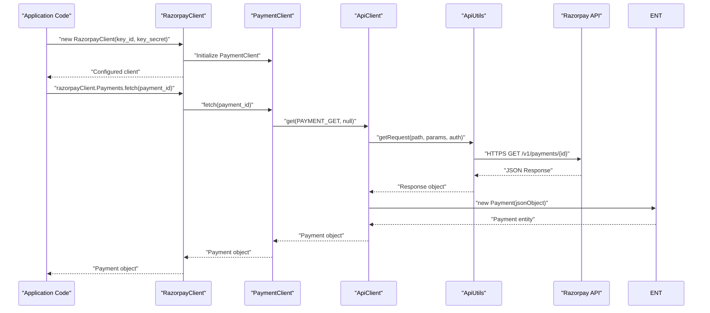

# Overview

Relevant source files

The following files were used as context for generating this wiki page:

- [LICENSE.txt](LICENSE.txt)
- [README.md](README.md)

## Purpose and Scope

This document provides a comprehensive overview of the Razorpay Java SDK, including its architecture, key components, and capabilities. It serves as the entry point for understanding how the SDK is structured and what functionality it provides for integrating with the Razorpay payment platform.

For detailed installation and setup instructions, see [Quick Start Guide](#2). For in-depth technical details about specific components, see [Core Architecture](#3) and its subsections.

## What is Razorpay Java SDK

The Razorpay Java SDK is the official Java client library for integrating with the [Razorpay API](https://docs.razorpay.com/docs/payments). It provides a comprehensive set of tools for payment processing, customer management, subscription billing, and other financial operations within Java applications.

**Key Specifications:**
- **Minimum Java Version:** Java 1.7+
- **Current Version:** 1.3.9 
- **License:** MIT License
- **Maven Coordinates:** `com.razorpay:razorpay-java:1.3.9`

Sources: [README.md:3-3](), [README.md:12-12](), [README.md:24-24](), [LICENSE.txt:1-1]()

## Key Features

The SDK provides comprehensive coverage of Razorpay's payment ecosystem:

| Feature Category | Capabilities | Primary Classes |
|------------------|--------------|----------------|
| **Payment Processing** | Create, capture, refund, transfer payments | `PaymentClient`, `Payment` |
| **Order Management** | Create orders, track payments | `OrderClient`, `Order` |
| **Customer Management** | Customer creation, token management | `CustomerClient`, `Customer`, `Token` |
| **Subscription Billing** | Recurring plans, subscriptions, addons | `PlanClient`, `SubscriptionClient`, `AddonClient` |
| **Alternative Payments** | Virtual accounts, invoices, bank transfers | `VirtualAccountClient`, `InvoiceClient` |
| **Transfers & Marketplace** | Direct transfers, reversals | `TransferClient`, `Transfer`, `Reversal` |
| **Security** | Signature verification, webhook validation | `Utils` |
| **Card Management** | Card details retrieval | `CardClient`, `Card` |

Sources: [README.md:50-422]()

## High-Level Architecture

The SDK follows a facade pattern with `RazorpayClient` serving as the main entry point to specialized resource clients:

### SDK Component Architecture

Sources: Based on architectural analysis of the codebase structure and [README.md:38-422]()

### Request Processing Flow

Sources: Based on method patterns shown in [README.md:42-98]()

## Core Components

### Main Entry Point
- **`RazorpayClient`**: Primary facade providing access to all SDK functionality through specialized clients ([README.md:42-42]())

### Resource Clients
Each client handles operations for a specific Razorpay API domain:
- **`PaymentClient`**: Payment creation, capture, refund operations ([README.md:53-125]())
- **`OrderClient`**: Order management and payment tracking ([README.md:147-161]())
- **`CustomerClient`**: Customer and token management ([README.md:223-252]())
- **`SubscriptionClient`**: Subscription lifecycle management ([README.md:337-353]())

### Infrastructure Layer
- **`ApiClient`**: Base class providing common HTTP operations for all resource clients
- **`ApiUtils`**: HTTP client management with OkHttp integration and secure TLS configuration
- **`Entity`**: Base class for all data models with JSON handling capabilities

### Security & Utilities
- **`Utils`**: Signature verification for payments and webhooks ([README.md:165-175]())
- **`Constants`**: API endpoint definitions and configuration values

Sources: Based on architectural patterns and [README.md:36-422]()

## Supported Operations

The SDK provides comprehensive coverage of Razorpay's API capabilities:

**Core Payment Operations:**
- Payment creation, fetching, capturing, and refunding
- Transfer creation and management for marketplace scenarios
- Bank transfer data retrieval

**Order & Customer Management:**
- Order creation and payment tracking
- Customer creation, editing, and token management
- Card management and retrieval

**Subscription & Billing:**
- Plan creation and management
- Subscription lifecycle operations
- Addon management for subscriptions

**Advanced Features:**
- Virtual account creation and management
- Invoice generation and cancellation
- Webhook signature verification
- Custom API request capabilities

For detailed documentation of each operation, see:
- [Payment Operations](#4) for payment-related functionality
- [Order Management](#5) for order operations
- [Customer & Account Management](#6) for customer and account features
- [Subscription & Billing](#7) for recurring billing operations
- [Additional Features](#8) for transfers, invoices, and other capabilities

Sources: [README.md:50-422]()

## Development Information

**Build System:** Maven-based project with Gradle support
**Dependencies:** Minimal external dependencies including OkHttp for HTTP operations and org.json for JSON processing
**Security:** Built-in TLS 1.1/1.2 enforcement and signature verification capabilities

For development setup and build configuration details, see [Development & Build Setup](#10).

Sources: [README.md:16-34]()
