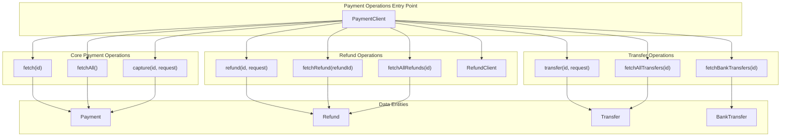
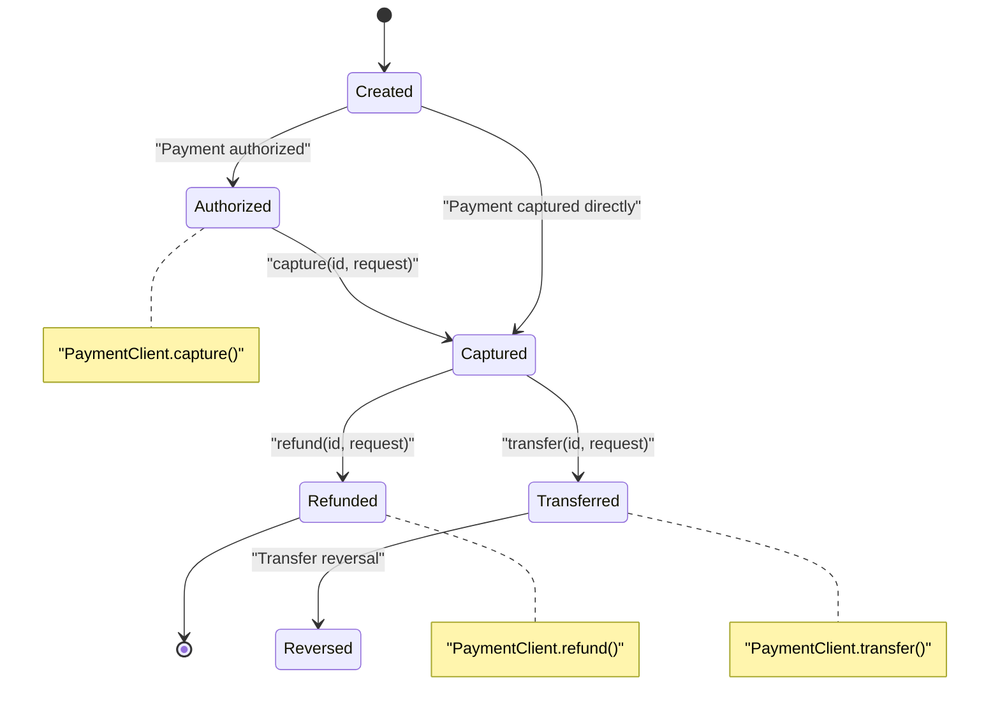
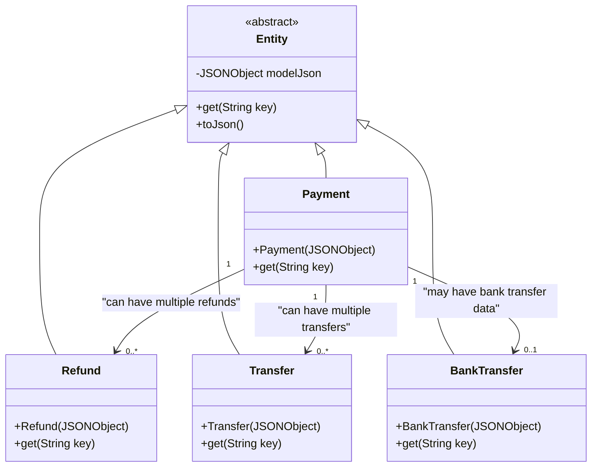

# Payment Operations

Relevant source files

The following files were used as context for generating this wiki page:

- [README.md](README.md)
- [src/main/java/com/razorpay/Payment.java](src/main/java/com/razorpay/Payment.java)
- [src/main/java/com/razorpay/PaymentClient.java](src/main/java/com/razorpay/PaymentClient.java)

## Purpose and Scope

This document provides a comprehensive overview of payment-related functionality in the Razorpay Java SDK, covering the core operations for processing payments, handling refunds, and managing payment transfers. The `PaymentClient` class serves as the primary interface for all payment operations, providing methods to fetch, capture, refund, and transfer payments.

For detailed order creation and management, see [Order Management](#5). For customer and account-related operations, see [Customer & Account Management](#6). Specific payment and refund implementation details are covered in [Payments](#4.1) and [Refunds](#4.2) respectively.

## Payment Operations Architecture

The payment operations are built around the `PaymentClient` class, which extends `ApiClient` and provides access to all payment-related functionality. The client manages payment lifecycle operations and integrates with refund and transfer subsystems.

**Sources:** [src/main/java/com/razorpay/PaymentClient.java:1-83](), [src/main/java/com/razorpay/Payment.java:1-10]()

## Payment Lifecycle Operations

The SDK supports the complete payment lifecycle through dedicated methods in `PaymentClient`. Each operation corresponds to specific API endpoints and returns typed entity objects.

| Operation | Method | Purpose | Returns |
|-----------|--------|---------|---------|
| Fetch Single | `fetch(String id)` | Retrieve a specific payment by ID | `Payment` |
| Fetch Multiple | `fetchAll()` / `fetchAll(JSONObject request)` | Retrieve payments with optional filtering | `List<Payment>` |
| Capture | `capture(String id, JSONObject request)` | Capture an authorized payment | `Payment` |
| Refund | `refund(String id)` / `refund(String id, JSONObject request)` | Process full or partial refunds | `Refund` |
| Transfer | `transfer(String id, JSONObject request)` | Create transfers from payment | `List<Transfer>` |

**Sources:** [src/main/java/com/razorpay/PaymentClient.java:18-32](), [README.md:50-125]()

## Payment State Flow

Payments in the Razorpay system follow a specific state flow, and the SDK provides operations that correspond to each state transition:

**Sources:** [src/main/java/com/razorpay/PaymentClient.java:30-44](), [README.md:65-115]()

## Refund Integration

The `PaymentClient` provides multiple approaches to handle refunds, integrating with a dedicated `RefundClient` for comprehensive refund management:

### Direct Payment Refunds
- `refund(String id)` - Full refund of a payment
- `refund(String id, JSONObject request)` - Partial refund with amount specification
- `fetchRefund(String id, String refundId)` - Fetch specific refund for a payment
- `fetchAllRefunds(String id)` - Get all refunds for a payment

### Standalone Refund Operations
- `refund(JSONObject request)` - Creates refund through `RefundClient`
- `fetchRefund(String refundId)` - Fetch refund by ID through `RefundClient`
- `fetchAllRefunds(JSONObject request)` - Fetch refunds with filters through `RefundClient`

**Sources:** [src/main/java/com/razorpay/PaymentClient.java:34-64](), [README.md:73-98]()

## Transfer and Bank Transfer Operations

The SDK provides comprehensive support for payment transfers and bank transfer data retrieval:

### Transfer Operations
- `transfer(String id, JSONObject request)` - Create transfers from a payment to marketplace accounts
- `fetchAllTransfers(String id)` - Retrieve all transfers associated with a payment

### Bank Transfer Data
- `fetchBankTransfers(String id)` - Retrieve bank transfer information for payments received via bank transfer

The transfer operations use direct API calls through `ApiUtils.postRequest()` rather than the standard `ApiClient` methods, indicating their specialized nature for marketplace scenarios.

**Sources:** [src/main/java/com/razorpay/PaymentClient.java:66-82](), [README.md:100-125]()

## Entity Relationships

The payment operations work with several interconnected entity types that represent different aspects of the payment ecosystem:

**Sources:** [src/main/java/com/razorpay/Payment.java:1-10](), [src/main/java/com/razorpay/PaymentClient.java:1-83]()

## Error Handling Considerations

All payment operations in `PaymentClient` throw `RazorpayException` for error conditions. Common scenarios include:

- **Payment Not Found**: When fetching payments with invalid IDs
- **Capture Failures**: When attempting to capture already captured or failed payments
- **Refund Errors**: When refund amount exceeds available balance or payment is not refundable
- **Transfer Failures**: When marketplace account validation fails or insufficient balance

For comprehensive error handling patterns, see [Error Handling](#9).

**Sources:** [src/main/java/com/razorpay/PaymentClient.java:18-82]()

## Integration Patterns

The `PaymentClient` follows consistent patterns for API interaction:

1. **Authentication**: All operations use the auth token passed during client initialization
2. **Request Format**: Operations accepting parameters use `JSONObject` for request data
3. **Response Processing**: Single entities return typed objects, collections return `List<T>`
4. **URL Construction**: API endpoints use `String.format()` with constants from `Constants` class

Common usage patterns include chaining operations (fetch → capture → refund) and batch processing (fetchAll with filtering for bulk operations).

**Sources:** [src/main/java/com/razorpay/PaymentClient.java:13-83](), [README.md:40-125]()
