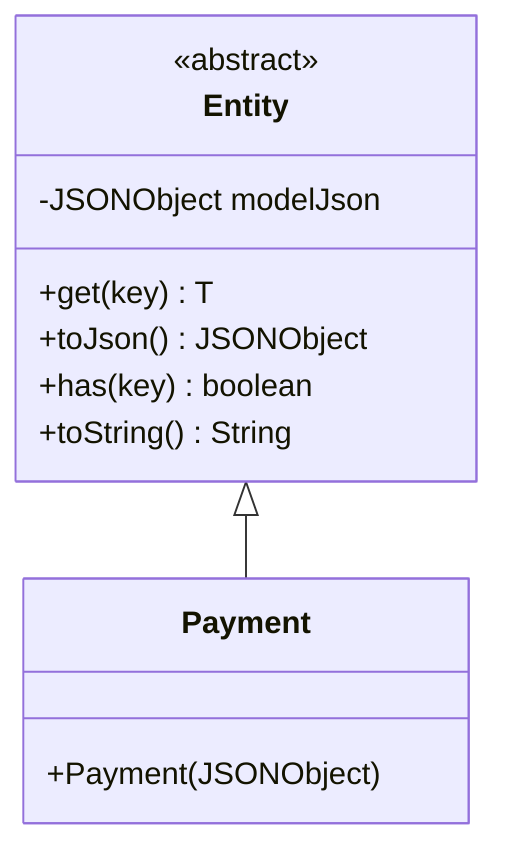
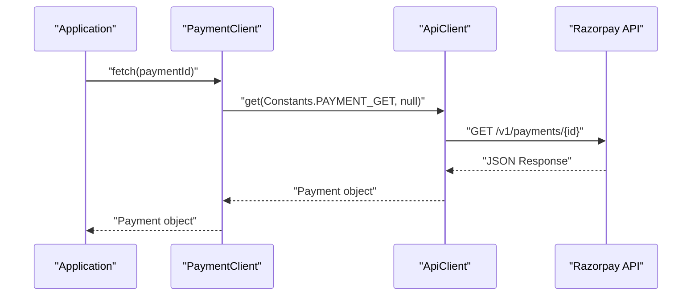
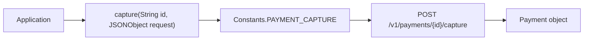
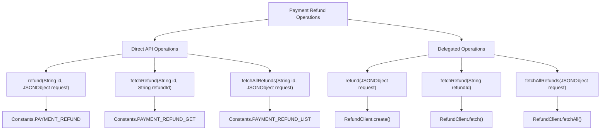
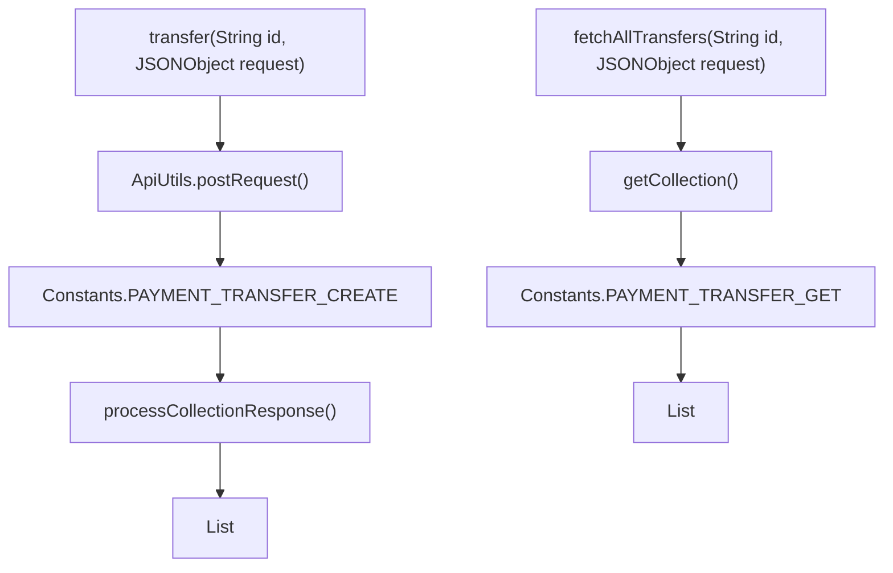
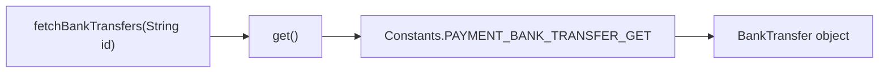

# Payments

Relevant source files

The following files were used as context for generating this wiki page:

- [src/main/java/com/razorpay/Payment.java](src/main/java/com/razorpay/Payment.java)
- [src/main/java/com/razorpay/PaymentClient.java](src/main/java/com/razorpay/PaymentClient.java)

## Purpose and Scope

This page documents the Payment system within the Razorpay Java SDK, specifically covering payment operations available through the `PaymentClient` class and the `Payment` data model. This includes payment retrieval, capturing, refund operations, transfers, and bank transfer data access.

For standalone refund operations not tied to specific payments, see [Refunds](#4.2). For order creation that typically precedes payment collection, see [Order Management](#5). For detailed transfer management including reversals, see [Transfers](#8.1).

## Payment Data Model

The `Payment` class serves as the primary data model for payment entities returned by the Razorpay API. It extends the base `Entity` class to provide JSON-based data access with automatic type conversion and timestamp handling.

**Payment Entity Structure**
The `Payment` class inherits all functionality from `Entity`, providing access to payment data through the base class methods. Payment objects contain fields such as payment ID, amount, currency, status, created timestamps, and payment method details.

Sources: [src/main/java/com/razorpay/Payment.java:1-10](), [src/main/java/com/razorpay/Entity.java]()

## PaymentClient Operations Overview

The `PaymentClient` class provides comprehensive payment management functionality through inheritance from `ApiClient`. It also maintains a `RefundClient` instance for payment-specific refund operations.

```mermaid
graph TD
    PaymentClient["PaymentClient"] --> ApiClient["ApiClient"]
    PaymentClient --> RefundClient["RefundClient"]
    
    PaymentClient --> fetch["fetch(String id)"]
    PaymentClient --> fetchAll1["fetchAll()"]
    PaymentClient --> fetchAll2["fetchAll(JSONObject request)"]
    PaymentClient --> capture["capture(String id, JSONObject request)"]
    PaymentClient --> refund1["refund(String id)"]
    PaymentClient --> refund2["refund(String id, JSONObject request)"]
    PaymentClient --> refund3["refund(JSONObject request)"]
    PaymentClient --> fetchRefund1["fetchRefund(String id, String refundId)"]
    PaymentClient --> fetchRefund2["fetchRefund(String refundId)"]
    PaymentClient --> fetchAllRefunds1["fetchAllRefunds(String id)"]
    PaymentClient --> fetchAllRefunds2["fetchAllRefunds(String id, JSONObject request)"]
    PaymentClient --> fetchAllRefunds3["fetchAllRefunds(JSONObject request)"]
    PaymentClient --> transfer["transfer(String id, JSONObject request)"]
    PaymentClient --> fetchAllTransfers1["fetchAllTransfers(String id)"]
    PaymentClient --> fetchAllTransfers2["fetchAllTransfers(String id, JSONObject request)"]
    PaymentClient --> fetchBankTransfers["fetchBankTransfers(String id)"]
    
    fetch --> PAYMENT_GET["Constants.PAYMENT_GET"]
    fetchAll2 --> PAYMENT_LIST["Constants.PAYMENT_LIST"]
    capture --> PAYMENT_CAPTURE["Constants.PAYMENT_CAPTURE"]
    refund2 --> PAYMENT_REFUND["Constants.PAYMENT_REFUND"]
    fetchRefund1 --> PAYMENT_REFUND_GET["Constants.PAYMENT_REFUND_GET"]
    fetchAllRefunds2 --> PAYMENT_REFUND_LIST["Constants.PAYMENT_REFUND_LIST"]
    transfer --> PAYMENT_TRANSFER_CREATE["Constants.PAYMENT_TRANSFER_CREATE"]
    fetchAllTransfers2 --> PAYMENT_TRANSFER_GET["Constants.PAYMENT_TRANSFER_GET"]
    fetchBankTransfers --> PAYMENT_BANK_TRANSFER_GET["Constants.PAYMENT_BANK_TRANSFER_GET"]
```

**PaymentClient Initialization**
The `PaymentClient` is initialized with authentication credentials and automatically creates a `RefundClient` instance for handling payment-specific refund operations.

Sources: [src/main/java/com/razorpay/PaymentClient.java:13-16]()

## Core Payment Operations

### Payment Retrieval

| Method | Purpose | Parameters | Returns |
|--------|---------|------------|---------|
| `fetch(String id)` | Retrieve a single payment | Payment ID | `Payment` object |
| `fetchAll()` | Retrieve all payments | None | `List<Payment>` |
| `fetchAll(JSONObject request)` | Retrieve payments with filters | Query parameters | `List<Payment>` |

The `fetch` method uses the `PAYMENT_GET` endpoint pattern to retrieve individual payments by ID. The `fetchAll` methods use the `PAYMENT_LIST` endpoint and support optional filtering through request parameters.

Sources: [src/main/java/com/razorpay/PaymentClient.java:18-28]()

### Payment Capture

The `capture` method allows capturing of authorized payments that were created with `capture=false`. This is essential for two-step payment flows where authorization and capture are separated.

Sources: [src/main/java/com/razorpay/PaymentClient.java:30-32]()

## Refund Operations Through Payments

The `PaymentClient` provides multiple refund operation patterns, bridging between payment-specific refunds and standalone refund operations.

### Refund Method Variations

| Method | Purpose | Delegation |
|--------|---------|------------|
| `refund(String id)` | Full refund of payment | Direct API call |
| `refund(String id, JSONObject request)` | Partial/custom refund | Direct API call |
| `refund(JSONObject request)` | Standalone refund creation | Delegates to `RefundClient` |

### Refund Retrieval Operations

| Method | Purpose | Scope |
|--------|---------|-------|
| `fetchRefund(String id, String refundId)` | Get specific payment refund | Payment-specific |
| `fetchRefund(String refundId)` | Get refund by ID only | Delegates to `RefundClient` |
| `fetchAllRefunds(String id, ...)` | List payment refunds | Payment-specific |
| `fetchAllRefunds(JSONObject request)` | List all refunds | Delegates to `RefundClient` |

Sources: [src/main/java/com/razorpay/PaymentClient.java:34-64]()

## Transfer Operations

Payment transfers enable marketplace scenarios where payments need to be distributed to multiple accounts. Transfer operations are available directly through `PaymentClient` for payment-specific transfers.

### Transfer Methods

| Method | Purpose | Returns |
|--------|---------|---------|
| `transfer(String id, JSONObject request)` | Create transfers for payment | `List<Transfer>` |
| `fetchAllTransfers(String id)` | Get all payment transfers | `List<Transfer>` |
| `fetchAllTransfers(String id, JSONObject request)` | Get filtered payment transfers | `List<Transfer>` |

The `transfer` method uses direct `ApiUtils.postRequest` calls rather than the inherited `ApiClient` methods, indicating special handling for transfer creation responses.

Sources: [src/main/java/com/razorpay/PaymentClient.java:66-78]()

## Bank Transfer Operations

The `fetchBankTransfers` method provides access to bank transfer data associated with payments, returning a `BankTransfer` entity containing transfer details.

This operation is read-only and provides information about bank transfer details for payments that were made via bank transfer methods.

Sources: [src/main/java/com/razorpay/PaymentClient.java:80-82]()

## Usage Patterns

The `PaymentClient` follows consistent patterns established by the SDK architecture:

1. **Authentication**: Inherited from `ApiClient` through constructor injection
2. **Error Handling**: All methods throw `RazorpayException` for API errors
3. **Response Processing**: Uses inherited `get`, `post`, and `getCollection` methods
4. **Delegation**: Leverages `RefundClient` for operations that can work independently of payments
5. **Constants**: All API endpoints are defined in the `Constants` class for maintainability

The client serves as both a direct API interface for payment-specific operations and a facade that coordinates with other specialized clients like `RefundClient` for cross-cutting functionality.

Sources: [src/main/java/com/razorpay/PaymentClient.java:1-83]()
