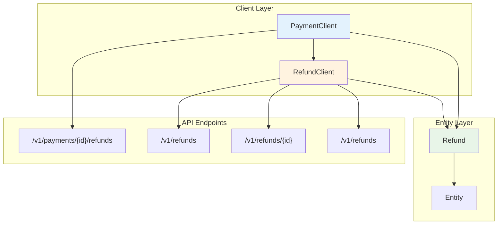
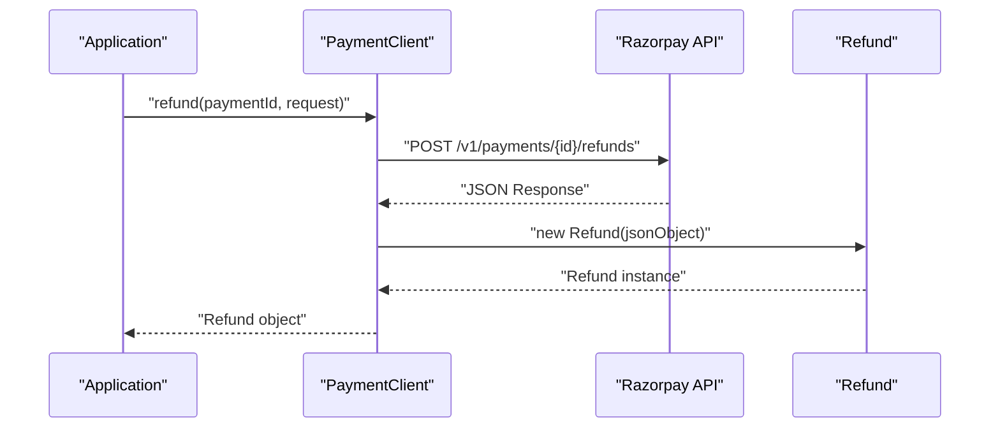
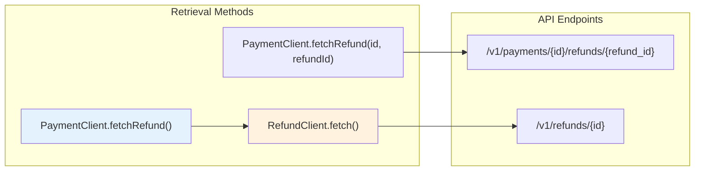
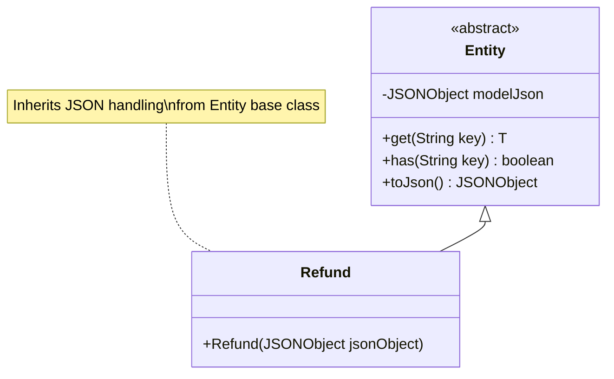
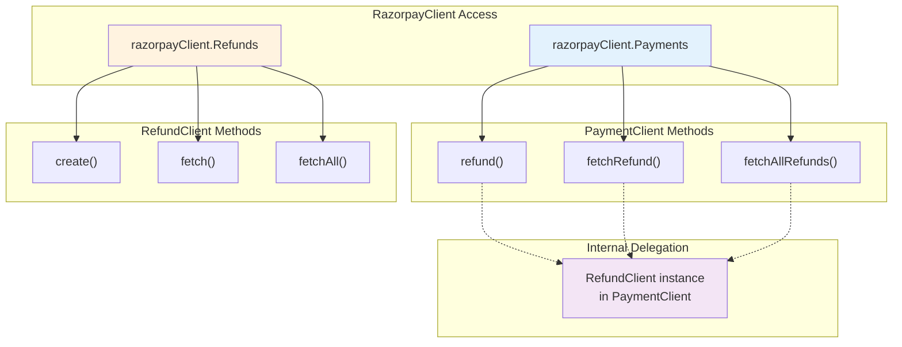

# Refunds

Relevant source files

The following files were used as context for generating this wiki page:

- [src/main/java/com/razorpay/PaymentClient.java](src/main/java/com/razorpay/PaymentClient.java)
- [src/main/java/com/razorpay/Refund.java](src/main/java/com/razorpay/Refund.java)
- [src/main/java/com/razorpay/RefundClient.java](src/main/java/com/razorpay/RefundClient.java)

## Purpose and Scope

This document covers the refund functionality in the Razorpay Java SDK, including refund creation, retrieval, and management operations. Refunds can be created and managed either through payment-specific operations or as standalone entities. For general payment operations, see [Payments](#4.1). For order management, see [Order Management](#5).

## Refund Architecture Overview

The SDK provides two primary access patterns for refund operations through dual client architecture:

**Refund Client Architecture**

Sources: [src/main/java/com/razorpay/PaymentClient.java:11-16](), [src/main/java/com/razorpay/RefundClient.java:7-11]()

## Refund Creation

### Payment-Specific Refunds

Payment-specific refunds are created through `PaymentClient` and are associated with a particular payment:

| Method | Parameters | Description |
|--------|------------|-------------|
| `refund(String id)` | Payment ID | Creates full refund for payment |
| `refund(String id, JSONObject request)` | Payment ID, refund details | Creates partial/custom refund for payment |

**Payment Refund Creation Flow**

Sources: [src/main/java/com/razorpay/PaymentClient.java:34-40]()

### Standalone Refunds

Standalone refunds are created through `RefundClient` and can reference any payment:

| Method | Parameters | Description |
|--------|------------|-------------|
| `refund(JSONObject request)` | Refund details including payment_id | Creates standalone refund |

The `PaymentClient.refund(JSONObject request)` method delegates to `RefundClient.create()` for standalone refund creation.

Sources: [src/main/java/com/razorpay/PaymentClient.java:42-44](), [src/main/java/com/razorpay/RefundClient.java:13-15]()

## Refund Retrieval

### Individual Refund Retrieval

Refunds can be retrieved using different identifier combinations:

| Access Pattern | Method | Parameters | Use Case |
|---------------|---------|------------|----------|
| Payment + Refund ID | `fetchRefund(String id, String refundId)` | Payment ID, Refund ID | When you have both identifiers |
| Refund ID only | `fetchRefund(String refundId)` | Refund ID | When you only have refund identifier |
| Direct RefundClient | `fetch(String id)` | Refund ID | Direct access through RefundClient |

**Refund Retrieval Patterns**

Sources: [src/main/java/com/razorpay/PaymentClient.java:46-52](), [src/main/java/com/razorpay/RefundClient.java:21-23]()

### Bulk Refund Retrieval

Multiple refunds can be retrieved using collection methods:

| Scope | Method | Parameters | Description |
|-------|---------|------------|-------------|
| Payment-specific | `fetchAllRefunds(String id)` | Payment ID | All refunds for a payment |
| Payment-specific | `fetchAllRefunds(String id, JSONObject request)` | Payment ID, filters | Filtered refunds for payment |
| Global | `fetchAllRefunds(JSONObject request)` | Filters | All refunds with filters |

The global `fetchAllRefunds(JSONObject request)` delegates to `RefundClient.fetchAll()`.

Sources: [src/main/java/com/razorpay/PaymentClient.java:54-64](), [src/main/java/com/razorpay/RefundClient.java:17-19,25-27]()

## Refund Data Model

The `Refund` class extends the base `Entity` class and provides JSON-based data access:

**Refund Entity Structure**

The `Refund` entity inherits all functionality from `Entity`, including:
- JSON property access via `get(String key)`
- Property existence checking via `has(String key)`
- JSON serialization via `toJson()`
- Special handling for timestamp fields like `created_at`

Sources: [src/main/java/com/razorpay/Refund.java:5-10]()

## Integration Patterns

### Dual Access Architecture

The SDK provides flexible refund access through both payment-centric and refund-centric approaches:

**Refund Access Patterns**

This dual architecture allows developers to choose the most appropriate access pattern based on their use case - whether working within a payment context or managing refunds independently.

Sources: [src/main/java/com/razorpay/PaymentClient.java:11-16,42-44,50-52,62-64]()
