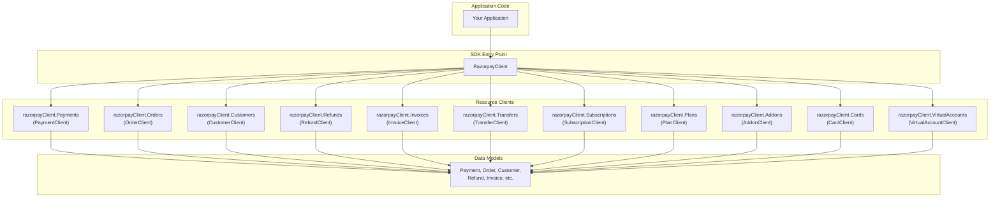
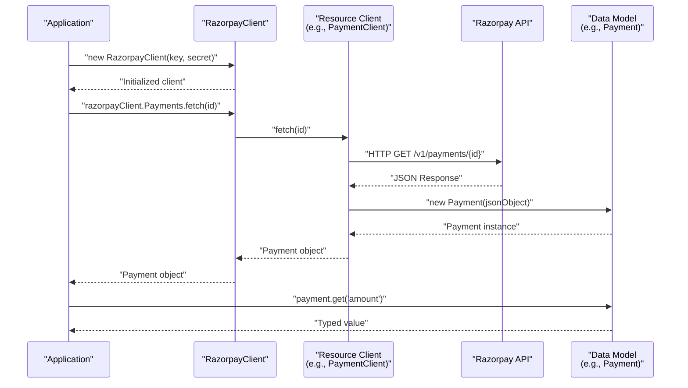

# Quick Start Guide

<details>
<summary>Relevant source files</summary>

The following files were used as context for generating this wiki page:

- [README.md](README.md)
- [src/main/java/com/razorpay/RazorpayClient.java](src/main/java/com/razorpay/RazorpayClient.java)

</details>


This guide provides essential information to get started with the Razorpay Java SDK quickly. It covers installation, basic configuration, and simple usage examples for common payment operations. For detailed information about specific features, see the relevant sections: [Payment Operations](#4) for comprehensive payment functionality, [Customer & Account Management](#6) for customer-related operations, and [Subscription & Billing](#7) for recurring payments.

## Requirements and Installation

### System Requirements

The Razorpay Java SDK requires **Java 1.7 or later**.

### Maven Installation

Add the following dependency to your project's `pom.xml`:

```xml
<dependency>
    <groupId>com.razorpay</groupId>
    <artifactId>razorpay-java</artifactId>
    <version>1.3.9</version>
</dependency>
```

### Gradle Installation

Add the following dependency to your `build.gradle`:

```groovy
compile "com.razorpay:razorpay-java:1.3.9"
```

Sources: [README.md:10-34]()

## Basic Configuration

### SDK Initialization

Initialize the `RazorpayClient` with your API credentials. Obtain your `key_id` and `key_secret` from the [Razorpay Dashboard](https://dashboard.razorpay.com/#/app/keys).

```java
// Basic initialization
RazorpayClient razorpayClient = new RazorpayClient("key_id", "key_secret");

// With logging enabled (optional)
RazorpayClient razorpayClient = new RazorpayClient("key_id", "key_secret", true);
```

### Adding Custom Headers (Optional)

```java
Map<String, String> headers = new HashMap<String, String>();
headers.put("Custom-Header", "value");
razorpayClient.addHeaders(headers);
```

Sources: [README.md:38-48](), [src/main/java/com/razorpay/RazorpayClient.java:21-44]()

## SDK Architecture Overview

Understanding the core structure of the SDK helps in effective usage:



The `RazorpayClient` serves as the main entry point, providing access to specialized client objects for different API resources. Each client handles specific operations and returns strongly-typed data model objects.

Sources: [src/main/java/com/razorpay/RazorpayClient.java:9-19]()

## Essential Operations

### Working with Payments

#### Fetch a Payment
```java
Payment payment = razorpayClient.Payments.fetch("payment_id");

// Access payment attributes with type safety
int amount = payment.get("amount");
String id = payment.get("id");
Date createdAt = payment.get("created_at");
```

#### Capture a Payment
```java
JSONObject options = new JSONObject();
options.put("amount", 1000); // Amount in paise
razorpayClient.Payments.capture("payment_id", options);
```

#### Refund a Payment
```java
// Full refund
JSONObject refundRequest = new JSONObject();
refundRequest.put("payment_id", "payment_id");
Refund refund = razorpayClient.Payments.refund(refundRequest);

// Partial refund
JSONObject partialRefundRequest = new JSONObject();
partialRefundRequest.put("amount", 500); // Amount in paise
partialRefundRequest.put("payment_id", "payment_id");
Refund partialRefund = razorpayClient.Payments.refund(partialRefundRequest);
```

Sources: [README.md:50-86]()

### Working with Orders

#### Create an Order
```java
JSONObject orderRequest = new JSONObject();
orderRequest.put("amount", 5000); // Amount in paise
orderRequest.put("currency", "INR");
orderRequest.put("receipt", "txn_123456");
Order order = razorpayClient.Orders.create(orderRequest);
```

#### Fetch an Order
```java
Order order = razorpayClient.Orders.fetch("order_id");
```

#### Fetch Payments for an Order
```java
List<Payment> payments = razorpayClient.Orders.fetchPayments("order_id");
```

Sources: [README.md:139-161]()

### Working with Customers

#### Create a Customer
```java
JSONObject customerRequest = new JSONObject();
customerRequest.put("name", "John Doe");
customerRequest.put("email", "john@example.com");
Customer customer = razorpayClient.Customers.create(customerRequest);
```

#### Fetch a Customer
```java
Customer customer = razorpayClient.Customers.fetch("customer_id");
```

Sources: [README.md:216-237]()

## Common Operation Flow

This diagram shows the typical flow for executing operations through the SDK:



Sources: [src/main/java/com/razorpay/RazorpayClient.java:21-39]()

## Signature Verification

For security, verify payment signatures and webhooks using the `Utils` class:

### Payment Signature Verification
```java
JSONObject options = new JSONObject();
options.put("razorpay_order_id", "order_id");
options.put("razorpay_payment_id", "payment_id");
options.put("razorpay_signature", "signature");
Utils.verifyPaymentSignature(options, "secret_key");
```

### Webhook Signature Verification
```java
Utils.verifyWebhookSignature("webhook_payload", "webhook_signature", "webhook_secret");
```

Sources: [README.md:163-175]()

## Data Model Usage

All API responses are wrapped in strongly-typed entity classes that extend the base `Entity` class. Key features include:

| Method | Description | Example |
|--------|-------------|---------|
| `get(key)` | Retrieve attribute with type inference | `int amount = payment.get("amount")` |
| `has(key)` | Check if attribute exists | `boolean hasNotes = payment.has("notes")` |
| `toJson()` | Convert to JSON representation | `JSONObject json = payment.toJson()` |

The `Entity.get()` method provides flexible return types based on the attribute being accessed, handling automatic type conversion for common data types including timestamps.

Sources: [README.md:59-63]()

## Next Steps

Once you have completed this quick start:

1. **Explore specific features**: See [Payment Operations](#4) for comprehensive payment handling
2. **Learn about architecture**: Review [Core Architecture](#3) for deeper understanding
3. **Handle errors properly**: Check [Error Handling](#9) for robust error management
4. **Set up development environment**: Visit [Development & Build Setup](#10) for advanced configuration

For comprehensive API documentation, refer to the [official Razorpay documentation](https://docs.razorpay.com).

Sources: [README.md:6-8]()
