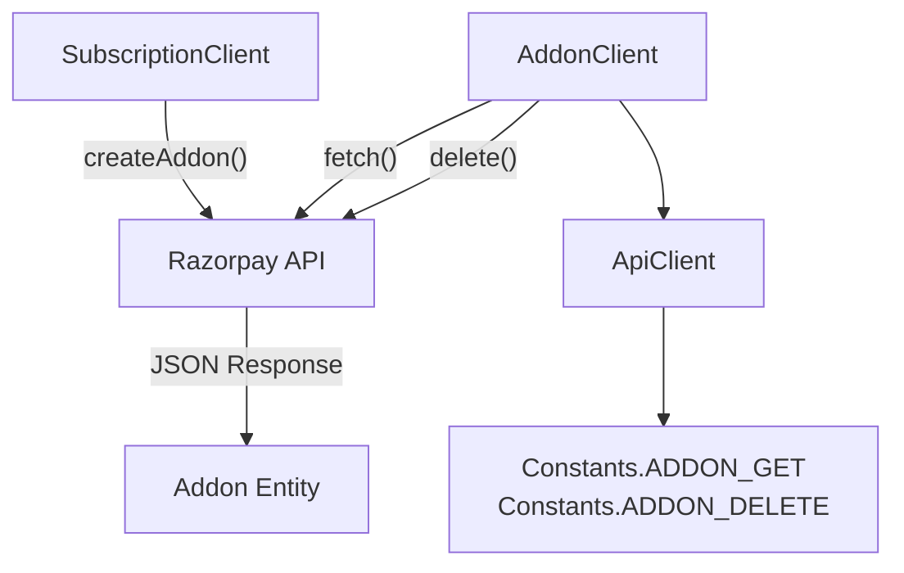
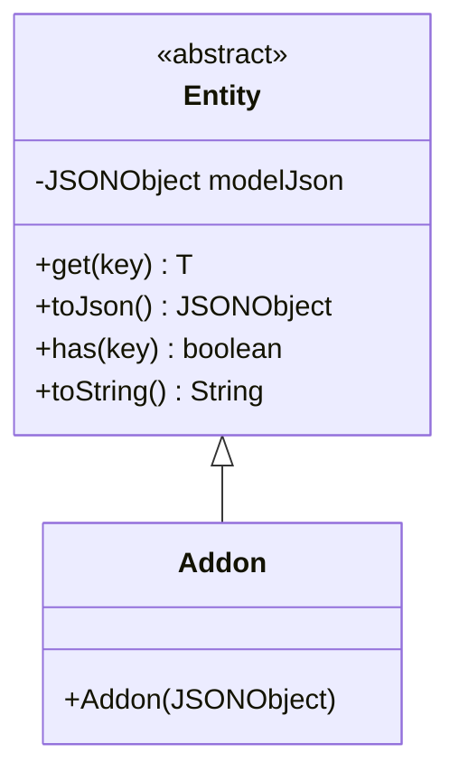
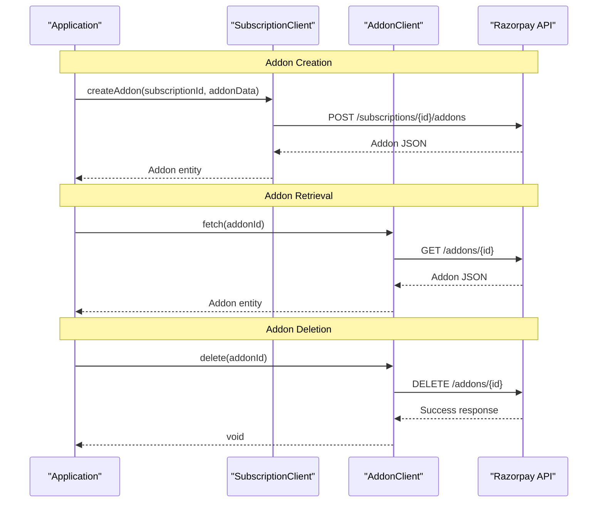

# Addons

<details>
<summary>Relevant source files</summary>

The following files were used as context for generating this wiki page:

- [src/main/java/com/razorpay/Addon.java](src/main/java/com/razorpay/Addon.java)
- [src/main/java/com/razorpay/AddonClient.java](src/main/java/com/razorpay/AddonClient.java)

</details>


This document covers addon management functionality within the Razorpay Java SDK. Addons represent additional charges or discounts that can be applied to existing subscriptions, allowing for flexible billing adjustments during a subscription's lifecycle.

For information about creating and managing subscriptions themselves, see [Subscriptions](#7.2). For details about setting up recurring billing plans, see [Plans](#7.1).

## Overview

Addons in the Razorpay ecosystem are one-time charges or credits that can be applied to active subscriptions. They provide a mechanism for billing adjustments such as setup fees, one-time discounts, or additional service charges without modifying the underlying subscription plan.

The addon functionality is implemented through two primary components:
- `AddonClient` - Handles addon retrieval and deletion operations
- `Addon` - Represents addon data model

**Note**: Addon creation is handled through the `SubscriptionClient.createAddon()` method rather than directly through `AddonClient`, reflecting the tight coupling between addons and their parent subscriptions.

## Addon Client Operations

### AddonClient Architecture



**Addon Client Operation Flow**

The `AddonClient` provides two primary operations for managing existing addons:

| Operation | Method | Purpose |
|-----------|--------|---------|
| Retrieve | `fetch(String id)` | Fetches addon details by ID |
| Remove | `delete(String id)` | Deletes an existing addon |

Sources: [src/main/java/com/razorpay/AddonClient.java:1-17]()

### Fetching Addons

The `fetch()` method retrieves addon information using the addon's unique identifier:

```java
public Addon fetch(String id) throws RazorpayException
```

This method constructs a GET request to the addon endpoint and returns an `Addon` entity containing the addon's complete data.

Sources: [src/main/java/com/razorpay/AddonClient.java:10-12]()

### Deleting Addons

The `delete()` method removes an addon from the system:

```java
public void delete(String id) throws RazorpayException
```

This operation is irreversible and removes the addon completely from the associated subscription.

Sources: [src/main/java/com/razorpay/AddonClient.java:14-16]()

## Addon Data Model

### Entity Structure



**Addon Entity Inheritance**

The `Addon` class follows the standard entity pattern used throughout the SDK:

- Extends the base `Entity` class
- Accepts a `JSONObject` in its constructor
- Inherits all common entity operations for data access

Sources: [src/main/java/com/razorpay/Addon.java:1-10]()

### Data Access

Addon data is accessed through the inherited `Entity` methods:

| Method | Purpose |
|--------|---------|
| `get(String key)` | Retrieve specific addon property |
| `has(String key)` | Check if property exists |
| `toJson()` | Get raw JSON representation |

## Integration with Subscription System

### Addon Lifecycle



**Addon Management Flow**

The addon creation process is intentionally routed through `SubscriptionClient` because addons are always associated with a specific subscription. This design ensures proper relationship management and prevents orphaned addons.

Sources: [src/main/java/com/razorpay/AddonClient.java:9]()

### Relationship with Other Components

Addons operate within the broader subscription billing ecosystem:

- **Plans**: Define base subscription terms
- **Subscriptions**: Active billing arrangements that can receive addons
- **Addons**: One-time adjustments to existing subscriptions

The `AddonClient` is accessed through the main `RazorpayClient` instance alongside other resource clients, maintaining consistency with the SDK's overall architecture pattern.

## Error Handling

All addon operations can throw `RazorpayException` for various error conditions:

- Invalid addon IDs
- Authorization failures
- Network connectivity issues
- API-level errors (subscription not found, addon already deleted, etc.)

For comprehensive error handling patterns, see [Error Handling](#9).

Sources: [src/main/java/com/razorpay/AddonClient.java:10-16]()
