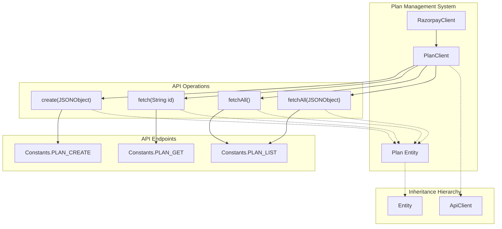
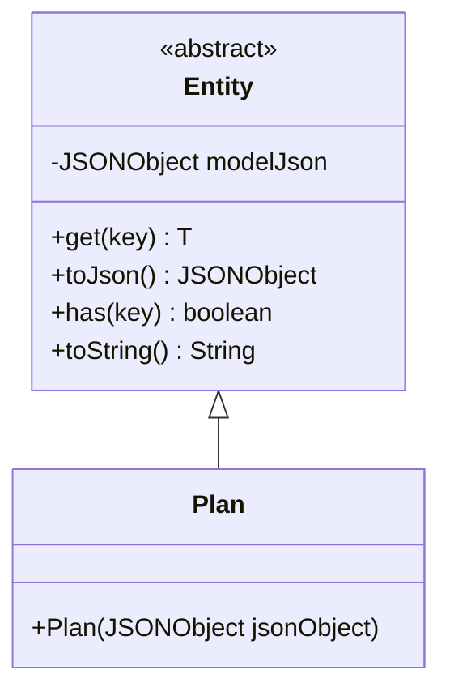
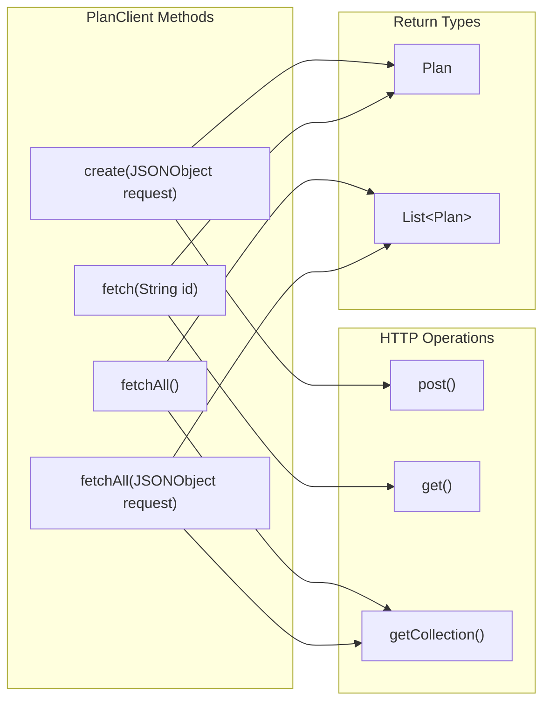
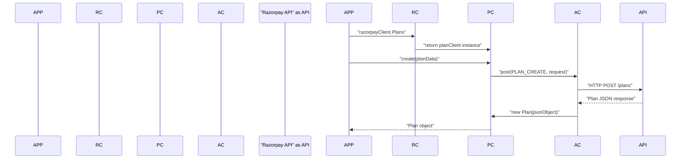

# Plans

<details>
<summary>Relevant source files</summary>

The following files were used as context for generating this wiki page:

- [src/main/java/com/razorpay/Plan.java](src/main/java/com/razorpay/Plan.java)
- [src/main/java/com/razorpay/PlanClient.java](src/main/java/com/razorpay/PlanClient.java)

</details>


This page documents the plan management functionality in the Razorpay Java SDK, specifically covering plan creation, retrieval, and listing operations for recurring billing scenarios. Plans serve as templates for subscriptions, defining billing amounts, intervals, and other recurring payment parameters.

For subscription lifecycle management using these plans, see [Subscriptions](#7.2). For additional subscription features, see [Addons](#7.3). For understanding the underlying data model architecture, see [Data Models](#3.3).

## System Overview

The plan management system consists of two main components: the `PlanClient` for API operations and the `Plan` entity for data representation.



Sources: [src/main/java/com/razorpay/PlanClient.java:1-28](), [src/main/java/com/razorpay/Plan.java:1-10]()

## Plan Entity

The `Plan` class represents a billing plan in the Razorpay system. It extends the base `Entity` class, inheriting JSON handling capabilities and common functionality.



### Plan Constructor

The `Plan` entity is instantiated with a `JSONObject` containing the plan data from the Razorpay API response.

| Constructor | Parameters | Description |
|-------------|------------|-------------|
| `Plan(JSONObject jsonObject)` | `jsonObject` - JSON data from API | Creates a Plan instance with the provided JSON data |

Sources: [src/main/java/com/razorpay/Plan.java:7-9]()

## PlanClient Operations

The `PlanClient` class provides methods for managing plans through the Razorpay API. It extends `ApiClient` and requires authentication credentials during initialization.



### Constructor

The `PlanClient` is initialized with authentication credentials and is typically accessed through the main `RazorpayClient`.

| Constructor | Parameters | Description |
|-------------|------------|-------------|
| `PlanClient(String auth)` | `auth` - Authentication string | Creates a PlanClient instance with API credentials |

Sources: [src/main/java/com/razorpay/PlanClient.java:9-11]()

### Core Operations

#### Create Plan

Creates a new plan with the specified parameters.

```java
public Plan create(JSONObject request) throws RazorpayException
```

- **Parameters**: `request` - JSONObject containing plan creation parameters
- **Returns**: `Plan` object representing the created plan
- **HTTP Method**: POST to `Constants.PLAN_CREATE`
- **Throws**: `RazorpayException` on API errors

Sources: [src/main/java/com/razorpay/PlanClient.java:13-15]()

#### Fetch Single Plan

Retrieves a specific plan by its ID.

```java
public Plan fetch(String id) throws RazorpayException
```

- **Parameters**: `id` - Unique plan identifier
- **Returns**: `Plan` object with plan details
- **HTTP Method**: GET to `Constants.PLAN_GET` with ID parameter
- **Throws**: `RazorpayException` on API errors

Sources: [src/main/java/com/razorpay/PlanClient.java:17-19]()

#### Fetch All Plans

Retrieves all plans, with optional filtering parameters.

| Method Signature | Parameters | Description |
|------------------|------------|-------------|
| `fetchAll()` | None | Retrieves all plans without filters |
| `fetchAll(JSONObject request)` | `request` - Filter parameters | Retrieves plans with specified filters |

Both methods return `List<Plan>` and use the `Constants.PLAN_LIST` endpoint.

Sources: [src/main/java/com/razorpay/PlanClient.java:21-27]()

## Integration with RazorpayClient

The `PlanClient` is accessed through the main `RazorpayClient` facade, providing a consistent interface for plan operations within the broader SDK architecture.



Sources: [src/main/java/com/razorpay/PlanClient.java:1-28]()

## Method Summary

| Operation | Method | HTTP Verb | Endpoint Constant | Return Type |
|-----------|--------|-----------|-------------------|-------------|
| Create Plan | `create(JSONObject)` | POST | `PLAN_CREATE` | `Plan` |
| Get Plan | `fetch(String)` | GET | `PLAN_GET` | `Plan` |
| List Plans | `fetchAll()` | GET | `PLAN_LIST` | `List<Plan>` |
| List Plans (Filtered) | `fetchAll(JSONObject)` | GET | `PLAN_LIST` | `List<Plan>` |

The `PlanClient` follows the same architectural patterns as other resource clients in the SDK, providing a clean interface for plan management operations while leveraging the underlying HTTP infrastructure and authentication mechanisms.

Sources: [src/main/java/com/razorpay/PlanClient.java:1-28](), [src/main/java/com/razorpay/Plan.java:1-10]()
