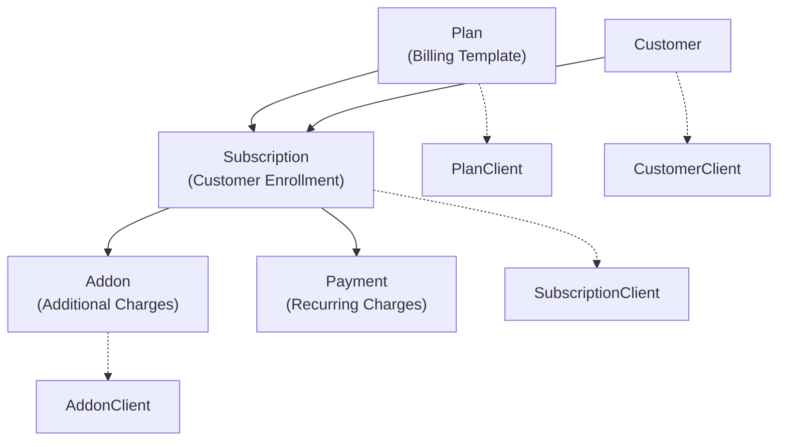
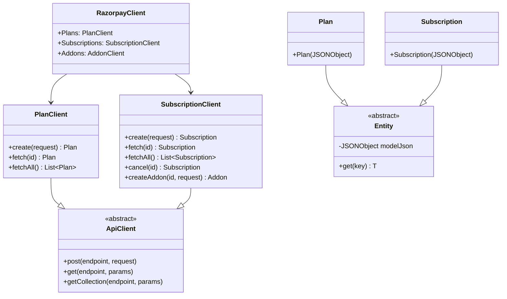
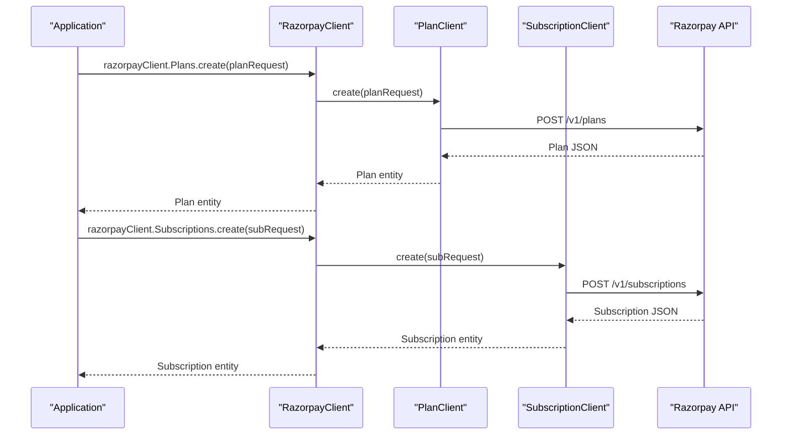
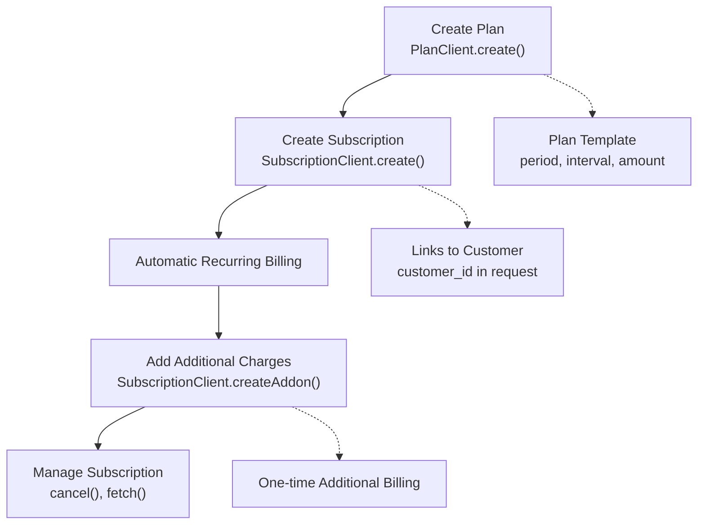

# Subscription & Billing

Relevant source files

The following files were used as context for generating this wiki page:

- [README.md](README.md)
- [src/main/java/com/razorpay/Plan.java](src/main/java/com/razorpay/Plan.java)
- [src/main/java/com/razorpay/PlanClient.java](src/main/java/com/razorpay/PlanClient.java)
- [src/main/java/com/razorpay/Subscription.java](src/main/java/com/razorpay/Subscription.java)
- [src/main/java/com/razorpay/SubscriptionClient.java](src/main/java/com/razorpay/SubscriptionClient.java)

## Purpose and Scope

This document covers the subscription and billing functionality in the Razorpay Java SDK, which enables developers to implement recurring billing and subscription management. The subscription system consists of three core components: Plans (billing templates), Subscriptions (customer enrollments), and Addons (additional charges). 

For one-time payment processing, see [Payment Operations](#4). For customer management that integrates with subscriptions, see [Customer & Account Management](#6).

## Core Concepts

The subscription billing system follows a hierarchical model where Plans define the billing structure, Subscriptions represent customer enrollments in those plans, and Addons provide additional charges to existing subscriptions.

### Business Entity Relationships

**Sources:** [README.md:291-377](), [src/main/java/com/razorpay/SubscriptionClient.java:1-36](), [src/main/java/com/razorpay/PlanClient.java:1-28]()

## Architecture Overview

The subscription billing system is implemented through specialized client classes that inherit from `ApiClient`, providing a consistent interface for CRUD operations on subscription-related entities.

### Component Architecture

**Sources:** [src/main/java/com/razorpay/PlanClient.java:7-28](), [src/main/java/com/razorpay/SubscriptionClient.java:7-36](), [src/main/java/com/razorpay/Plan.java:1-11](), [src/main/java/com/razorpay/Subscription.java:1-11]()

## Core Operations

The subscription billing system supports a complete lifecycle management approach for recurring billing scenarios.

| Operation | Plan | Subscription | Addon |
|-----------|------|--------------|-------|
| **Create** | ✓ | ✓ | ✓ |
| **Fetch** | ✓ | ✓ | ✓ |
| **List All** | ✓ | ✓ | - |
| **Cancel** | - | ✓ | ✓ (Delete) |
| **Update** | - | - | - |

### API Client Methods

**Sources:** [src/main/java/com/razorpay/PlanClient.java:13-15](), [src/main/java/com/razorpay/SubscriptionClient.java:13-15]()

## Data Flow and Integration

### Subscription Lifecycle

The typical flow for implementing subscription billing involves creating reusable plan templates, enrolling customers in subscriptions, and managing additional charges through addons.

**Sources:** [README.md:293-306](), [README.md:319-337](), [README.md:355-366]()

## Key Implementation Details

### Plan Configuration
Plans define the billing schedule and amount structure for recurring charges. The plan configuration includes:
- `period`: Billing frequency (weekly, monthly, yearly)
- `interval`: Multiplier for the period (e.g., every 2 weeks)
- `item`: Contains name, description, amount, and currency

### Subscription Management
Subscriptions link customers to plans and control the billing lifecycle:
- `plan_id`: References the billing plan
- `customer_notify`: Controls notification settings
- `total_count`: Limits number of billing cycles
- `start_at`: Timestamp for billing start date

### Addon Integration
Addons provide flexibility for additional charges on existing subscriptions:
- Created through `SubscriptionClient.createAddon()`
- Managed independently through `AddonClient`
- Support quantity-based billing

**Sources:** [README.md:294-306](), [README.md:321-337](), [README.md:357-366](), [src/main/java/com/razorpay/SubscriptionClient.java:33-35]()

## Error Handling

All subscription billing operations can throw `RazorpayException` for API-related errors. Common scenarios include invalid plan configurations, subscription state conflicts, and addon creation failures. For comprehensive error handling patterns, see [Error Handling](#9).

**Sources:** [src/main/java/com/razorpay/PlanClient.java:13-27](), [src/main/java/com/razorpay/SubscriptionClient.java:13-35]()
