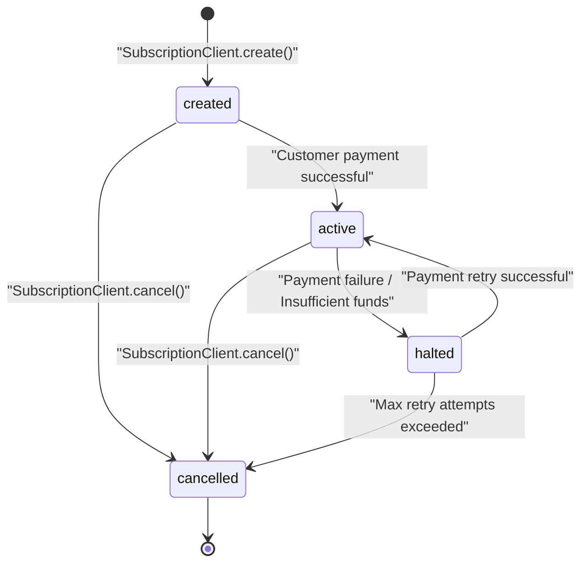
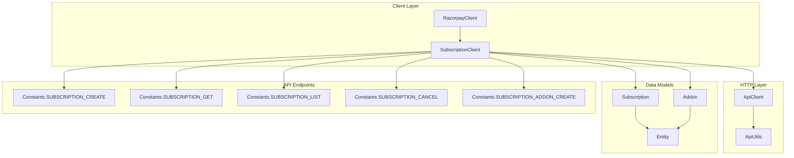
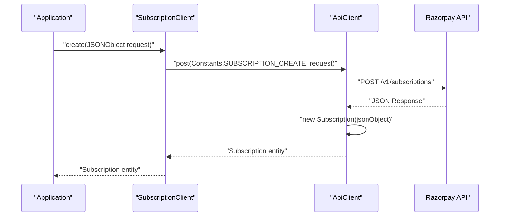
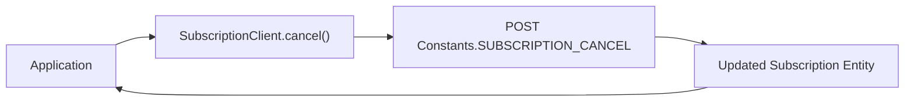
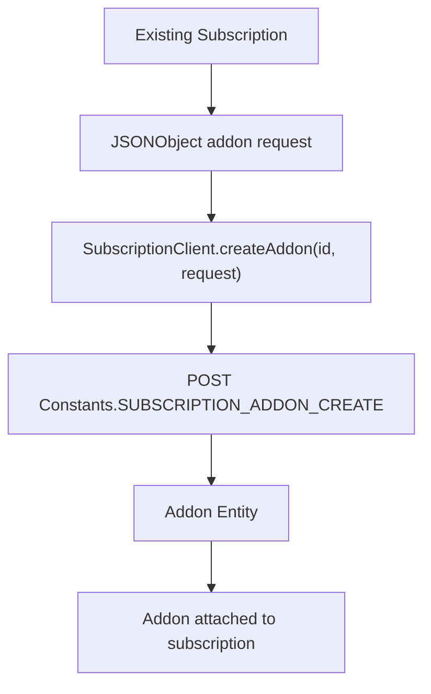
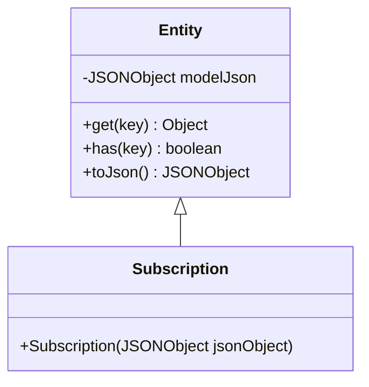
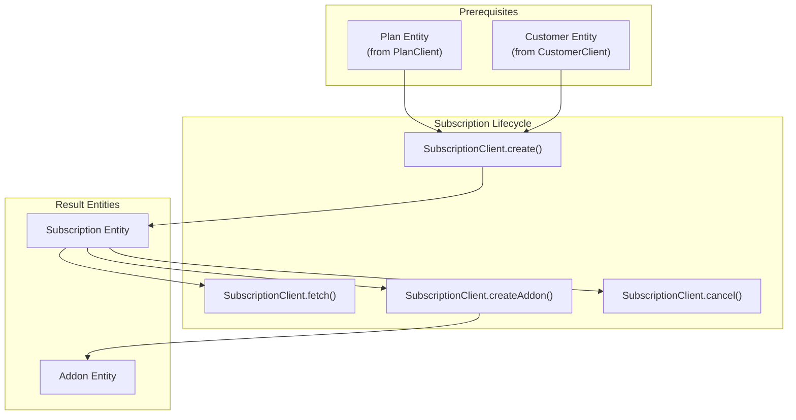

# Subscriptions

Relevant source files

The following files were used as context for generating this wiki page:

- [src/main/java/com/razorpay/Subscription.java](src/main/java/com/razorpay/Subscription.java)
- [src/main/java/com/razorpay/SubscriptionClient.java](src/main/java/com/razorpay/SubscriptionClient.java)

## Purpose and Scope

This document covers the subscription management functionality in the Razorpay Java SDK, including subscription lifecycle operations, cancellation, and addon management. Subscriptions enable recurring billing scenarios where customers are charged automatically at regular intervals.

For information about creating and managing plans that define subscription templates, see [Plans](#7.1). For detailed addon operations beyond subscription context, see [Addons](#7.3).

## Overview

The subscription system in the Razorpay Java SDK provides a complete solution for managing recurring billing scenarios. Subscriptions are built on top of plans and can be customized with addons for additional charges.

### Core Components

| Component | Purpose | File Location |
|-----------|---------|---------------|
| `SubscriptionClient` | Main interface for subscription operations | [src/main/java/com/razorpay/SubscriptionClient.java]() |
| `Subscription` | Data model representing subscription entities | [src/main/java/com/razorpay/Subscription.java]() |

### Subscription Lifecycle States

**Sources:** [src/main/java/com/razorpay/SubscriptionClient.java:13-36]()

## SubscriptionClient Operations

The `SubscriptionClient` class extends `ApiClient` and provides methods for complete subscription lifecycle management.

### Architecture Overview

**Sources:** [src/main/java/com/razorpay/SubscriptionClient.java:7-11]()

### Core Operations

#### Subscription Creation

The `create` method accepts a `JSONObject` containing subscription parameters and returns a `Subscription` entity.

**Sources:** [src/main/java/com/razorpay/SubscriptionClient.java:13-15]()

#### Subscription Retrieval

Two retrieval patterns are supported:

| Method | Purpose | API Endpoint Reference |
|--------|---------|----------------------|
| `fetch(String id)` | Retrieve single subscription | `Constants.SUBSCRIPTION_GET` |
| `fetchAll()` | Retrieve all subscriptions | `Constants.SUBSCRIPTION_LIST` |
| `fetchAll(JSONObject request)` | Retrieve filtered subscriptions | `Constants.SUBSCRIPTION_LIST` |

**Sources:** [src/main/java/com/razorpay/SubscriptionClient.java:17-27]()

#### Subscription Cancellation

The `cancel` method terminates an active subscription by posting to the cancellation endpoint.

**Sources:** [src/main/java/com/razorpay/SubscriptionClient.java:29-31]()

#### Addon Management

Subscriptions support dynamic addon creation through the `createAddon` method, which allows adding extra charges to existing subscriptions.

**Sources:** [src/main/java/com/razorpay/SubscriptionClient.java:33-35]()

## Data Model Structure

The `Subscription` class follows the standard entity pattern used throughout the SDK.

### Inheritance Hierarchy

**Sources:** [src/main/java/com/razorpay/Subscription.java:5-10]()

## Integration Patterns

### Complete Subscription Workflow

**Sources:** [src/main/java/com/razorpay/SubscriptionClient.java:1-36](), [src/main/java/com/razorpay/Subscription.java:1-11]()

### Error Handling

All `SubscriptionClient` methods can throw `RazorpayException` for API-related errors. The exception handling follows the standard pattern used across all SDK clients.

| Operation | Common Error Scenarios |
|-----------|----------------------|
| `create()` | Invalid plan ID, missing customer details |
| `fetch()` | Subscription not found, invalid ID format |
| `cancel()` | Subscription already cancelled, invalid state |
| `createAddon()` | Subscription not active, invalid addon parameters |

**Sources:** [src/main/java/com/razorpay/SubscriptionClient.java:13-35]()
